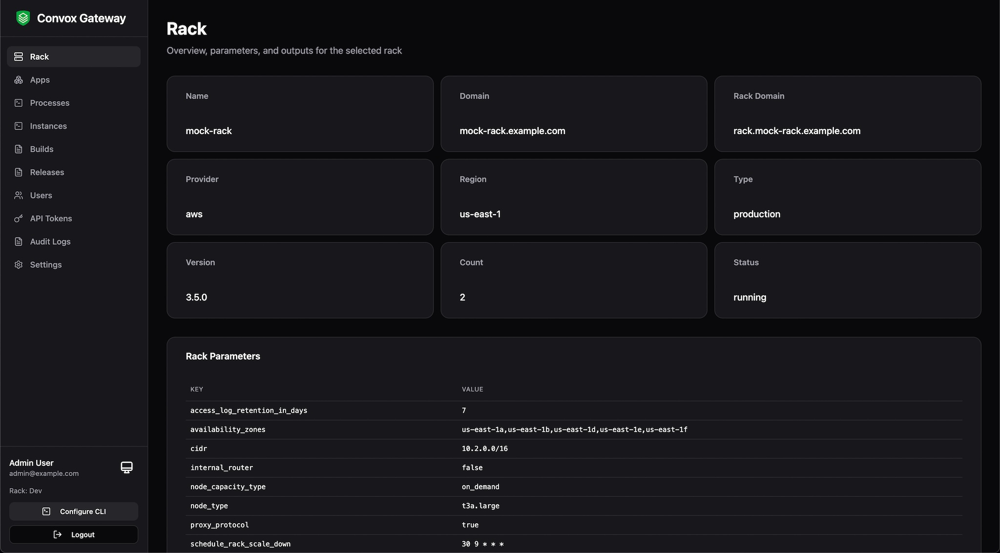
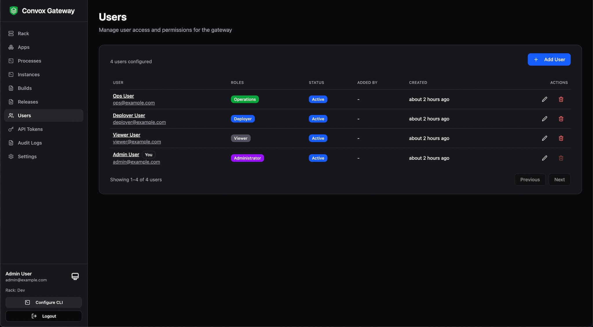
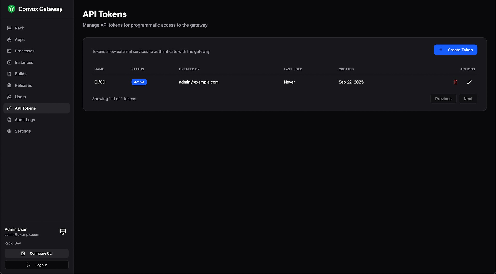
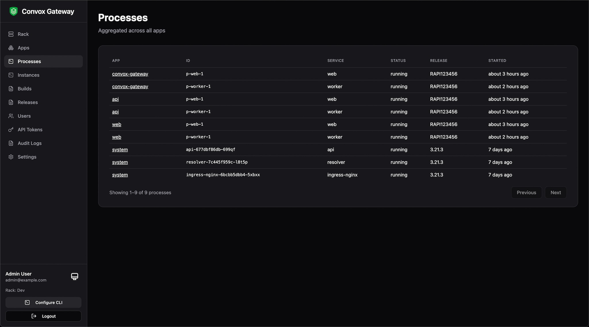
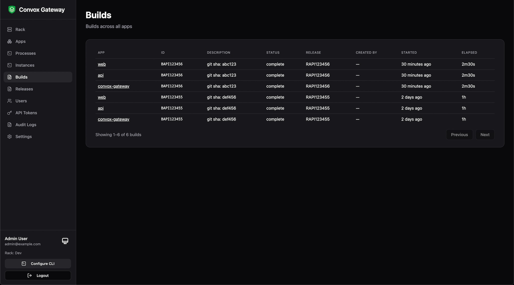
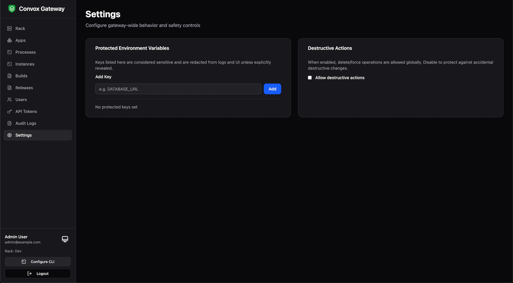

# Screenshots

## Rack



## Audit Logs


## Users



## API Tokens



## Processes



## Builds



## Settings



---

# CLI

```bash
❯ rack-gateway
Rack Gateway provides secure authenticated access to Convox racks
with SSO authentication, role-based access control, and audit logging.

To run convox commands through the gateway:
  rack-gateway convox apps
  rack-gateway convox ps
  rack-gateway convox deploy

Recommended aliases for your shell:
  alias cx="rack-gateway convox"   # cx apps, cx ps, cx deploy
  alias cg="rack-gateway"          # cg login, cg switch, cg rack

Rack management:
  rack-gateway rack                # Show current rack
  rack-gateway racks               # List all racks
  rack-gateway switch <rack>       # Switch to a different rack
  rack-gateway login <rack> <url>  # Login to a new rack

Usage:
  rack-gateway [flags]
  rack-gateway [command]

Available Commands:
  api-token   Manage API tokens for the current gateway
  completion  Generate shell completion script
  convox      Run a convox CLI command through the gateway
  env         List environment variables for an app (masked by default)
  help        Help about any command
  login       Login to a Convox rack via OAuth
  logout      Remove a rack (deletes config and token)
  rack        Show current rack and gateway information
  racks       List all configured racks
  switch      Switch to a different rack
  version     Show rack-gateway version
  web         Open the Rack Gateway web UI

Flags:
      --config string   Config directory (default "/Users/ndbroadbent/.config/rack-gateway")
  -h, --help            help for rack-gateway
      --rack string     Rack to use (overrides current rack)

Use "rack-gateway [command] --help" for more information about a command.
```
