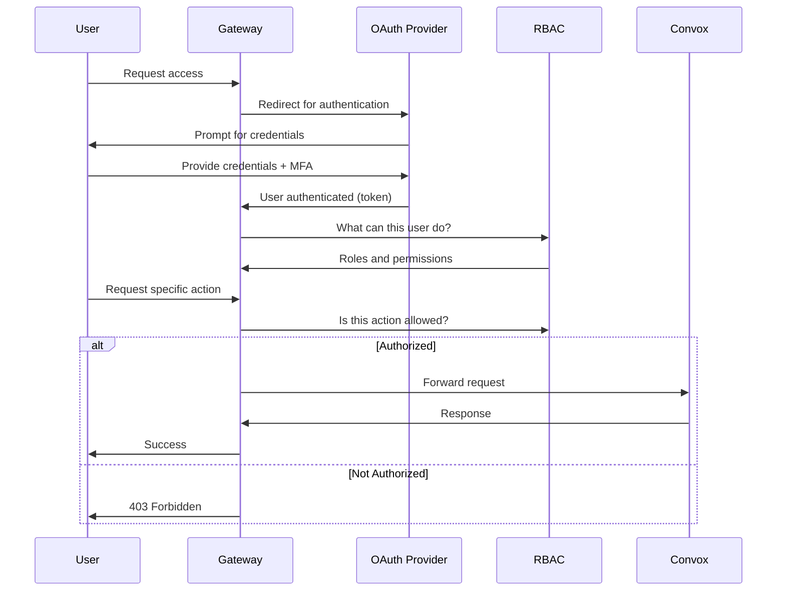

import { Aside, Steps } from '@astrojs/starlight/components';

Authentication and authorization are the two pillars of access control. While often confused or conflated, they serve distinct purposes. Understanding this distinction is essential for designing secure systems.

## The Core Distinction

| Aspect | Authentication | Authorization |
|--------|---------------|---------------|
| **Question** | "Who are you?" | "What can you do?" |
| **Verification** | Identity | Permissions |
| **Timing** | First (before authorization) | Second (after authentication) |
| **Failure Mode** | "I don't know who you are" | "You're not allowed to do that" |
| **HTTP Status** | 401 Unauthorized | 403 Forbidden |

<Aside type="note">
Despite the name, HTTP 401 "Unauthorized" actually means "unauthenticated"—the server doesn't know who you are. HTTP 403 "Forbidden" means you're authenticated but lack permission.
</Aside>

## Authentication: Proving Identity

Authentication answers the question: **"Who are you?"**

It's the process of verifying that someone is who they claim to be. Common authentication methods include:

### Something You Know

- Passwords
- PINs
- Security questions

**Weakness**: Can be guessed, phished, or stolen.

### Something You Have

- Hardware security keys (YubiKey)
- Mobile authenticator apps
- Smart cards

**Weakness**: Can be lost or stolen physically.

### Something You Are

- Fingerprints
- Facial recognition
- Voice patterns

**Weakness**: Cannot be changed if compromised.

### Multi-Factor Authentication

Combining multiple factors dramatically increases security. An attacker must compromise multiple independent systems to gain access.

```
Single Factor:     Password → Access
Multi-Factor:      Password + TOTP + Security Key → Access
                   ↑         ↑        ↑
                   Know      Have     Have (different device)
```

## Authorization: Granting Access

Authorization answers the question: **"What are you allowed to do?"**

After verifying identity, the system must determine what actions the authenticated user can perform. This involves:

### Access Control Models

**Discretionary Access Control (DAC)**
- Resource owners grant permissions
- Flexible but hard to audit
- Example: File system permissions

**Mandatory Access Control (MAC)**
- Central authority sets policies
- Strict but less flexible
- Example: Military classifications

**Role-Based Access Control (RBAC)**
- Permissions assigned to roles
- Users assigned to roles
- Balances flexibility and control
- **Used by Rack Gateway**

**Attribute-Based Access Control (ABAC)**
- Policies based on attributes
- Most flexible, most complex
- Example: "Engineers can access prod during business hours"

## The Authentication-Authorization Flow



## How Rack Gateway Implements This

### Authentication Layer

Rack Gateway uses **Google OAuth 2.0** for authentication:

1. User clicks "Sign in with Google"
2. Google verifies identity (password, MFA)
3. Google returns user identity to Gateway
4. Gateway creates a session token

```
Google OAuth → User Identity → Session Token → Authenticated Requests
```

The gateway itself never sees passwords—Google handles that responsibility.

### Authorization Layer

Rack Gateway uses **Role-Based Access Control** for authorization:

1. Each user has one or more roles
2. Each role has specific permissions
3. Each request requires certain permissions
4. Gateway checks user's roles against required permissions

```
User → Roles → Permissions → Allowed Actions
```

### Example Flow

<Steps>

1. **Authentication**: Alice signs in with Google OAuth

   - Google verifies Alice's password and 2FA
   - Gateway receives: "This is alice@example.com"

2. **Role Assignment**: Gateway looks up Alice's roles

   - Alice has role: `operator`
   - Operator role includes: `convox:apps:list`, `convox:builds:create`

3. **Authorization Check**: Alice requests to deploy

   - Deploy requires: `convox:releases:create`
   - Alice's permissions don't include this
   - Result: **403 Forbidden**

4. **Audit Log**: Action recorded regardless of outcome

   - Who: alice@example.com
   - What: Attempted deploy
   - When: 2024-01-15 10:30:00
   - Result: Denied (insufficient permissions)

</Steps>

## Common Pitfalls

### Conflating the Two

❌ **Wrong**: "We have passwords, so we have security"

✅ **Right**: Passwords provide authentication. You still need authorization to control what authenticated users can do.

### Authorization Without Authentication

❌ **Wrong**: Checking permissions before verifying identity

✅ **Right**: Always authenticate first, then authorize. You can't grant permissions to an unknown identity.

### Over-Reliance on Authentication

❌ **Wrong**: "They're logged in, so they can do anything"

✅ **Right**: Least privilege principle—only grant the minimum permissions needed.

### Ignoring Failed Attempts

❌ **Wrong**: Only logging successful actions

✅ **Right**: Failed authentication and authorization attempts are security signals. Rack Gateway logs everything.

## Security Implications

### Defense in Depth

Neither authentication nor authorization alone is sufficient:

| Scenario | Authentication Only | Authorization Only | Both |
|----------|--------------------|--------------------|------|
| Compromised password | Attacker has full access | N/A (no identity) | Attacker limited to role permissions |
| Privilege escalation | N/A | Attacker can access anything | Blocked by role check |
| Insider threat | Trusted user has full access | N/A | Limited by principle of least privilege |

### The Principle of Least Privilege

Every user should have the minimum permissions necessary:

```
Admin:     Full access (rare, audited)
Operator:  Deploy apps, view logs (common)
Developer: Run commands, view output (most users)
Viewer:    Read-only access (auditors, managers)
```

### Separation of Duties

Critical actions should require multiple authorized users:

```
Developer creates deploy request → Operator approves → Deploy executes
```

Rack Gateway's [deploy approvals](/integrations/deploy-approvals/) implement this pattern.

## Key Takeaways

1. **Authentication proves identity**—it answers "who are you?"
2. **Authorization grants permissions**—it answers "what can you do?"
3. **Both are required** for proper access control
4. **RBAC** provides a practical balance of security and usability
5. **Audit logging** captures both for compliance and forensics
6. **Least privilege** limits damage from any single compromise

## Rack Gateway Implementation

| Aspect | Implementation |
|--------|---------------|
| Authentication | Google OAuth 2.0 with PKCE |
| Session Management | Secure HTTP-only cookies |
| Authorization | Role-based access control |
| Roles | Admin, Operator, Developer, Viewer |
| Audit | Every action logged with user attribution |
| MFA | TOTP, WebAuthn, YubiKey (step-up for sensitive actions) |

## Further Reading

- [OAuth 2.0 Explained](/concepts/oauth-explained/) - How the authentication protocol works
- [RBAC Principles](/concepts/rbac-principles/) - Designing access control systems
- [RBAC Roles](/security/rbac/roles/) - Rack Gateway's specific roles
