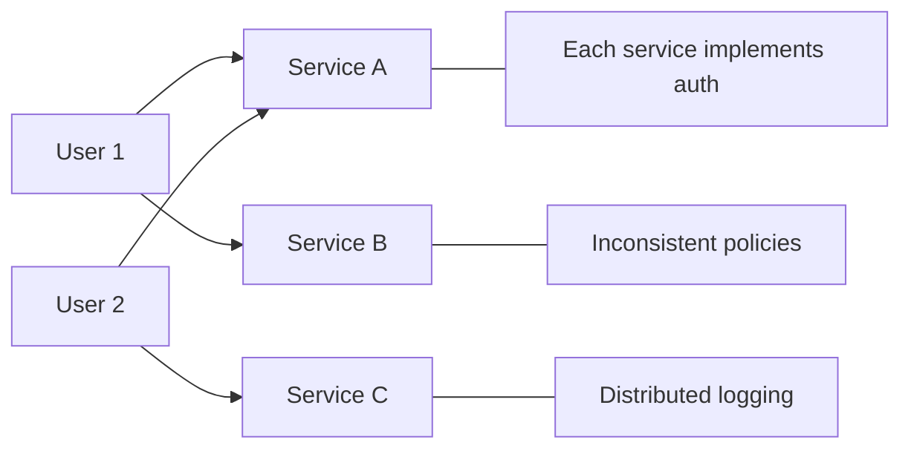
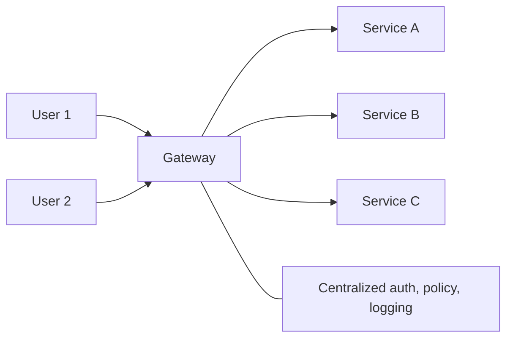
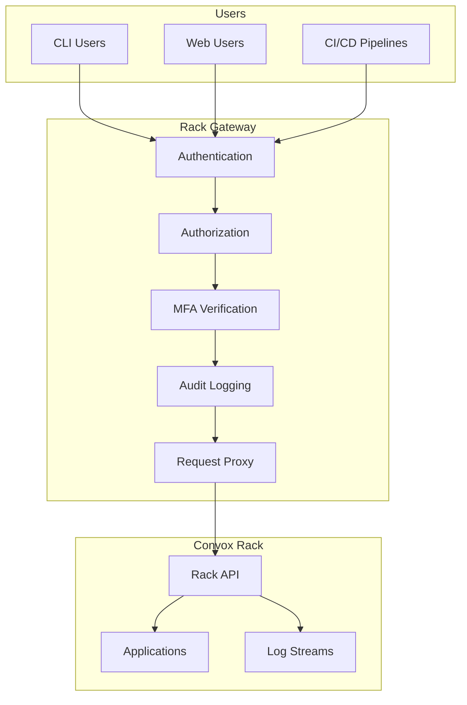
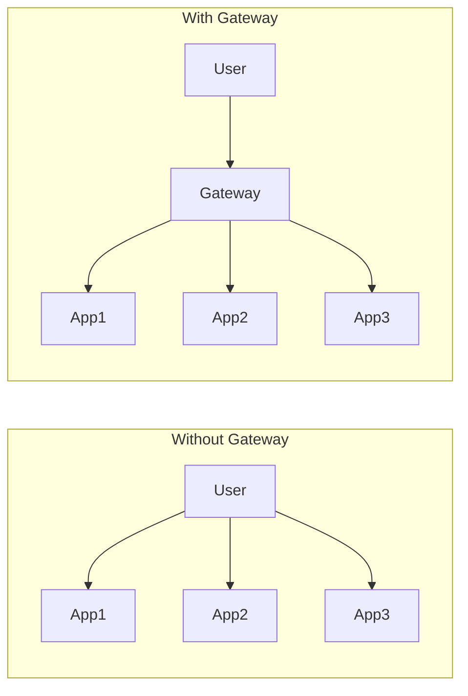

import { Aside, Steps } from '@astrojs/starlight/components';

An infrastructure gateway is a single entry point that mediates access to internal services. Rather than exposing multiple services directly, all traffic flows through the gateway, which handles authentication, authorization, and logging centrally.

## The Gateway Pattern

### Without a Gateway

Each service manages its own security:



**Problems**:
- Each service must implement authentication
- Access policies may be inconsistent
- Audit logging is fragmented
- Attack surface is larger

### With a Gateway

All access flows through a single point:



**Benefits**:
- Single authentication implementation
- Consistent access policies
- Unified audit logging
- Reduced attack surface

## Gateway Responsibilities

A well-designed gateway handles:

| Responsibility | Description |
|---------------|-------------|
| **Authentication** | Verify user identity |
| **Authorization** | Check permissions for each request |
| **Rate Limiting** | Prevent abuse and DoS |
| **Logging** | Record all access for audit |
| **Request Routing** | Direct requests to appropriate services |
| **Protocol Translation** | Convert between protocols if needed |
| **TLS Termination** | Handle encryption at the edge |

## Types of Gateways

### API Gateway

Manages access to APIs, typically for web and mobile applications:

```
Mobile App → API Gateway → Microservices
Web App   →              ↗
```

**Focus**: Developer experience, rate limiting, API versioning

### Identity-Aware Proxy (IAP)

Protects internal web applications:

```
User → IAP → Internal Apps
         ↓
       Identity Provider
```

**Focus**: User authentication, single sign-on

### Infrastructure Gateway

Secures access to infrastructure tools and APIs:

```
Admin → Infrastructure Gateway → Cloud APIs
DevOps →                       → Container Orchestration
CI/CD  →                       → Database Admin
```

**Focus**: RBAC, audit logging, compliance

**Rack Gateway is an infrastructure gateway** for Convox rack access.

## The Rack Gateway Architecture



### Single-Tenant Design

Rack Gateway follows a single-tenant model:

```
Production Rack:
  └── Rack Gateway (Production)
        └── Convox API

Staging Rack:
  └── Rack Gateway (Staging)
        └── Convox API
```

Each gateway:
- Serves one rack
- Has its own database
- Has its own user base
- Has its own audit logs

**Benefits**:
- Complete isolation between environments
- Independent policies per rack
- Separate audit trails
- Simpler failure domains

## Gateway Security Properties

### Defense in Depth

The gateway adds security layers:

```
Layer 1: Network (VPN/Tailscale)
  ↓
Layer 2: Authentication (OAuth)
  ↓
Layer 3: Authorization (RBAC)
  ↓
Layer 4: MFA (step-up)
  ↓
Layer 5: Audit (logging)
  ↓
Protected Resource
```

Each layer must be passed before reaching the resource.

### Single Choke Point

All traffic flows through one point:



**Security implications**:
- Easier to monitor all access
- Policy changes apply universally
- Single point to audit

### Credential Isolation

The gateway holds the Convox API token; users don't:

```
Traditional:
  User → Convox Token → Convox API

With Gateway:
  User → Session Token → Gateway → Convox Token → Convox API
                         ↑
                    Token never exposed
```

**Benefits**:
- Convox token never leaves server
- Users can be revoked without rotating token
- Token usage is logged per-user

## Implementing Gateway Security

### Zero Trust Integration

The gateway is a natural enforcement point for zero trust:

| Zero Trust Principle | Gateway Implementation |
|---------------------|----------------------|
| Verify explicitly | Every request authenticated |
| Least privilege | RBAC with minimal permissions |
| Assume breach | All actions logged, MFA required |

See [Zero Trust Security](/concepts/zero-trust-security/) for more.

### Authentication Options

| Method | Use Case | Rack Gateway |
|--------|----------|--------------|
| OAuth/OIDC | Interactive users | ✅ Google OAuth |
| API Tokens | CI/CD, automation | ✅ Supported |
| mTLS | Service-to-service | Not needed |
| API Keys | Simple automation | API tokens |

### Authorization Models

| Model | Complexity | Rack Gateway |
|-------|-----------|--------------|
| Allow/Deny lists | Low | ✅ ADMIN_USERS |
| RBAC | Medium | ✅ Primary model |
| ABAC | High | Future consideration |

## Gateway Deployment Patterns

### Sidecar Pattern

Gateway deployed alongside each service:

```
Pod:
  ├── Application Container
  └── Gateway Sidecar
```

**Use case**: Service mesh (Istio, Linkerd)

### Centralized Pattern

Single gateway for all services:

```
Gateway Cluster → Service A
                → Service B
                → Service C
```

**Use case**: Rack Gateway, API gateways

### Hybrid Pattern

Centralized gateway with service-specific policies:

```
Central Gateway → Per-Service Gateways → Services
```

**Use case**: Large organizations with diverse requirements

## Common Pitfalls

### Gateway as Single Point of Failure

**Problem**: If the gateway goes down, nothing works

**Solutions**:
- Run multiple gateway instances (HA)
- Load balancer with health checks
- Graceful degradation (read-only mode)

### Gateway Bypass

**Problem**: Services still accessible without gateway

**Solutions**:
- Network segmentation (services only reachable from gateway)
- Service-level authentication (mTLS)
- Audit for direct access attempts

### Credential Sprawl

**Problem**: Gateway needs credentials for all backend services

**Solutions**:
- Centralized secret management (Vault)
- IAM roles for AWS services
- Short-lived tokens where possible

### Logging Overload

**Problem**: Logging everything creates too much data

**Solutions**:
- Structured logging for efficient querying
- Log aggregation and rotation
- Sampling for high-volume endpoints

## Rack Gateway Specifics

### What It Protects

| Resource | Protection |
|----------|-----------|
| Convox API | All operations authenticated and authorized |
| App deployments | Deploy approval workflow |
| Environment variables | Secret redaction in logs |
| Exec access | MFA for sensitive operations |

### Deployment Model

```
Recommended:
  Internet → VPN/Tailscale → Rack Gateway → Convox

Optional (with TLS):
  Internet → TLS → Rack Gateway → Convox
```

### Configuration Example

```yaml
# convox.yml
services:
  gateway:
    domain: gateway.example.com
    port: 8443
    resources:
      - database
    environment:
      - RACK_HOST=rack.example.com
      - RACK_TOKEN          # From Convox resources
      - GOOGLE_CLIENT_ID
      - GOOGLE_CLIENT_SECRET
      - ADMIN_USERS=admin@example.com

resources:
  database:
    type: postgres
```

## Key Takeaways

1. **Gateways centralize security** at a single enforcement point
2. **Single-tenant design** provides isolation between environments
3. **Credential isolation** keeps sensitive tokens server-side
4. **Zero trust** integrates naturally with gateway architecture
5. **High availability** is essential—gateways are critical path
6. **Network segmentation** prevents gateway bypass

## Further Reading

- [Architecture Overview](/getting-started/architecture/) - Rack Gateway architecture
- [Zero Trust Security](/concepts/zero-trust-security/) - Security model
- [Private Network Deployment](/deployment/private-network/) - Network security
- [Convox Deployment](/deployment/convox/) - Deploying Rack Gateway
