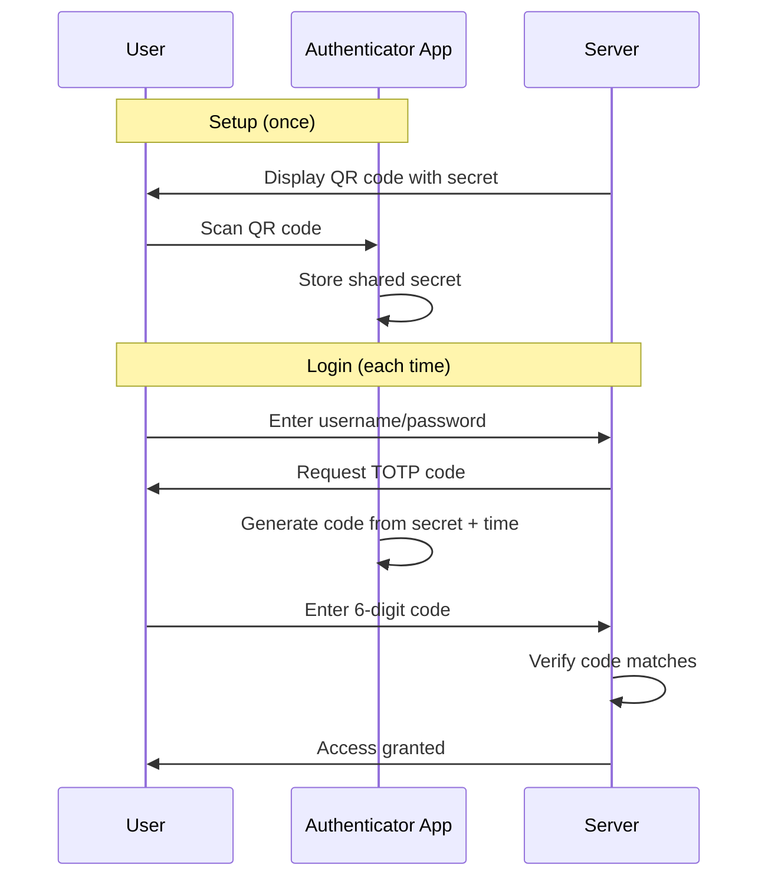
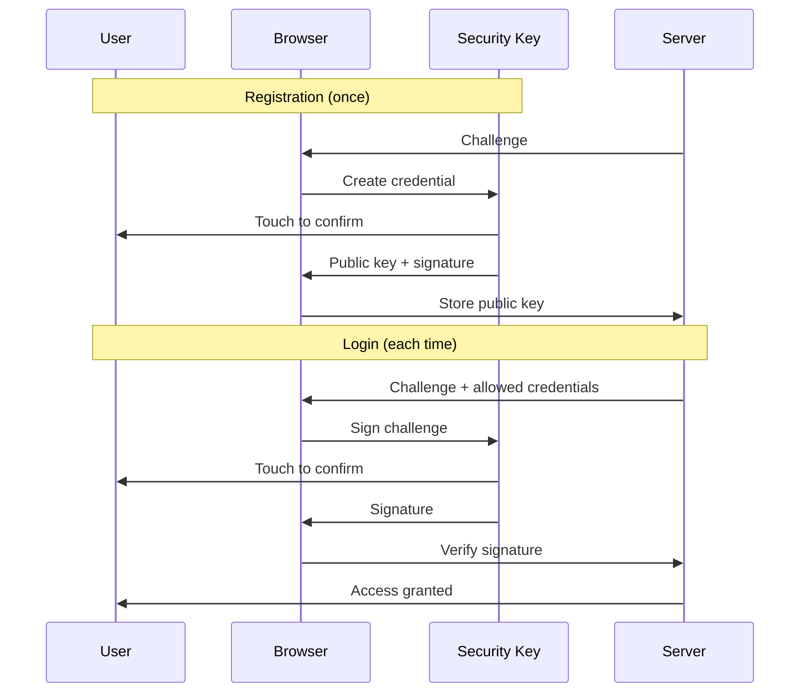
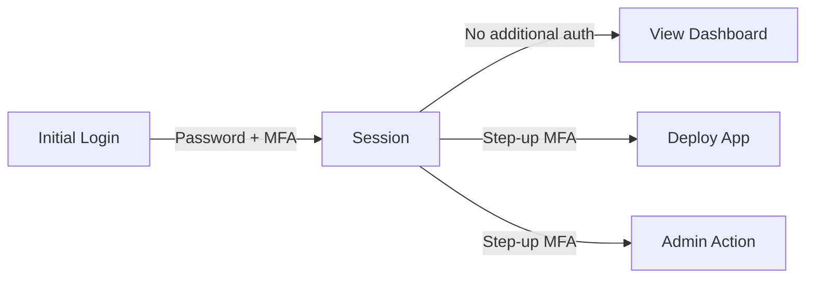
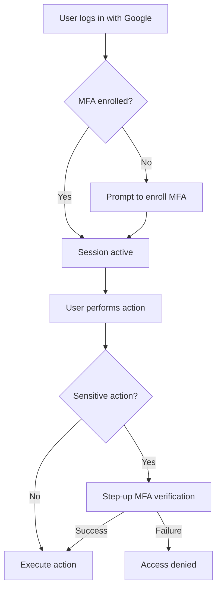

import { Aside, Steps } from '@astrojs/starlight/components';

Multi-Factor Authentication (MFA) requires users to provide multiple forms of evidence to verify their identity. By combining factors, MFA dramatically reduces the risk of unauthorized access even when one factor is compromised.

## Why Passwords Aren't Enough

Passwords are the weakest link in authentication:

| Attack Vector | How Passwords Fail |
|--------------|-------------------|
| **Phishing** | Users enter passwords on fake sites |
| **Credential stuffing** | Reused passwords from breached sites |
| **Brute force** | Weak passwords can be guessed |
| **Keyloggers** | Malware captures passwords |
| **Social engineering** | Users reveal passwords to attackers |
| **Shoulder surfing** | Passwords observed while typing |

<Aside type="danger">
81% of hacking-related breaches involve stolen or weak passwords (Verizon Data Breach Report). Passwords alone cannot secure sensitive systems.
</Aside>

## The Three Authentication Factors

MFA combines multiple independent factors:

### Something You Know

- Passwords
- PINs
- Security questions

**Strengths**: Easy to deploy, no hardware required
**Weaknesses**: Can be guessed, phished, or stolen

### Something You Have

- Security keys (YubiKey)
- Mobile phones (SMS, authenticator apps)
- Smart cards

**Strengths**: Physical possession required
**Weaknesses**: Can be lost or stolen

### Something You Are

- Fingerprints
- Face recognition
- Voice patterns
- Retina scans

**Strengths**: Always with you, hard to replicate
**Weaknesses**: Cannot be changed if compromised, privacy concerns

## MFA Methods Compared

| Method | Phishing Resistant | Convenience | Recovery | Cost |
|--------|-------------------|-------------|----------|------|
| **TOTP (Authenticator)** | Partially | High | Medium | Free |
| **WebAuthn (Security Keys)** | Yes | Medium | Low | $25-50/key |
| **YubiKey OTP** | Partially | High | Low | $25-50/key |
| **SMS Codes** | No | High | High | Low |
| **Push Notifications** | Partially | High | Medium | Varies |
| **Backup Codes** | No | Low | N/A | Free |

### TOTP (Time-based One-Time Password)

How it works:



**Pros**:
- Free (use any authenticator app)
- Works offline
- No per-authentication cost

**Cons**:
- Codes can be phished in real-time
- Shared secret stored on both sides
- Account recovery requires backup

### WebAuthn / FIDO2 (Security Keys)

How it works:



**Pros**:
- Phishing resistant (origin verification)
- Private key never leaves device
- User presence verification (touch)

**Cons**:
- Requires hardware purchase
- Can be lost (need backup method)
- Not all browsers support fully

### YubiKey OTP

How it works:

```
Press button → YubiKey types: ccccccbcgujhingjrdejhgfnuetrgigvejhhgbkugded
                               ↑                        ↑
                            Static prefix          One-time password
```

**Pros**:
- Simple (just touch the key)
- Works everywhere (emulates keyboard)
- Yubico cloud validation available

**Cons**:
- Codes sent in plain text (can be phished)
- Requires Yubico infrastructure or self-hosting
- One key per account typically

### SMS Codes

<Aside type="caution">
SMS-based MFA is better than no MFA, but is the weakest MFA method due to SIM swapping attacks and SS7 vulnerabilities. Use stronger methods for sensitive systems.
</Aside>

**Why SMS is weak**:
- SIM swapping: Attackers convince carriers to transfer your number
- SS7 attacks: Network-level interception of messages
- Malware: Can intercept SMS on compromised phones

## Step-Up Authentication

Not all actions need the same security level. Step-up MFA adds verification for sensitive operations:



### Rack Gateway Step-Up Actions

| Action | Requires Step-Up | Rationale |
|--------|-----------------|-----------|
| View applications | No | Low-risk read operation |
| View logs | No | Low-risk read operation |
| Run exec command | Configurable | Could access secrets |
| Deploy application | Yes | Changes production |
| Manage users | Yes | Privilege escalation |
| Manage API tokens | Yes | Credential management |

## Implementing MFA Securely

### Registration Best Practices

<Steps>

1. **Verify identity before enrollment**

   Ensure the user is who they claim to be before letting them add MFA

2. **Require multiple methods**

   Encourage users to register backup methods (TOTP + backup codes)

3. **Secure the enrollment process**

   Use authenticated sessions, prevent session hijacking during enrollment

4. **Display recovery options**

   Show backup codes only once, encourage secure storage

</Steps>

### Verification Best Practices

<Steps>

1. **Rate limit attempts**

   Prevent brute-force attacks on 6-digit codes

2. **Lock out after failures**

   Temporarily lock accounts after repeated failures

3. **Log all attempts**

   Track successful and failed MFA attempts for forensics

4. **Clear session on MFA failure**

   Don't allow continued access after MFA rejection

</Steps>

### Recovery Best Practices

| Scenario | Recommended Recovery |
|----------|---------------------|
| Lost phone (TOTP) | Use backup codes |
| Lost security key | Use backup key or admin reset |
| Forgot backup codes | Admin reset with identity verification |
| Compromised account | Admin reset + security review |

## MFA in Rack Gateway

### Supported Methods

| Method | Type | Setup Location |
|--------|------|----------------|
| **TOTP** | Something you have | Web UI or CLI |
| **WebAuthn** | Something you have | Web UI |
| **YubiKey OTP** | Something you have | Web UI |
| **Backup Codes** | Something you have | Web UI |

### Configuration

```bash
# MFA Settings
RGW_SETTING_MFA_REQUIRED_ROLES=admin,operator  # Require MFA for these roles
RGW_SETTING_MFA_TIMEOUT_SECONDS=300            # Step-up MFA timeout
```

### User Experience



## Common MFA Mistakes

### "We have MFA, we're secure"

MFA is one layer; you still need:
- Strong passwords
- Session management
- Authorization (RBAC)
- Audit logging

### Weak recovery mechanisms

Recovery options that bypass MFA defeat its purpose:
- ❌ Email-only recovery
- ❌ Security questions
- ✅ Backup codes stored securely
- ✅ Admin-verified identity reset

### Not enforcing MFA for all users

Partial deployment leaves gaps:
- ❌ MFA optional for developers
- ❌ MFA only for admins
- ✅ MFA required for everyone, with different policies per role

### Ignoring phishing-resistant options

TOTP can still be phished in real-time. For high-security environments:
- ✅ Require WebAuthn/FIDO2 for admin accounts
- ✅ Use hardware security keys

## Key Takeaways

1. **Passwords alone are insufficient** for securing sensitive systems
2. **MFA combines independent factors** to dramatically reduce risk
3. **WebAuthn is most secure** but TOTP is a good balance of security and convenience
4. **Step-up MFA** adds verification for sensitive operations without friction for routine tasks
5. **Recovery planning** is essential—users will lose devices
6. **SMS is weak**—use app-based TOTP or hardware keys

## Further Reading

- [TOTP Setup Guide](/user-guide/mfa/totp-setup/) - Configure authenticator apps
- [WebAuthn Setup](/user-guide/mfa/webauthn/) - Use security keys
- [Backup Codes](/user-guide/mfa/backup-codes/) - Recovery options
- [MFA Verification in CLI](/user-guide/cli/mfa-verification/) - CLI MFA flow
