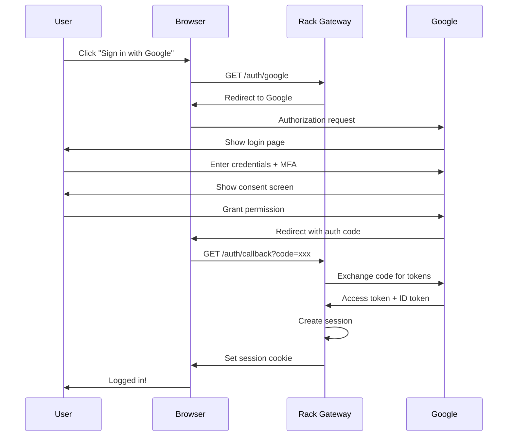
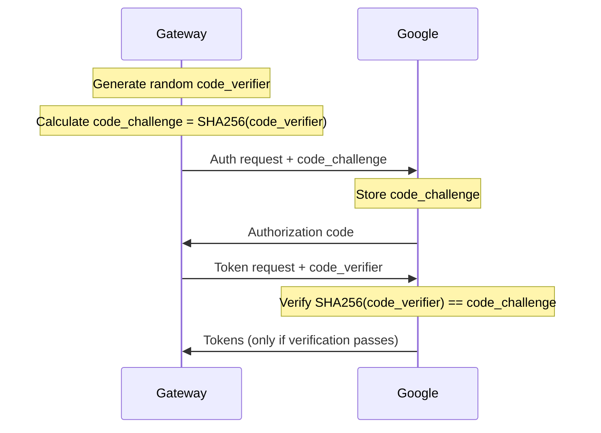

import { Aside, Steps } from '@astrojs/starlight/components';

OAuth 2.0 is the industry standard protocol for authorization. It enables applications to obtain limited access to user accounts without exposing credentials. Rack Gateway uses OAuth 2.0 with Google Workspace to authenticate users.

## Why OAuth?

Before OAuth, applications often asked users for their passwords:

```
❌ Old Pattern:
App: "What's your Google password?"
User: Enters password
App: Stores password, uses it to access Google
```

This created serious problems:

- Apps had full access to accounts
- Users couldn't revoke access without changing passwords
- Password breaches affected all connected apps
- No audit trail of what apps accessed

OAuth solves this:

```
✅ OAuth Pattern:
App: "Click here to sign in with Google"
User: Redirected to Google, enters password there
Google: "App wants to know your email. Allow?"
User: Clicks Allow
Google: Gives app a limited token
```

## Key Concepts

### Roles in OAuth

| Role | Description | In Rack Gateway |
|------|-------------|-----------------|
| **Resource Owner** | The user who owns the data | Your employees |
| **Client** | The application requesting access | Rack Gateway |
| **Authorization Server** | Issues tokens after authentication | Google OAuth |
| **Resource Server** | Hosts protected resources | Google APIs |

### Tokens

OAuth uses tokens instead of passwords:

**Authorization Code**
- Short-lived, one-time use
- Exchanged for access token
- Never exposed to browser

**Access Token**
- Used to access protected resources
- Limited lifetime (typically 1 hour)
- Scoped to specific permissions

**Refresh Token**
- Used to get new access tokens
- Longer lifetime
- Can be revoked

**ID Token** (OpenID Connect)
- Contains user identity information
- JWT format, can be validated locally
- Used by Rack Gateway to identify users

## The Authorization Code Flow

This is the flow Rack Gateway uses. It's the most secure OAuth flow for web applications.



<Steps>

1. **Authorization Request**

   User clicks "Sign in with Google" and Gateway redirects to Google with:
   - `client_id`: Identifies Rack Gateway to Google
   - `redirect_uri`: Where to send user after login
   - `scope`: What information Gateway needs (email, profile)
   - `state`: Random string to prevent CSRF
   - `code_challenge`: PKCE challenge (explained below)

2. **User Authentication**

   Google handles the actual authentication:
   - Password verification
   - MFA challenges
   - Account security checks

3. **User Consent**

   Google shows what Gateway is requesting:
   - "Rack Gateway wants to know your email address"
   - User can accept or deny

4. **Authorization Code**

   Google redirects back to Gateway with:
   - `code`: One-time authorization code
   - `state`: Same value Gateway sent (verified for CSRF)

5. **Token Exchange**

   Gateway sends code to Google's token endpoint:
   - `code`: The authorization code
   - `client_secret`: Proves Gateway's identity
   - `code_verifier`: PKCE verification (explained below)

6. **Tokens Received**

   Google returns:
   - `access_token`: For API calls (if needed)
   - `id_token`: JWT with user identity
   - `refresh_token`: For token renewal (if requested)

7. **Session Created**

   Gateway validates the ID token and creates a session:
   - Extracts email from ID token
   - Creates or updates user record
   - Issues session cookie

</Steps>

## PKCE: Proof Key for Code Exchange

PKCE (pronounced "pixy") prevents authorization code interception attacks. It's required for public clients and recommended for all OAuth flows.

### The Problem PKCE Solves

Without PKCE, an attacker who intercepts the authorization code could exchange it for tokens:

```
1. User starts OAuth flow
2. Attacker intercepts redirect with code
3. Attacker exchanges code before legitimate client
4. Attacker gets tokens, user session compromised
```

### How PKCE Works



1. **Generate**: Client creates a random `code_verifier`
2. **Challenge**: Client computes `code_challenge = SHA256(code_verifier)`
3. **Send Challenge**: Authorization request includes `code_challenge`
4. **Store**: Authorization server stores `code_challenge` with the code
5. **Verify**: Token exchange includes `code_verifier`
6. **Validate**: Server verifies `SHA256(code_verifier) == code_challenge`

### Why It Works

An attacker who intercepts the authorization code:
- Has the `code_challenge` (public)
- Does **not** have the `code_verifier` (never transmitted)
- Cannot compute `code_verifier` from `code_challenge` (SHA256 is one-way)
- Cannot exchange the code for tokens

## OpenID Connect

OpenID Connect (OIDC) is an identity layer on top of OAuth 2.0. While OAuth handles authorization ("what can this app do?"), OIDC handles authentication ("who is this user?").

### ID Token

The ID token is a JWT containing user identity:

```json
{
  "iss": "https://accounts.google.com",
  "sub": "1234567890",
  "aud": "your-client-id.apps.googleusercontent.com",
  "email": "alice@example.com",
  "email_verified": true,
  "name": "Alice Smith",
  "picture": "https://...",
  "iat": 1704067200,
  "exp": 1704070800
}
```

### Token Validation

Rack Gateway validates ID tokens by:

1. **Signature verification**: Using Google's public keys
2. **Issuer check**: Must be `accounts.google.com`
3. **Audience check**: Must match our client ID
4. **Expiration check**: Token must not be expired
5. **Domain check**: Email must match `GOOGLE_ALLOWED_DOMAIN`

## Security Considerations

### State Parameter

The `state` parameter prevents CSRF attacks:

```
Without state:
1. Attacker crafts malicious OAuth redirect
2. Victim clicks link, logs in
3. Victim's session linked to attacker's account

With state:
1. Gateway generates random state, stores in session
2. State included in authorization request
3. State returned with callback
4. Gateway verifies state matches → CSRF blocked
```

### Redirect URI Validation

OAuth providers strictly validate redirect URIs:

- Must exactly match registered URIs
- Prevents open redirect attacks
- Prevents authorization code theft

<Aside type="caution">
Never use wildcards in redirect URIs. Always register exact URIs for each environment (development, staging, production).
</Aside>

### Token Storage

Rack Gateway handles tokens securely:

| Token | Storage | Rationale |
|-------|---------|-----------|
| Authorization code | Memory only | One-time use, exchanged immediately |
| Access token | Not stored | Only used for immediate API calls |
| ID token | Validated, discarded | Identity extracted, token not needed |
| Session token | HTTP-only cookie | Prevents JavaScript access |

## How Rack Gateway Uses OAuth

### Configuration

```bash
# Required OAuth settings
GOOGLE_CLIENT_ID=your-client-id.apps.googleusercontent.com
GOOGLE_CLIENT_SECRET=your-client-secret
GOOGLE_ALLOWED_DOMAIN=example.com  # Restrict to your organization

# Generated automatically
REDIRECT_URI=https://gateway.example.com/auth/google/callback
```

### Login Flow

1. User visits Gateway and clicks "Sign in with Google"
2. Gateway redirects to Google with PKCE challenge
3. User authenticates with Google (password + MFA)
4. Google redirects back with authorization code
5. Gateway exchanges code for ID token
6. Gateway validates token and checks domain
7. Gateway creates session, issues cookie
8. User is now authenticated

### Session Management

After OAuth login, Rack Gateway manages its own sessions:

- Session token stored in HTTP-only cookie
- Session validated on each request
- Session expires after configurable timeout
- No continuous connection to Google required

This means:

- Users don't need internet access to Google after login
- Gateway can work offline after initial authentication
- Session policies are controlled by Gateway, not Google

## Common OAuth Misunderstandings

### "OAuth is for Authentication"

OAuth is for **authorization**—granting access to resources. OpenID Connect adds authentication on top. Rack Gateway uses OIDC for authentication.

### "Access Tokens are Session Tokens"

Access tokens are for API access, not session management. Rack Gateway uses its own session tokens, which are simpler and more controllable.

### "OAuth is Complicated"

The protocol has many options, but the authorization code flow with PKCE is straightforward:

1. Redirect user to provider
2. User logs in
3. Receive code, exchange for tokens
4. Validate ID token, create session

## Key Takeaways

1. **OAuth separates concerns**: Identity providers handle authentication; apps handle authorization
2. **PKCE is essential**: Always use PKCE, even for confidential clients
3. **ID tokens are for identity**: Use them to know who the user is
4. **Session tokens are for sessions**: Don't reuse OAuth tokens as session tokens
5. **Validate everything**: Check issuer, audience, expiration, and domain

## Further Reading

- [OAuth Setup](/configuration/oauth-setup/) - Configure Google OAuth for Rack Gateway
- [Session Management](/configuration/session-management/) - Session policies and timeouts
- [Authentication Flow](/security/authentication/oauth-flow/) - Technical implementation details
