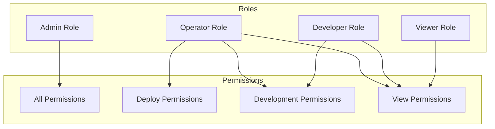
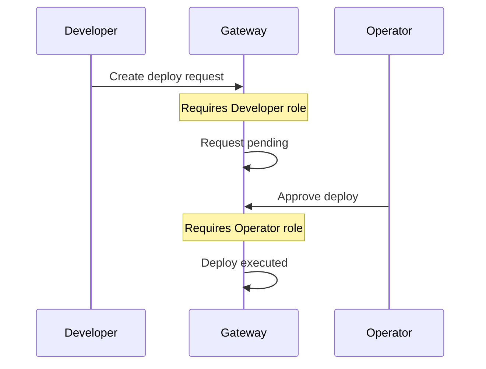
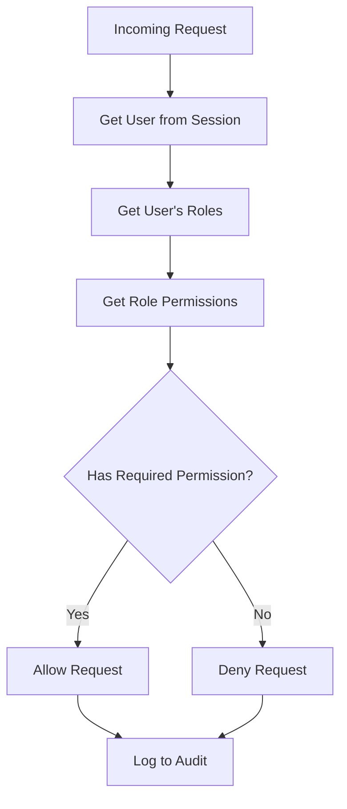

import { Aside, Steps } from '@astrojs/starlight/components';

Role-Based Access Control (RBAC) is a method of regulating access based on the roles of individual users. Instead of assigning permissions directly to users, permissions are grouped into roles, and roles are assigned to users.

## Why RBAC?

Managing permissions directly creates complexity:

```
Direct Assignment (100 users × 50 permissions = 5,000 relationships):
Alice → can_view_logs, can_deploy, can_manage_users, ...
Bob → can_view_logs, can_deploy, ...
Carol → can_view_logs, ...
(repeat for every user and permission)
```

RBAC simplifies this:

```
Role-Based (4 roles + user assignments):
Admin role → all permissions
Operator role → deploy, manage apps
Developer role → view, run commands
Viewer role → read-only

Alice → Admin
Bob → Operator
Carol → Developer
```

## Core RBAC Concepts

### Users

Individuals who need access to the system. In Rack Gateway, users are identified by their email addresses via Google OAuth.

### Roles

Named collections of permissions. Roles represent job functions or responsibilities:

- **Admin**: Full system control
- **Operator**: Day-to-day operations
- **Developer**: Development activities
- **Viewer**: Read-only observation

### Permissions

Specific actions that can be performed. Rack Gateway uses a hierarchical permission system:

```
convox:*                    # All Convox permissions
convox:app:*                # All app-related permissions
convox:app:list             # List applications
convox:app:create           # Create applications
convox:release:promote      # Promote releases (deploy)
```

### Role-Permission Mapping

Each role has a defined set of permissions:



## RBAC Design Principles

### Principle of Least Privilege

Users should have the minimum permissions necessary to perform their job:

| Role | Should Have | Should NOT Have |
|------|-------------|-----------------|
| Developer | Run exec, view logs | Deploy to production |
| Operator | Deploy, scale apps | Create users, modify RBAC |
| Viewer | View dashboards | Modify anything |

<Aside type="tip">
Start with minimal permissions and add more as needed. It's easier to grant additional access than to revoke excess access.
</Aside>

### Separation of Duties

Critical operations should require multiple roles:



Rack Gateway implements this through [deploy approvals](/integrations/deploy-approvals/).

### Role Hierarchy

Roles can inherit permissions from other roles:

```
Admin
  └── includes all Operator permissions
        └── includes all Developer permissions
              └── includes all Viewer permissions
```

Higher roles automatically have all permissions of lower roles.

### Named Roles, Not Ad-Hoc Permissions

❌ **Anti-pattern**: Creating permissions per user

```
alice_special_deploy_permission
bob_temp_admin_access
```

✅ **Best practice**: Using standard roles

```
Alice → Operator (has deploy permission)
Bob → Admin (temporary, will revert to Developer)
```

## Designing an RBAC System

### Step 1: Identify Resources

What needs to be protected?

- Applications
- Deployments
- Logs
- User accounts
- Configuration

### Step 2: Define Operations

What actions can be performed on each resource?

| Resource | Operations |
|----------|------------|
| Applications | list, create, delete, update |
| Deployments | create, promote, rollback |
| Logs | view, export |
| Users | list, create, update, delete |

### Step 3: Create Permissions

Combine resources and operations:

```
convox:app:list
convox:app:create
convox:app:delete
convox:release:create
convox:release:promote
convox:log:read
gateway:user:create
```

### Step 4: Define Roles

Group permissions by job function:

```yaml
viewer:
  - convox:app:list
  - convox:log:read

developer:
  - convox:app:list
  - convox:app:update
  - convox:log:read
  - convox:process:exec

operator:
  - convox:app:*
  - convox:release:*
  - convox:log:*

admin:
  - convox:*:*
  - gateway:*:*
```

### Step 5: Assign Roles to Users

Map users to appropriate roles:

```yaml
users:
  alice@example.com: admin
  bob@example.com: operator
  carol@example.com: developer
  dan@example.com: viewer
```

## RBAC in Rack Gateway

### Role Definitions

| Role | Purpose | Key Permissions |
|------|---------|-----------------|
| **Admin** | Full system access | All permissions including user management |
| **Deployer** | Production operations | Deploy, scale, environment management |
| **Ops** | Operational work | Run commands, view logs, manage processes |
| **Viewer** | Read-only access | View apps, logs, status |

### Permission Structure

Rack Gateway uses a hierarchical permission system:

```
gateway:*                     # All gateway permissions
gateway:user:*                # User management
gateway:api_token:*           # API token management
gateway:deploy_approval_request:* # Deploy approvals
gateway:setting:*             # Settings (individual)

convox:*                      # All Convox permissions
convox:app:*                  # App management
convox:build:*                # Build operations
convox:release:*              # Release/deploy operations
convox:env:*                  # Environment variables
convox:process:*              # Process operations
```

### Role Assignment

Roles are assigned through:

1. **Admin users list**: Users in `ADMIN_USERS` env var get Admin role
2. **Web UI**: Admins can assign roles to users
3. **API tokens**: Tokens can have specific roles

### Permission Checking

Every request is checked against the user's permissions:



## Common RBAC Patterns

### Role Explosion

**Problem**: Too many roles created for edge cases

```
developer_with_deploy
developer_with_env_access
developer_with_deploy_and_env
senior_developer
junior_developer
...
```

**Solution**: Use permission composition or attribute-based rules

### Role Creep

**Problem**: Roles accumulate permissions over time

```
# Started as:
developer: [read, write]

# After 2 years:
developer: [read, write, deploy, admin, debug, ...]
```

**Solution**: Regular role audits and permission reviews

### Orphaned Permissions

**Problem**: Permissions that no role uses

**Solution**: Audit permissions quarterly, remove unused ones

## Best Practices

### 1. Start Simple

Begin with basic roles and expand as needed:

```
v1.0: Admin, User
v2.0: Admin, Operator, Developer, Viewer
v3.0: Add specialized roles if truly needed
```

### 2. Document Role Intent

Each role should have clear documentation:

```yaml
operator:
  description: "Day-to-day production operations"
  intended_for: "DevOps team members on rotation"
  permissions:
    - Deploy applications
    - Scale services
    - View all logs
  does_not_include:
    - User management
    - RBAC configuration
    - Audit log deletion
```

### 3. Regular Audits

<Steps>

1. **Monthly**: Review user-role assignments
2. **Quarterly**: Review role-permission mappings
3. **Annually**: Review entire RBAC structure

</Steps>

### 4. Use Groups When Possible

If your organization has teams, map roles to groups:

```
engineering-team@example.com → Developer role
devops-team@example.com → Operator role
```

### 5. Implement MFA for Sensitive Roles

Require MFA for roles with elevated permissions:

```yaml
admin:
  requires_mfa: true
  mfa_frequency: every_action

operator:
  requires_mfa: true
  mfa_frequency: sensitive_actions

developer:
  requires_mfa: false
```

## RBAC vs Other Models

| Model | Description | Best For |
|-------|-------------|----------|
| **RBAC** | Roles with permissions | Most organizations |
| **ABAC** | Attribute-based policies | Complex rules (time, location) |
| **DAC** | Owner-controlled | File systems |
| **MAC** | Central authority | High-security environments |

Rack Gateway uses RBAC because it provides the right balance of security and usability for infrastructure access control.

## Key Takeaways

1. **RBAC simplifies management** by grouping permissions into roles
2. **Least privilege** means starting with minimal access
3. **Separation of duties** requires multiple roles for critical operations
4. **Regular audits** prevent role creep and orphaned permissions
5. **Simple role structures** are easier to maintain and understand

## Further Reading

- [RBAC Roles](/security/rbac/roles/) - Rack Gateway's specific roles
- [RBAC Permissions](/security/rbac/permissions/) - Complete permission reference
- [RBAC Best Practices](/security/rbac/best-practices/) - Operational guidelines
