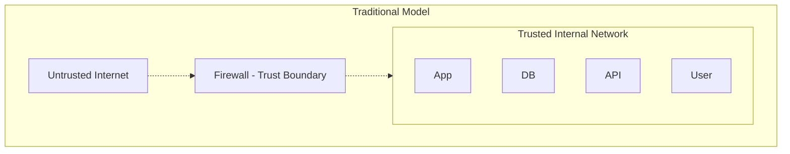
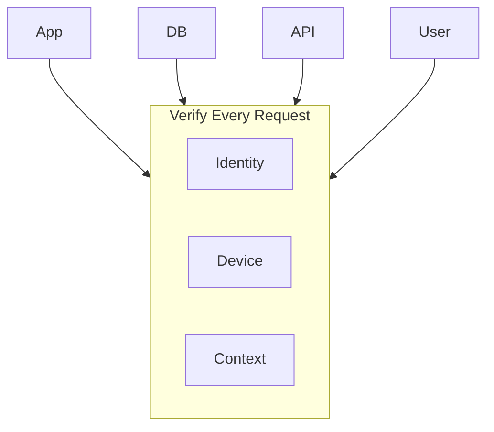
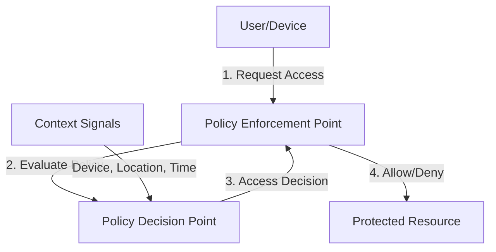
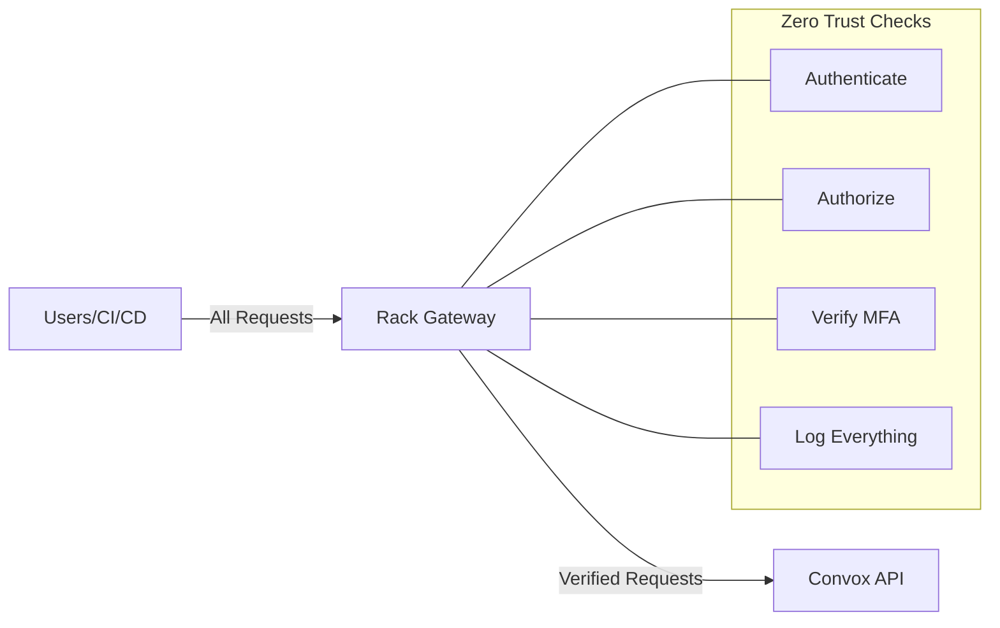
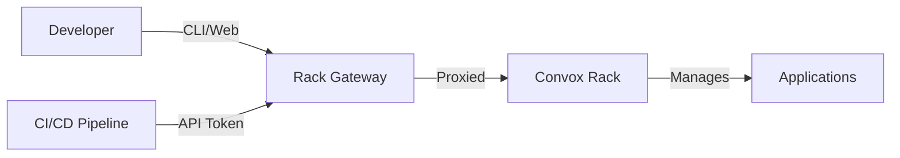

import { Aside, Steps } from '@astrojs/starlight/components';

Zero Trust is a security model based on the principle "never trust, always verify." It assumes that threats exist both inside and outside traditional network boundaries, requiring strict verification for every user and device.

## The End of the Perimeter

Traditional security relied on a network perimeter:



**Problem**: Once inside the perimeter, everything is trusted. A single compromised credential or device gives access to everything.

Zero Trust eliminates implicit trust:



## Core Principles

### 1. Verify Explicitly

Always authenticate and authorize based on all available data points:

- **User identity**: Who is making the request?
- **Device health**: Is the device compliant?
- **Location**: Where is the request coming from?
- **Service identity**: What service is requesting access?
- **Data classification**: How sensitive is the resource?

### 2. Use Least Privilege Access

Grant minimum access necessary, just-in-time:

```
Traditional:  Bob → Permanent Admin Access → All Resources
Zero Trust:   Bob → Temporary Elevated Access → Specific Resource
              ↓     (expires after task)        (for this task only)
```

### 3. Assume Breach

Design systems assuming adversaries are already inside:

- **Segment networks**: Limit lateral movement
- **Encrypt everything**: Protect data in transit and at rest
- **Log everything**: Enable detection and forensics
- **Minimize blast radius**: Contain compromises

## Zero Trust Architecture



**Components:**

- **Policy Enforcement Point (PEP)**: Intercepts all access requests
- **Policy Decision Point (PDP)**: Evaluates policies against context
- **Context Signals**: Identity, device, location, behavior, etc.

## How Rack Gateway Implements Zero Trust

Rack Gateway is a Policy Enforcement Point for your Convox infrastructure:



### Verify Explicitly

Every request to Rack Gateway is verified:

| Check | Implementation |
|-------|----------------|
| **Identity** | Google OAuth + session tokens |
| **Authorization** | RBAC permission check |
| **MFA Status** | Step-up MFA for sensitive operations |
| **Session Validity** | Token expiration, session timeout |
| **API Token** | Token validation for CI/CD |

### Least Privilege

Rack Gateway enforces minimum necessary access:

<Steps>

1. **Role-based permissions**: Users only have access their role grants
2. **Action-specific authorization**: Each operation is separately authorized
3. **Deploy approvals**: Critical operations require explicit approval
4. **Session timeouts**: Access automatically expires

</Steps>

### Assume Breach

Rack Gateway is designed for breach scenarios:

| Defense | Purpose |
|---------|---------|
| **Immutable audit logs** | Attackers can't cover tracks |
| **S3 WORM anchoring** | Logs protected from deletion |
| **Session isolation** | Compromise of one session doesn't affect others |
| **Secret redaction** | Sensitive data not exposed in logs |

## Zero Trust vs Traditional Security

| Aspect | Traditional | Zero Trust |
|--------|-------------|------------|
| **Trust model** | Trust internal network | Trust nothing |
| **Access control** | Network-based | Identity-based |
| **Default stance** | Allow unless blocked | Block unless allowed |
| **Verification** | At perimeter only | Every request |
| **Segmentation** | Network segments | Micro-segmentation |
| **Visibility** | Perimeter logs | Full request logging |

## Implementing Zero Trust

### Step 1: Identify Your Assets

What needs protection?

```
Critical:
- Production databases
- Customer data
- API keys and secrets
- Infrastructure access (← Rack Gateway protects this)

Important:
- Staging environments
- Internal tools
- Development systems
```

### Step 2: Map Transaction Flows

How do users and systems access resources?



### Step 3: Architect Your Zero Trust Network

Place enforcement points at critical junctions:

```
Before:
  Developer → SSH → Production Server

After:
  Developer → Rack Gateway → MFA → RBAC → Audit → Convox → Production
              ↑
              Zero Trust Enforcement Point
```

### Step 4: Create Policies

Define access rules based on context:

```yaml
# Example policy structure
policies:
  - name: "Production Deploy"
    conditions:
      - user.role in ["operator", "admin"]
      - user.mfa_verified == true
      - request.type == "deploy"
    actions:
      - require_approval
      - log_enhanced
      - notify_slack
```

### Step 5: Monitor and Adapt

Continuously verify and improve:

- **Analyze access patterns**: Detect anomalies
- **Review denied requests**: Tune policies
- **Audit permissions**: Remove unused access
- **Update policies**: Respond to new threats

## Zero Trust and Compliance

Zero Trust aligns with compliance frameworks:

### SOC 2

| Trust Service Criteria | Zero Trust Implementation |
|----------------------|---------------------------|
| **CC6.1** Security | Every request authenticated and authorized |
| **CC6.2** Access Control | RBAC with least privilege |
| **CC6.3** System Boundaries | Gateway as enforcement point |
| **CC7.1** Change Management | Deploy approvals and audit logs |

### NIST 800-207

NIST's Zero Trust Architecture framework aligns with:

- **Policy Engine**: Rack Gateway's RBAC system
- **Policy Administrator**: Gateway's session and token management
- **Policy Enforcement Point**: Gateway's request proxying

## Common Misconceptions

### "Zero Trust means no trust"

Zero Trust means **explicit trust verification**, not absence of trust. After verification, appropriate access is granted.

### "VPNs provide Zero Trust"

VPNs extend the network perimeter but don't implement Zero Trust principles. Users inside a VPN still have broad access.

<Aside type="note">
Rack Gateway can work alongside VPNs. The VPN provides network access; Gateway provides identity-based access control on top.
</Aside>

### "Zero Trust is a product"

Zero Trust is a **strategy**, not a product. It requires multiple components working together. Rack Gateway is one component of a Zero Trust architecture.

### "Zero Trust is only for cloud"

Zero Trust applies to any environment—cloud, on-premises, or hybrid. The principles remain the same.

## Practical Zero Trust Checklist

<Steps>

1. **Strong Authentication**
   - [ ] Multi-factor authentication enabled
   - [ ] OAuth with verified identity provider
   - [ ] Session timeouts configured

2. **Authorization**
   - [ ] Role-based access control
   - [ ] Least privilege principle applied
   - [ ] Separation of duties enforced

3. **Micro-segmentation**
   - [ ] Gateway as single entry point
   - [ ] Internal services not directly accessible
   - [ ] Network policies restrict lateral movement

4. **Visibility**
   - [ ] All access logged
   - [ ] Logs tamper-evident (WORM storage)
   - [ ] Alerting on anomalies

5. **Continuous Verification**
   - [ ] Session validity checked each request
   - [ ] Step-up MFA for sensitive operations
   - [ ] Regular access reviews

</Steps>

## Key Takeaways

1. **Never trust, always verify**: Every request is authenticated and authorized
2. **Assume breach**: Design for adversaries already inside
3. **Least privilege**: Grant minimum access for minimum time
4. **Visibility**: Log everything for detection and forensics
5. **Context-aware**: Decisions based on identity, device, location, and behavior

## Further Reading

- [Security Hardening](/security/hardening/) - Practical security configuration
- [Audit Logging](/concepts/audit-logging/) - Building tamper-evident records
- [Private Network Deployment](/deployment/private-network/) - Limiting network exposure
