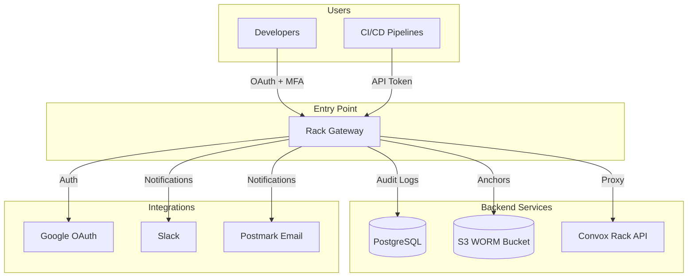
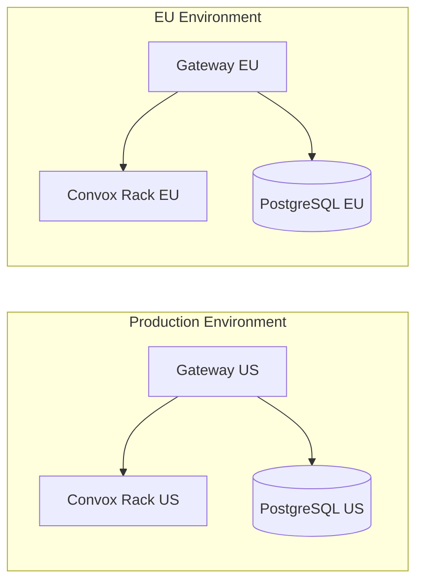

import { Aside, CardGrid, LinkCard, Steps } from '@astrojs/starlight/components';

Rack Gateway can be deployed using Docker, Convox, or any container orchestration platform. This section covers deployment options, infrastructure setup, and production best practices.

## Deployment Options

<CardGrid>
  <LinkCard
    title="Docker"
    description="Run with Docker Compose or standalone containers."
    href="/deployment/docker/"
  />
  <LinkCard
    title="Convox"
    description="Deploy on Convox racks (recommended for production)."
    href="/deployment/convox/"
  />
  <LinkCard
    title="Private Network"
    description="Deploy behind Tailscale or VPN for maximum security."
    href="/deployment/private-network/"
  />
  <LinkCard
    title="Terraform"
    description="Infrastructure as code for AWS resources."
    href="/deployment/terraform/"
  />
</CardGrid>

## Architecture Overview

## Deployment Model

Rack Gateway follows a **single-tenant, per-rack** deployment model:

| Aspect | Description |
|--------|-------------|
| **One gateway per rack** | Each Convox rack has its own gateway instance |
| **No multi-tenancy** | Gateway manages exactly one rack |
| **Shared database** | Gateway uses its own PostgreSQL database |
| **Private network** | Recommended: Deploy behind Tailscale/VPN |

## Prerequisites

Before deploying, ensure you have:

### Required

- **PostgreSQL 14+** - Database for users, tokens, audit logs
- **Google Workspace** - OAuth provider for authentication
- **Domain name** - For gateway API and web UI

### Recommended

- **Tailscale** - Private network access
- **Postmark** - Email notifications
- **Slack** - Real-time notifications
- **S3 bucket** - WORM storage for audit anchoring

## Quick Start Path

<Steps>

1. **Set up infrastructure**

   Create PostgreSQL database and S3 bucket (if using audit anchoring).

2. **Configure OAuth**

   Create Google OAuth client with correct redirect URIs.

3. **Set environment variables**

   Configure all required environment variables for your deployment method.

4. **Deploy**

   Choose Docker for testing, Convox for production.

5. **Verify**

   Check health endpoints and log in to web UI.

6. **Harden**

   Follow the production checklist for security hardening.

</Steps>

## Environment Configuration

All deployments use the same environment variables. Key categories:

| Category | Variables | Purpose |
|----------|-----------|---------|
| **Core** | `APP_SECRET_KEY`, `DOMAIN` | Security and routing |
| **OAuth** | `GOOGLE_CLIENT_*`, `GOOGLE_ALLOWED_DOMAIN` | Authentication |
| **Database** | `DATABASE_URL`, `DB_*` | PostgreSQL connection |
| **Rack** | `RACK_TOKEN`, `RACK_HOST` | Convox connectivity |
| **Email** | `POSTMARK_*` | Email notifications |
| **Audit** | `AUDIT_*`, S3 settings | Audit log anchoring |

See [Environment Variables](/configuration/environment-variables/) for the complete reference.

## Deployment Guides

### By Platform

| Platform | Use Case | Guide |
|----------|----------|-------|
| **Docker** | Development, testing | [Docker Deployment](/deployment/docker/) |
| **Convox** | Production deployments | [Convox Deployment](/deployment/convox/) |
| **Kubernetes** | Custom orchestration | Use Docker image directly |

### By Security Level

| Level | Setup | When to Use |
|-------|-------|-------------|
| **Standard** | Public gateway + OAuth | Internal tools, low-risk |
| **Private** | Tailscale + OAuth | Sensitive infrastructure |
| **Maximum** | Private + MFA + Audit anchoring | Compliance requirements |

## Infrastructure Components

### Required

| Component | Purpose | Sizing |
|-----------|---------|--------|
| **PostgreSQL** | User data, audit logs | 10GB minimum, scale with logs |
| **Gateway container** | API server | 256MB RAM, 0.25 CPU minimum |
| **Web container** | Static SPA | 64MB RAM, minimal CPU |

### Optional (Recommended)

| Component | Purpose | Guide |
|-----------|---------|-------|
| **S3 WORM bucket** | Audit anchoring | [S3 WORM Storage](/deployment/terraform/s3-worm-storage/) |
| **KMS key** | Encryption at rest | [AWS Infrastructure](/deployment/terraform/aws-infrastructure/) |
| **Tailscale** | Private networking | [Private Network](/deployment/private-network/) |

## Production Readiness

<Aside type="tip">
Before going to production, review the [Production Checklist](/deployment/production-checklist/) to ensure your deployment meets security requirements.
</Aside>

Key production requirements:

- [ ] Strong `APP_SECRET_KEY` (256-bit random)
- [ ] HTTPS with valid certificates
- [ ] Database backups configured
- [ ] Audit log retention set (`LOG_RETENTION_DAYS`)
- [ ] Admin users configured
- [ ] MFA policies enforced
- [ ] Monitoring and alerting enabled

## Next Steps

- [Docker Deployment](/deployment/docker/) - Quick start with Docker
- [Convox Deployment](/deployment/convox/) - Production deployment
- [Database Setup](/deployment/database-setup/) - PostgreSQL configuration
- [Production Checklist](/deployment/production-checklist/) - Go-live preparation
