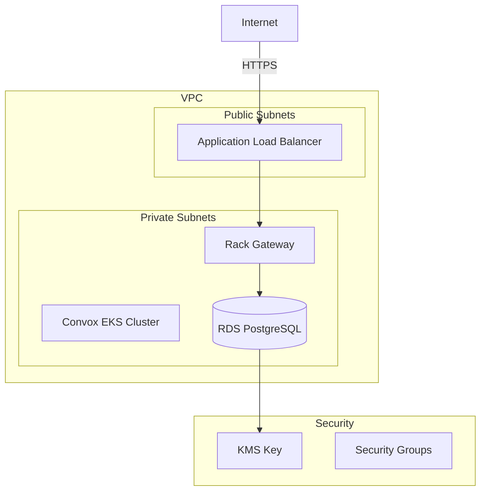

import { Aside, Steps, Tabs, TabItem } from '@astrojs/starlight/components';

This guide covers provisioning AWS infrastructure for Rack Gateway using Terraform, including RDS PostgreSQL, security groups, KMS encryption, and IAM roles.

## Infrastructure Overview



## RDS PostgreSQL

### Basic Configuration

```hcl
resource "aws_db_instance" "gateway" {
  identifier     = "rack-gateway-${var.environment}"
  engine         = "postgres"
  engine_version = "16.1"

  # Instance sizing
  instance_class = var.db_instance_class  # e.g., "db.t3.medium"

  # Storage
  allocated_storage     = var.db_allocated_storage  # e.g., 50
  max_allocated_storage = var.db_max_storage        # e.g., 200
  storage_type          = "gp3"
  storage_encrypted     = true
  kms_key_id            = aws_kms_key.database.arn

  # Database settings
  db_name  = "rack_gateway"
  username = "rack_gateway_admin"
  password = var.db_password
  port     = 5432

  # Networking
  db_subnet_group_name   = aws_db_subnet_group.gateway.name
  vpc_security_group_ids = [aws_security_group.rds.id]
  publicly_accessible    = false

  # Backup and maintenance
  backup_retention_period = 30
  backup_window           = "03:00-04:00"
  maintenance_window      = "sun:04:00-sun:05:00"
  copy_tags_to_snapshot   = true

  # Protection
  deletion_protection = var.environment == "production"
  skip_final_snapshot = false
  final_snapshot_identifier = "rack-gateway-${var.environment}-final"

  # Performance monitoring
  performance_insights_enabled          = true
  performance_insights_retention_period = 7
  monitoring_interval                   = 60
  monitoring_role_arn                   = aws_iam_role.rds_monitoring.arn

  tags = merge(var.tags, {
    Name = "rack-gateway-${var.environment}"
  })
}
```

### Database Subnet Group

```hcl
resource "aws_db_subnet_group" "gateway" {
  name       = "rack-gateway-${var.environment}"
  subnet_ids = var.private_subnet_ids

  tags = merge(var.tags, {
    Name = "rack-gateway-${var.environment}"
  })
}
```

### RDS Security Group

```hcl
resource "aws_security_group" "rds" {
  name        = "rack-gateway-rds-${var.environment}"
  description = "Security group for Rack Gateway RDS"
  vpc_id      = var.vpc_id

  # Allow PostgreSQL from gateway
  ingress {
    description     = "PostgreSQL from Gateway"
    from_port       = 5432
    to_port         = 5432
    protocol        = "tcp"
    security_groups = [var.gateway_security_group_id]
  }

  # Allow from Tailscale (for admin access)
  ingress {
    description = "PostgreSQL from Tailscale"
    from_port   = 5432
    to_port     = 5432
    protocol    = "tcp"
    cidr_blocks = var.tailscale_cidr_blocks
  }

  egress {
    from_port   = 0
    to_port     = 0
    protocol    = "-1"
    cidr_blocks = ["0.0.0.0/0"]
  }

  tags = merge(var.tags, {
    Name = "rack-gateway-rds-${var.environment}"
  })
}
```

## KMS Encryption

### Database Encryption Key

```hcl
resource "aws_kms_key" "database" {
  description             = "Rack Gateway database encryption - ${var.environment}"
  deletion_window_in_days = 30
  enable_key_rotation     = true

  policy = jsonencode({
    Version = "2012-10-17"
    Statement = [
      {
        Sid    = "Enable IAM User Permissions"
        Effect = "Allow"
        Principal = {
          AWS = "arn:aws:iam::${data.aws_caller_identity.current.account_id}:root"
        }
        Action   = "kms:*"
        Resource = "*"
      },
      {
        Sid    = "Allow RDS Service"
        Effect = "Allow"
        Principal = {
          Service = "rds.amazonaws.com"
        }
        Action = [
          "kms:Encrypt",
          "kms:Decrypt",
          "kms:ReEncrypt*",
          "kms:GenerateDataKey*",
          "kms:DescribeKey"
        ]
        Resource = "*"
      }
    ]
  })

  tags = merge(var.tags, {
    Name = "rack-gateway-db-${var.environment}"
  })
}

resource "aws_kms_alias" "database" {
  name          = "alias/rack-gateway-db-${var.environment}"
  target_key_id = aws_kms_key.database.key_id
}
```

### S3 Encryption Key

```hcl
resource "aws_kms_key" "s3" {
  description             = "Rack Gateway S3 encryption - ${var.environment}"
  deletion_window_in_days = 30
  enable_key_rotation     = true

  policy = jsonencode({
    Version = "2012-10-17"
    Statement = [
      {
        Sid    = "Enable IAM User Permissions"
        Effect = "Allow"
        Principal = {
          AWS = "arn:aws:iam::${data.aws_caller_identity.current.account_id}:root"
        }
        Action   = "kms:*"
        Resource = "*"
      },
      {
        Sid    = "Allow Gateway Service"
        Effect = "Allow"
        Principal = {
          AWS = aws_iam_role.gateway.arn
        }
        Action = [
          "kms:Encrypt",
          "kms:Decrypt",
          "kms:GenerateDataKey"
        ]
        Resource = "*"
      }
    ]
  })

  tags = merge(var.tags, {
    Name = "rack-gateway-s3-${var.environment}"
  })
}

resource "aws_kms_alias" "s3" {
  name          = "alias/rack-gateway-s3-${var.environment}"
  target_key_id = aws_kms_key.s3.key_id
}
```

## IAM Roles

### Gateway Service Role

```hcl
resource "aws_iam_role" "gateway" {
  name = "rack-gateway-${var.environment}"

  assume_role_policy = jsonencode({
    Version = "2012-10-17"
    Statement = [
      {
        Action = "sts:AssumeRole"
        Effect = "Allow"
        Principal = {
          Service = "ecs-tasks.amazonaws.com"
        }
      }
    ]
  })

  tags = var.tags
}

resource "aws_iam_role_policy" "gateway_s3" {
  name = "s3-access"
  role = aws_iam_role.gateway.id

  policy = jsonencode({
    Version = "2012-10-17"
    Statement = [
      {
        Effect = "Allow"
        Action = [
          "s3:PutObject",
          "s3:PutObjectRetention",
          "s3:GetObject",
          "s3:ListBucket"
        ]
        Resource = [
          aws_s3_bucket.audit_anchors.arn,
          "${aws_s3_bucket.audit_anchors.arn}/*"
        ]
      }
    ]
  })
}

resource "aws_iam_role_policy" "gateway_kms" {
  name = "kms-access"
  role = aws_iam_role.gateway.id

  policy = jsonencode({
    Version = "2012-10-17"
    Statement = [
      {
        Effect = "Allow"
        Action = [
          "kms:Encrypt",
          "kms:Decrypt",
          "kms:GenerateDataKey"
        ]
        Resource = [
          aws_kms_key.s3.arn
        ]
      }
    ]
  })
}
```

### RDS Monitoring Role

```hcl
resource "aws_iam_role" "rds_monitoring" {
  name = "rack-gateway-rds-monitoring-${var.environment}"

  assume_role_policy = jsonencode({
    Version = "2012-10-17"
    Statement = [
      {
        Action = "sts:AssumeRole"
        Effect = "Allow"
        Principal = {
          Service = "monitoring.rds.amazonaws.com"
        }
      }
    ]
  })

  tags = var.tags
}

resource "aws_iam_role_policy_attachment" "rds_monitoring" {
  role       = aws_iam_role.rds_monitoring.name
  policy_arn = "arn:aws:iam::aws:policy/service-role/AmazonRDSEnhancedMonitoringRole"
}
```

## CloudWatch Alarms

### Database Alarms

```hcl
resource "aws_cloudwatch_metric_alarm" "db_cpu" {
  alarm_name          = "rack-gateway-db-cpu-${var.environment}"
  comparison_operator = "GreaterThanThreshold"
  evaluation_periods  = 3
  metric_name         = "CPUUtilization"
  namespace           = "AWS/RDS"
  period              = 300
  statistic           = "Average"
  threshold           = 80

  dimensions = {
    DBInstanceIdentifier = aws_db_instance.gateway.identifier
  }

  alarm_actions = var.alarm_sns_topic_arns
  ok_actions    = var.alarm_sns_topic_arns

  tags = var.tags
}

resource "aws_cloudwatch_metric_alarm" "db_connections" {
  alarm_name          = "rack-gateway-db-connections-${var.environment}"
  comparison_operator = "GreaterThanThreshold"
  evaluation_periods  = 2
  metric_name         = "DatabaseConnections"
  namespace           = "AWS/RDS"
  period              = 300
  statistic           = "Average"
  threshold           = 40  # Adjust based on max_connections

  dimensions = {
    DBInstanceIdentifier = aws_db_instance.gateway.identifier
  }

  alarm_actions = var.alarm_sns_topic_arns

  tags = var.tags
}

resource "aws_cloudwatch_metric_alarm" "db_storage" {
  alarm_name          = "rack-gateway-db-storage-${var.environment}"
  comparison_operator = "LessThanThreshold"
  evaluation_periods  = 1
  metric_name         = "FreeStorageSpace"
  namespace           = "AWS/RDS"
  period              = 300
  statistic           = "Average"
  threshold           = 10737418240  # 10 GB in bytes

  dimensions = {
    DBInstanceIdentifier = aws_db_instance.gateway.identifier
  }

  alarm_actions = var.alarm_sns_topic_arns

  tags = var.tags
}
```

## Variables

```hcl
# variables.tf

variable "environment" {
  description = "Environment name (staging, production)"
  type        = string
}

variable "vpc_id" {
  description = "VPC ID"
  type        = string
}

variable "private_subnet_ids" {
  description = "List of private subnet IDs"
  type        = list(string)
}

variable "gateway_security_group_id" {
  description = "Security group ID of the gateway service"
  type        = string
}

variable "tailscale_cidr_blocks" {
  description = "CIDR blocks for Tailscale access"
  type        = list(string)
  default     = []
}

variable "db_instance_class" {
  description = "RDS instance class"
  type        = string
  default     = "db.t3.small"
}

variable "db_allocated_storage" {
  description = "Initial storage allocation in GB"
  type        = number
  default     = 50
}

variable "db_max_storage" {
  description = "Maximum storage for autoscaling in GB"
  type        = number
  default     = 200
}

variable "db_password" {
  description = "Database password"
  type        = string
  sensitive   = true
}

variable "alarm_sns_topic_arns" {
  description = "SNS topic ARNs for CloudWatch alarms"
  type        = list(string)
  default     = []
}

variable "tags" {
  description = "Tags to apply to all resources"
  type        = map(string)
  default     = {}
}
```

## Outputs

```hcl
# outputs.tf

output "database_endpoint" {
  description = "RDS endpoint"
  value       = aws_db_instance.gateway.endpoint
}

output "database_url" {
  description = "Database connection URL"
  value       = "postgres://${aws_db_instance.gateway.username}:${var.db_password}@${aws_db_instance.gateway.endpoint}/${aws_db_instance.gateway.db_name}"
  sensitive   = true
}

output "database_security_group_id" {
  description = "RDS security group ID"
  value       = aws_security_group.rds.id
}

output "kms_key_database_arn" {
  description = "KMS key ARN for database encryption"
  value       = aws_kms_key.database.arn
}

output "kms_key_s3_arn" {
  description = "KMS key ARN for S3 encryption"
  value       = aws_kms_key.s3.arn
}

output "gateway_role_arn" {
  description = "IAM role ARN for gateway service"
  value       = aws_iam_role.gateway.arn
}
```

## Usage Example

```hcl
# environments/production/main.tf

module "rack_gateway_infra" {
  source = "../../modules/rack_gateway"

  environment               = "production"
  vpc_id                    = data.aws_vpc.main.id
  private_subnet_ids        = data.aws_subnets.private.ids
  gateway_security_group_id = data.aws_security_group.convox.id

  db_instance_class    = "db.t3.medium"
  db_allocated_storage = 100
  db_max_storage       = 500
  db_password          = var.db_password

  tailscale_cidr_blocks = ["100.64.0.0/10"]  # Tailscale CGNAT range

  alarm_sns_topic_arns = [aws_sns_topic.alerts.arn]

  tags = {
    Environment = "production"
    Project     = "rack-gateway"
    ManagedBy   = "terraform"
  }
}
```

## Sizing Guidelines

| Environment | Instance Class | Storage | Use Case |
|-------------|---------------|---------|----------|
| Development | db.t3.micro | 20 GB | Testing |
| Staging | db.t3.small | 50 GB | Pre-production |
| Production (small) | db.t3.medium | 100 GB | &lt;1000 users |
| Production (large) | db.r6g.large | 500 GB | &gt;1000 users |

## Security Best Practices

<Aside type="tip">

**Recommended Security Settings:**

- Enable encryption at rest with customer-managed KMS keys
- Use security groups to restrict access to known sources only
- Enable Performance Insights for query monitoring
- Configure deletion protection for production
- Use IAM database authentication when possible
- Enable automated backups with appropriate retention

</Aside>

## Next Steps

- [S3 WORM Storage](/deployment/terraform/s3-worm-storage/) - Audit log anchoring
- [Multi-Region](/deployment/terraform/multi-region/) - Cross-region deployment
- [Production Checklist](/deployment/production-checklist/) - Go-live preparation
