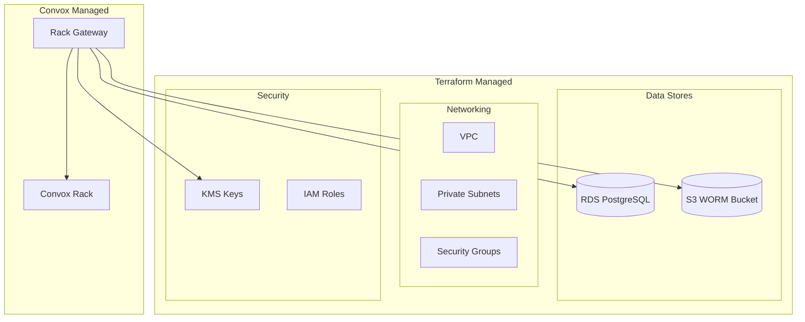

import { Aside, CardGrid, LinkCard, Steps } from '@astrojs/starlight/components';

This section covers using Terraform to provision AWS infrastructure for Rack Gateway, including RDS, S3 WORM buckets, KMS keys, and networking.

## Why Terraform?

Managing Rack Gateway infrastructure with Terraform provides:

- **Reproducibility** - Same infrastructure across environments
- **Version control** - Track infrastructure changes in git
- **Automation** - CI/CD for infrastructure deployments
- **Documentation** - Code is documentation

## Infrastructure Components

<CardGrid>
  <LinkCard
    title="AWS Infrastructure"
    description="VPC, RDS, security groups, and IAM."
    href="/deployment/terraform/aws-infrastructure/"
  />
  <LinkCard
    title="S3 WORM Storage"
    description="Immutable audit log anchoring."
    href="/deployment/terraform/s3-worm-storage/"
  />
  <LinkCard
    title="Multi-Region"
    description="Deploy across multiple regions."
    href="/deployment/terraform/multi-region/"
  />
</CardGrid>

## Architecture Overview



## Module Structure

```
terraform/
├── modules/
│   ├── rack_gateway/           # Main gateway module
│   │   ├── main.tf             # RDS, S3, KMS resources
│   │   ├── variables.tf        # Input variables
│   │   ├── outputs.tf          # Output values
│   │   └── iam.tf              # IAM roles and policies
│   └── networking/             # VPC and subnets
│       ├── main.tf
│       └── variables.tf
├── environments/
│   ├── staging/
│   │   ├── main.tf             # Staging configuration
│   │   └── terraform.tfvars    # Staging values
│   └── production/
│       ├── main.tf             # Production configuration
│       └── terraform.tfvars    # Production values
└── global/
    └── shared/                 # Cross-environment resources
```

## Quick Start

<Steps>

1. **Initialize Terraform**

   ```bash
   cd terraform/environments/production
   terraform init
   ```

2. **Review the plan**

   ```bash
   terraform plan -out=plan.tfplan
   ```

3. **Apply changes**

   ```bash
   terraform apply plan.tfplan
   ```

4. **Retrieve outputs**

   ```bash
   terraform output database_url
   terraform output audit_anchor_bucket
   ```

</Steps>

## Minimal Configuration

```hcl
# main.tf
module "rack_gateway" {
  source = "../../modules/rack_gateway"

  environment = "production"
  vpc_id      = var.vpc_id
  subnet_ids  = var.private_subnet_ids

  # Database
  db_instance_class = "db.t3.medium"
  db_password       = var.db_password

  # S3 WORM
  enable_audit_anchoring = true
  worm_retention_days    = 400

  # Tags
  tags = {
    Environment = "production"
    Project     = "rack-gateway"
  }
}
```

## Module Reference

### rack_gateway Module

| Variable | Type | Required | Description |
|----------|------|----------|-------------|
| `environment` | string | Yes | Environment name (staging, production) |
| `vpc_id` | string | Yes | VPC ID for resources |
| `subnet_ids` | list | Yes | Private subnet IDs |
| `db_instance_class` | string | No | RDS instance type (default: db.t3.small) |
| `db_password` | string | Yes | Database password (sensitive) |
| `enable_audit_anchoring` | bool | No | Enable S3 WORM bucket (default: true) |
| `worm_retention_days` | number | No | Object Lock retention (default: 400) |

### Outputs

| Output | Description |
|--------|-------------|
| `database_url` | PostgreSQL connection string |
| `database_host` | RDS endpoint hostname |
| `audit_anchor_bucket` | S3 bucket name for anchors |
| `kms_key_arn` | KMS key ARN for encryption |
| `iam_role_arn` | IAM role for S3 access |

## State Management

### Remote State (Recommended)

Store Terraform state in S3 with locking:

```hcl
# backend.tf
terraform {
  backend "s3" {
    bucket         = "myorg-terraform-state"
    key            = "rack-gateway/production/terraform.tfstate"
    region         = "us-east-1"
    encrypt        = true
    dynamodb_table = "terraform-locks"
  }
}
```

### State Locking

Create the DynamoDB table for state locking:

```hcl
resource "aws_dynamodb_table" "terraform_locks" {
  name         = "terraform-locks"
  billing_mode = "PAY_PER_REQUEST"
  hash_key     = "LockID"

  attribute {
    name = "LockID"
    type = "S"
  }
}
```

## Security Considerations

### Sensitive Variables

Never commit secrets to git. Use:

- Terraform Cloud/Enterprise variables
- AWS Secrets Manager
- Environment variables

```hcl
# terraform.tfvars (add to .gitignore)
db_password = "secure-password-here"
```

Or use environment variables:

```bash
export TF_VAR_db_password="secure-password-here"
terraform apply
```

### IAM Permissions

Terraform needs these AWS permissions:

```json
{
  "Version": "2012-10-17",
  "Statement": [
    {
      "Effect": "Allow",
      "Action": [
        "rds:*",
        "s3:*",
        "kms:*",
        "iam:*",
        "ec2:Describe*",
        "ec2:CreateSecurityGroup",
        "ec2:DeleteSecurityGroup",
        "ec2:AuthorizeSecurityGroupIngress",
        "ec2:RevokeSecurityGroupIngress"
      ],
      "Resource": "*"
    }
  ]
}
```

<Aside type="tip">
For production, scope permissions more narrowly using resource ARNs.
</Aside>

## CI/CD Integration

### GitHub Actions

```yaml
name: Terraform

on:
  push:
    branches: [main]
    paths: ['terraform/**']
  pull_request:
    paths: ['terraform/**']

jobs:
  terraform:
    runs-on: ubuntu-latest
    defaults:
      run:
        working-directory: terraform/environments/production

    steps:
      - uses: actions/checkout@v4

      - uses: hashicorp/setup-terraform@v3
        with:
          terraform_version: 1.6

      - name: Terraform Init
        run: terraform init

      - name: Terraform Plan
        run: terraform plan -no-color
        env:
          TF_VAR_db_password: ${{ secrets.DB_PASSWORD }}

      - name: Terraform Apply
        if: github.ref == 'refs/heads/main'
        run: terraform apply -auto-approve
        env:
          TF_VAR_db_password: ${{ secrets.DB_PASSWORD }}
```

## Importing Existing Resources

If you have existing infrastructure:

```bash
# Import existing RDS instance
terraform import module.rack_gateway.aws_db_instance.main rack-gateway

# Import existing S3 bucket
terraform import module.rack_gateway.aws_s3_bucket.audit_anchors audit-anchors-prod
```

## Troubleshooting

### State Issues

```bash
# List state resources
terraform state list

# Show resource details
terraform state show module.rack_gateway.aws_db_instance.main

# Remove resource from state (careful!)
terraform state rm module.rack_gateway.aws_db_instance.main
```

### Plan Diffs

If Terraform shows unexpected changes:

1. Check for manual changes in AWS console
2. Verify variable values match current state
3. Run `terraform refresh` to sync state

### Resource Dependencies

If resources fail to create in order:

```hcl
# Explicit dependency
resource "aws_db_instance" "main" {
  depends_on = [aws_security_group.rds]
  # ...
}
```

## Best Practices

### Environment Isolation

- Separate state files per environment
- Different AWS accounts for prod/non-prod
- Consistent naming conventions

### Change Management

- Always review plans before applying
- Use workspaces or directories for environments
- Tag resources for cost tracking

### Documentation

- Document module inputs/outputs
- Include architecture diagrams
- Maintain runbooks for common operations

## Next Steps

- [AWS Infrastructure](/deployment/terraform/aws-infrastructure/) - VPC, RDS, IAM setup
- [S3 WORM Storage](/deployment/terraform/s3-worm-storage/) - Audit anchoring
- [Multi-Region](/deployment/terraform/multi-region/) - Cross-region deployment
