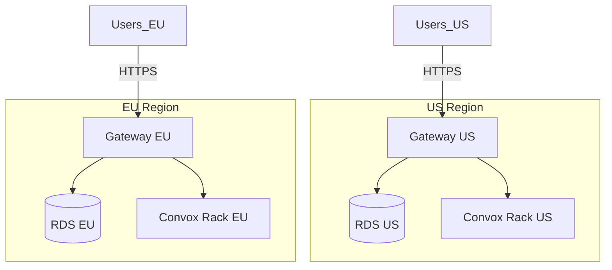
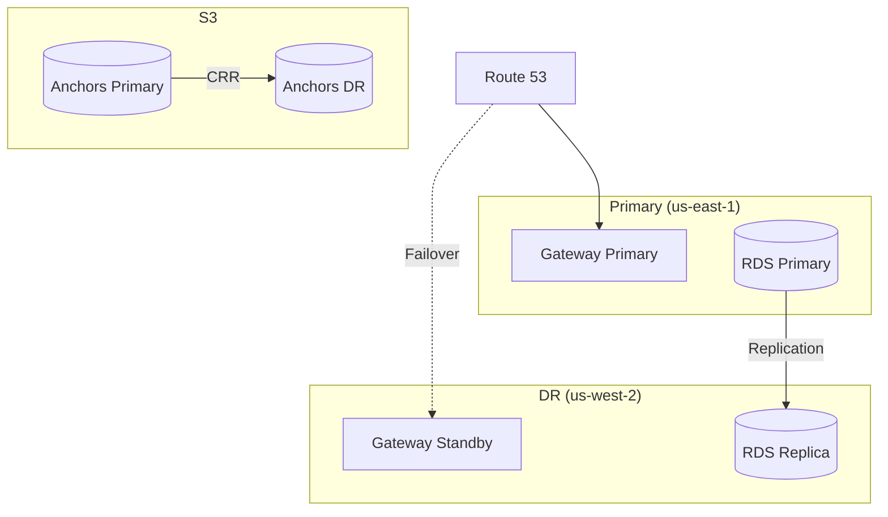

import { Aside, Steps, Tabs, TabItem } from '@astrojs/starlight/components';

This guide covers deploying Rack Gateway across multiple AWS regions for geographic distribution, compliance requirements, or disaster recovery.

## When to Use Multi-Region

| Scenario | Recommendation |
|----------|----------------|
| **Data residency requirements** | Deploy in required regions |
| **Disaster recovery** | Active-passive with replication |
| **Global team distribution** | Regional gateways per team location |
| **Compliance (GDPR, data sovereignty)** | Dedicated EU deployment |

## Architecture Patterns

### Pattern 1: Regional Isolation

Each region operates independently with its own gateway and database:



**Use when:**
- Data must not cross regional boundaries
- Each region manages separate infrastructure
- GDPR or similar compliance requirements

### Pattern 2: Active-Passive DR

Primary region handles traffic; secondary is standby:



**Use when:**
- High availability requirements
- RTO/RPO targets need geographic redundancy
- Cost-effective DR solution needed

## Terraform Module Structure

```
terraform/
├── modules/
│   └── rack_gateway/
│       ├── main.tf
│       ├── variables.tf
│       └── outputs.tf
├── environments/
│   ├── us/
│   │   ├── main.tf
│   │   ├── providers.tf
│   │   └── terraform.tfvars
│   └── eu/
│       ├── main.tf
│       ├── providers.tf
│       └── terraform.tfvars
└── global/
    └── dns/
        └── main.tf
```

## Regional Deployment

### Provider Configuration

```hcl
# environments/us/providers.tf
terraform {
  required_providers {
    aws = {
      source  = "hashicorp/aws"
      version = "~> 5.0"
    }
  }

  backend "s3" {
    bucket         = "myorg-terraform-state"
    key            = "rack-gateway/us/terraform.tfstate"
    region         = "us-east-1"
    dynamodb_table = "terraform-locks"
  }
}

provider "aws" {
  region = "us-east-1"

  default_tags {
    tags = {
      Project     = "rack-gateway"
      Environment = "production"
      Region      = "us"
    }
  }
}
```

```hcl
# environments/eu/providers.tf
provider "aws" {
  region = "eu-west-1"

  default_tags {
    tags = {
      Project     = "rack-gateway"
      Environment = "production"
      Region      = "eu"
    }
  }
}
```

### Regional Gateway Module

```hcl
# environments/us/main.tf
module "rack_gateway" {
  source = "../../modules/rack_gateway"

  environment = "production"
  region      = "us"

  vpc_id             = data.aws_vpc.main.id
  private_subnet_ids = data.aws_subnets.private.ids

  db_instance_class = "db.t3.medium"
  db_password       = var.db_password

  enable_audit_anchoring = true
  worm_retention_days    = 400

  domain     = "gateway-us.example.com"
  rack_alias = "us"

  tags = {
    Region = "us"
  }
}
```

```hcl
# environments/eu/main.tf
module "rack_gateway" {
  source = "../../modules/rack_gateway"

  environment = "production"
  region      = "eu"

  vpc_id             = data.aws_vpc.main.id
  private_subnet_ids = data.aws_subnets.private.ids

  db_instance_class = "db.t3.medium"
  db_password       = var.db_password_eu

  enable_audit_anchoring = true
  worm_retention_days    = 400

  domain     = "gateway-eu.example.com"
  rack_alias = "eu"

  tags = {
    Region = "eu"
  }
}
```

## Cross-Region RDS Replication

### Read Replica for DR

```hcl
# In DR region
resource "aws_db_instance" "replica" {
  provider = aws.dr

  identifier          = "rack-gateway-dr"
  replicate_source_db = aws_db_instance.primary.arn

  instance_class = "db.t3.medium"

  # Replica-specific settings
  storage_encrypted = true
  kms_key_id        = aws_kms_key.database_dr.arn

  vpc_security_group_ids = [aws_security_group.rds_dr.id]
  db_subnet_group_name   = aws_db_subnet_group.dr.name

  # Backup settings for replica
  backup_retention_period = 7

  tags = {
    Name = "rack-gateway-dr-replica"
    Role = "replica"
  }
}
```

### Promote Replica on Failover

```bash
# During DR event
aws rds promote-read-replica \
  --db-instance-identifier rack-gateway-dr \
  --region us-west-2
```

## S3 Cross-Region Replication

See [S3 WORM Storage](/deployment/terraform/s3-worm-storage/) for detailed replication configuration.

```hcl
resource "aws_s3_bucket_replication_configuration" "audit_anchors" {
  bucket = aws_s3_bucket.audit_anchors.id
  role   = aws_iam_role.replication.arn

  rule {
    id     = "replicate-to-dr"
    status = "Enabled"

    destination {
      bucket = aws_s3_bucket.audit_anchors_dr.arn

      replication_time {
        status = "Enabled"
        time {
          minutes = 15
        }
      }
    }
  }
}
```

## DNS and Routing

### Route 53 Health Checks

```hcl
resource "aws_route53_health_check" "gateway_us" {
  fqdn              = "gateway-us.example.com"
  port              = 443
  type              = "HTTPS"
  resource_path     = "/api/v1/health"
  failure_threshold = 3
  request_interval  = 30

  tags = {
    Name = "rack-gateway-us-health"
  }
}

resource "aws_route53_health_check" "gateway_eu" {
  fqdn              = "gateway-eu.example.com"
  port              = 443
  type              = "HTTPS"
  resource_path     = "/api/v1/health"
  failure_threshold = 3
  request_interval  = 30

  tags = {
    Name = "rack-gateway-eu-health"
  }
}
```

### Latency-Based Routing

Route users to nearest healthy region:

```hcl
resource "aws_route53_record" "gateway_us" {
  zone_id = aws_route53_zone.main.zone_id
  name    = "gateway.example.com"
  type    = "A"

  alias {
    name                   = aws_lb.gateway_us.dns_name
    zone_id                = aws_lb.gateway_us.zone_id
    evaluate_target_health = true
  }

  set_identifier = "us"
  latency_routing_policy {
    region = "us-east-1"
  }

  health_check_id = aws_route53_health_check.gateway_us.id
}

resource "aws_route53_record" "gateway_eu" {
  zone_id = aws_route53_zone.main.zone_id
  name    = "gateway.example.com"
  type    = "A"

  alias {
    name                   = aws_lb.gateway_eu.dns_name
    zone_id                = aws_lb.gateway_eu.zone_id
    evaluate_target_health = true
  }

  set_identifier = "eu"
  latency_routing_policy {
    region = "eu-west-1"
  }

  health_check_id = aws_route53_health_check.gateway_eu.id
}
```

### Failover Routing

Primary/DR configuration:

```hcl
resource "aws_route53_record" "gateway_primary" {
  zone_id = aws_route53_zone.main.zone_id
  name    = "gateway.example.com"
  type    = "A"

  alias {
    name                   = aws_lb.gateway_primary.dns_name
    zone_id                = aws_lb.gateway_primary.zone_id
    evaluate_target_health = true
  }

  set_identifier = "primary"
  failover_routing_policy {
    type = "PRIMARY"
  }

  health_check_id = aws_route53_health_check.gateway_primary.id
}

resource "aws_route53_record" "gateway_dr" {
  zone_id = aws_route53_zone.main.zone_id
  name    = "gateway.example.com"
  type    = "A"

  alias {
    name                   = aws_lb.gateway_dr.dns_name
    zone_id                = aws_lb.gateway_dr.zone_id
    evaluate_target_health = true
  }

  set_identifier = "secondary"
  failover_routing_policy {
    type = "SECONDARY"
  }
}
```

## CLI Configuration

Configure the CLI to handle multiple regional gateways:

```json
// ~/.config/rack-gateway/config.json
{
  "racks": {
    "us": {
      "gateway_url": "https://gateway-us.example.com",
      "session_token": "..."
    },
    "eu": {
      "gateway_url": "https://gateway-eu.example.com",
      "session_token": "..."
    }
  },
  "current_rack": "us"
}
```

Usage:

```bash
# Work with US rack
rack-gateway --rack us convox apps

# Work with EU rack
rack-gateway --rack eu convox apps

# Switch default rack
rack-gateway rack eu
```

## State Synchronization

### What Syncs

For independently deployed gateways, these items may need synchronization:

| Item | Sync Method | Frequency |
|------|-------------|-----------|
| Users | OAuth (automatic) | On login |
| RBAC roles | Manual or automation | As needed |
| API tokens | Region-specific | N/A |
| Audit logs | S3 replication | Continuous |

### User Synchronization

Users authenticate via Google OAuth, so they're automatically provisioned on first login to any region. Roles can be:

1. **Manual** - Admins assign roles in each region
2. **Automated** - Script syncs roles via API
3. **SSO-based** - Derive roles from Google Groups

```bash
#!/bin/bash
# Sync admin users across regions
ADMINS="admin1@example.com,admin2@example.com"

for REGION in us eu; do
  rack-gateway --rack $REGION admin users sync --admins "$ADMINS"
done
```

## Disaster Recovery Runbook

### RTO/RPO Targets

| Metric | Target | Achieved By |
|--------|--------|-------------|
| **RPO** | 15 minutes | S3 replication, RDS replica |
| **RTO** | 30 minutes | Automated failover |

### Failover Procedure

<Steps>

1. **Detect failure**

   Route 53 health checks automatically detect failure.

2. **Verify replication**

   ```bash
   # Check RDS replica lag
   aws rds describe-db-instances \
     --db-instance-identifier rack-gateway-dr \
     --query 'DBInstances[0].ReadReplicaSourceDBInstanceIdentifier'
   ```

3. **Promote RDS replica**

   ```bash
   aws rds promote-read-replica \
     --db-instance-identifier rack-gateway-dr \
     --region us-west-2
   ```

4. **Update gateway configuration**

   Point DR gateway to promoted database.

5. **Verify DR gateway**

   ```bash
   curl https://gateway-dr.example.com/api/v1/health
   ```

6. **DNS failover**

   Automatic if using Route 53 health checks, or manual:

   ```bash
   aws route53 change-resource-record-sets ...
   ```

</Steps>

### Failback Procedure

After primary is restored:

1. Set up new RDS replication (primary → DR)
2. Sync any data created during outage
3. Verify primary health
4. Failback DNS routing

## Cost Considerations

| Component | Single Region | Multi-Region |
|-----------|---------------|--------------|
| RDS | $50-200/mo | $100-400/mo |
| S3 (with CRR) | ~$0/mo | ~$0/mo |
| Route 53 health checks | - | $1.50/mo |
| Data transfer | - | Variable |

<Aside type="tip">
Multi-region adds ~$50-150/mo for a minimal DR setup. Most cost comes from the second RDS instance.
</Aside>

## Best Practices

### Regional Isolation

- Use separate VPCs per region
- Region-specific KMS keys
- Independent IAM roles

### Consistency

- Same Terraform modules across regions
- Consistent naming conventions
- Automated deployment pipelines

### Monitoring

- CloudWatch dashboards per region
- Cross-region metrics comparison
- Unified alerting

### Testing

- Regular DR drills
- Failover automation tests
- Replication lag monitoring

## Next Steps

- [S3 WORM Storage](/deployment/terraform/s3-worm-storage/) - Audit anchoring with replication
- [AWS Infrastructure](/deployment/terraform/aws-infrastructure/) - Single-region setup
- [Production Checklist](/deployment/production-checklist/) - Go-live preparation
