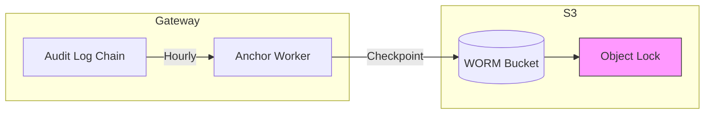

import { Aside, Steps, Tabs, TabItem } from '@astrojs/starlight/components';

This guide covers setting up S3 Object Lock (WORM - Write Once Read Many) storage for tamper-evident audit log anchoring.

## Why WORM Storage?

The gateway's audit log uses a cryptographic chain (HMAC-SHA256) to make logs tamper-evident. However, this chain lives in PostgreSQL, which could be compromised. S3 Object Lock anchors solve this by:

- **External immutability** - Checkpoints written to S3 with COMPLIANCE mode cannot be modified
- **Non-repudiation** - Once written, anchors cannot be deleted (even by AWS account owner)
- **Independent verification** - External auditors can verify without database access
- **Regulatory compliance** - Meets SOC 2, financial records, and audit requirements



## How It Works

### Anchor Cadence

Anchors are written based on time and volume:

| Trigger | Frequency | Purpose |
|---------|-----------|---------|
| **Time-based** | Every hour at :00 | Regular checkpoints |
| **Event-based** | Every 10,000 events | Volume-based checkpoints |
| **Key rotation** | On HMAC key change | Chain continuity |

### Anchor Content

Each anchor is a JSON blob containing chain state:

```json
{
  "chain_id": "production",
  "last_seq": 8723412,
  "last_hash": "b7e9f82a3c1d4e5f6a7b8c9d0e1f2a3b...",
  "ts_utc": "2025-01-15T14:00:00Z",
  "db_snapshot_lsn": "0/9F000A50",
  "prev_anchor_hash": "1d4f90e2b3c4d5e6f7a8b9c0d1e2f3a4..."
}
```

| Field | Purpose |
|-------|---------|
| `chain_id` | Environment identifier |
| `last_seq` | Last event's chain index |
| `last_hash` | Last event's hash (hex-encoded) |
| `ts_utc` | Anchor creation timestamp |
| `db_snapshot_lsn` | PostgreSQL LSN for PITR verification |
| `prev_anchor_hash` | SHA-256 of previous anchor (creates anchor chain) |

### S3 Object Structure

```
s3://bucket/chain_id/year/month/day/hour/anchor-timestamp.json
```

Example:
```
s3://audit-anchors-prod/production/2025/01/15/14/anchor-20250115T140000Z.json
```

## Cost Analysis

S3 Object Lock is extremely cost-effective:

| Item | Calculation | Annual Cost |
|------|-------------|-------------|
| Storage (steady state) | 24 anchors/day × 400 days × 2 KB | ~$0.01 |
| PUT requests | 24 × 365 = 8,760 @ $0.005/1k | ~$0.04 |
| KMS encryption | 8,760 requests @ $0.03/10k | ~$0.03 |
| GET requests (verification) | 8,760 @ $0.0004/1k | ~$0.00 |
| **Total** | | **~$0.08/year** |

<Aside type="tip">
Even with cross-region replication and 7-year retention, total cost is under $1/year.
</Aside>

## Terraform Configuration

### S3 Bucket with Object Lock

<Aside type="caution">
Object Lock can **only** be enabled at bucket creation. It cannot be added later.
</Aside>

```hcl
resource "aws_s3_bucket" "audit_anchors" {
  bucket = "audit-anchors-${var.environment}-${random_id.bucket_suffix.hex}"

  # Object Lock must be enabled at creation
  object_lock_enabled = true

  tags = merge(var.tags, {
    Name    = "audit-anchors-${var.environment}"
    Purpose = "WORM audit log anchoring"
  })
}

resource "random_id" "bucket_suffix" {
  byte_length = 4
}
```

### Object Lock Configuration

```hcl
resource "aws_s3_bucket_object_lock_configuration" "audit_anchors" {
  bucket = aws_s3_bucket.audit_anchors.id

  rule {
    default_retention {
      mode = "COMPLIANCE"
      days = var.worm_retention_days  # e.g., 400
    }
  }
}
```

**COMPLIANCE mode** means:
- Objects cannot be deleted or modified by anyone
- Even AWS account root cannot override
- Only way to delete is wait for retention to expire

### Versioning (Required)

```hcl
resource "aws_s3_bucket_versioning" "audit_anchors" {
  bucket = aws_s3_bucket.audit_anchors.id

  versioning_configuration {
    status = "Enabled"
  }
}
```

### Encryption

```hcl
resource "aws_s3_bucket_server_side_encryption_configuration" "audit_anchors" {
  bucket = aws_s3_bucket.audit_anchors.id

  rule {
    apply_server_side_encryption_by_default {
      sse_algorithm     = "aws:kms"
      kms_master_key_id = aws_kms_key.audit_anchors.arn
    }
    bucket_key_enabled = true
  }
}

resource "aws_kms_key" "audit_anchors" {
  description             = "Audit anchor encryption - ${var.environment}"
  deletion_window_in_days = 30
  enable_key_rotation     = true

  tags = var.tags
}
```

### Public Access Block

```hcl
resource "aws_s3_bucket_public_access_block" "audit_anchors" {
  bucket = aws_s3_bucket.audit_anchors.id

  block_public_acls       = true
  block_public_policy     = true
  ignore_public_acls      = true
  restrict_public_buckets = true
}
```

### Bucket Policy

```hcl
resource "aws_s3_bucket_policy" "audit_anchors" {
  bucket = aws_s3_bucket.audit_anchors.id

  policy = jsonencode({
    Version = "2012-10-17"
    Statement = [
      {
        Sid       = "DenyUnencryptedUploads"
        Effect    = "Deny"
        Principal = "*"
        Action    = "s3:PutObject"
        Resource  = "${aws_s3_bucket.audit_anchors.arn}/*"
        Condition = {
          StringNotEquals = {
            "s3:x-amz-server-side-encryption" = "aws:kms"
          }
        }
      },
      {
        Sid       = "DenyWithoutObjectLock"
        Effect    = "Deny"
        Principal = "*"
        Action    = "s3:PutObject"
        Resource  = "${aws_s3_bucket.audit_anchors.arn}/*"
        Condition = {
          StringNotEquals = {
            "s3:x-amz-object-lock-mode" = "COMPLIANCE"
          }
        }
      },
      {
        Sid       = "DenyDelete"
        Effect    = "Deny"
        Principal = "*"
        Action = [
          "s3:DeleteObject",
          "s3:DeleteObjectVersion"
        ]
        Resource = "${aws_s3_bucket.audit_anchors.arn}/*"
      }
    ]
  })
}
```

### IAM Role for Writer

```hcl
resource "aws_iam_role_policy" "anchor_writer" {
  name = "audit-anchor-writer"
  role = aws_iam_role.gateway.id

  policy = jsonencode({
    Version = "2012-10-17"
    Statement = [
      {
        Effect = "Allow"
        Action = [
          "s3:PutObject",
          "s3:PutObjectRetention",
          "s3:GetObject",
          "s3:ListBucket"
        ]
        Resource = [
          aws_s3_bucket.audit_anchors.arn,
          "${aws_s3_bucket.audit_anchors.arn}/*"
        ]
      },
      {
        Effect = "Allow"
        Action = [
          "kms:Encrypt",
          "kms:Decrypt",
          "kms:GenerateDataKey"
        ]
        Resource = [aws_kms_key.audit_anchors.arn]
      }
    ]
  })
}
```

### IAM Role for Verification (Read-Only)

```hcl
resource "aws_iam_role" "anchor_verifier" {
  name = "audit-anchor-verifier-${var.environment}"

  assume_role_policy = jsonencode({
    Version = "2012-10-17"
    Statement = [
      {
        Action = "sts:AssumeRole"
        Effect = "Allow"
        Principal = {
          AWS = var.auditor_account_ids
        }
      }
    ]
  })

  tags = var.tags
}

resource "aws_iam_role_policy" "anchor_verifier" {
  name = "s3-read-only"
  role = aws_iam_role.anchor_verifier.id

  policy = jsonencode({
    Version = "2012-10-17"
    Statement = [
      {
        Effect = "Allow"
        Action = [
          "s3:GetObject",
          "s3:GetObjectVersion",
          "s3:ListBucket",
          "s3:GetObjectRetention"
        ]
        Resource = [
          aws_s3_bucket.audit_anchors.arn,
          "${aws_s3_bucket.audit_anchors.arn}/*"
        ]
      },
      {
        Effect   = "Allow"
        Action   = ["kms:Decrypt"]
        Resource = [aws_kms_key.audit_anchors.arn]
      }
    ]
  })
}
```

## Gateway Configuration

Enable anchoring with these environment variables:

```bash
# Required
AUDIT_ANCHOR_BUCKET=audit-anchors-prod-abc123
AUDIT_ANCHOR_CHAIN_ID=production

# Optional
AUDIT_ANCHOR_RETENTION_DAYS=400  # Default: 400
AUDIT_ANCHOR_INTERVAL_MINUTES=60  # Default: 60

# AWS credentials (if not using IAM roles)
AWS_ACCESS_KEY_ID=xxx
AWS_SECRET_ACCESS_KEY=xxx
AWS_REGION=us-east-1
```

## Verification

### Automated Verification Job

The gateway runs hourly verification:

1. Fetch latest anchor from S3
2. Verify anchor checksum matches S3 metadata
3. Compare anchor hash to database chain head
4. Verify chain integrity since last anchor
5. Alert on any discrepancies

### Manual Verification

```bash
#!/bin/bash
BUCKET="audit-anchors-prod"
CHAIN_ID="production"

# Get latest anchor
LATEST_KEY=$(aws s3api list-objects-v2 \
  --bucket "$BUCKET" \
  --prefix "$CHAIN_ID/" \
  --query 'reverse(sort_by(Contents, &LastModified))[0].Key' \
  --output text)

echo "Latest anchor: s3://$BUCKET/$LATEST_KEY"

# Download and verify checksum
aws s3api get-object \
  --bucket "$BUCKET" \
  --key "$LATEST_KEY" \
  --checksum-mode ENABLED \
  /tmp/anchor.json > /tmp/metadata.json

# Compare checksums
COMPUTED=$(sha256sum /tmp/anchor.json | awk '{print $1}')
STORED=$(jq -r '.ChecksumSHA256' /tmp/metadata.json | base64 -d | xxd -p -c 256)

if [ "$COMPUTED" != "$STORED" ]; then
    echo "❌ ANCHOR TAMPERED"
    exit 1
fi

echo "✅ Anchor integrity verified"

# Verify against database
LAST_SEQ=$(jq -r '.last_seq' /tmp/anchor.json)
LAST_HASH=$(jq -r '.last_hash' /tmp/anchor.json)

DB_HASH=$(psql -t -A -c "SELECT encode(event_hash, 'hex') FROM audit_events WHERE chain_index = $LAST_SEQ")

if [ "$DB_HASH" != "$LAST_HASH" ]; then
    echo "❌ CHAIN TAMPERED"
    exit 1
fi

echo "✅ Chain verified against anchor"
```

## Cross-Region Replication

For disaster recovery, replicate anchors to another region:

```hcl
# Destination bucket (in different region)
resource "aws_s3_bucket" "audit_anchors_dr" {
  provider = aws.dr_region
  bucket   = "audit-anchors-dr-${var.environment}-${random_id.bucket_suffix.hex}"

  object_lock_enabled = true

  tags = var.tags
}

# Replication configuration
resource "aws_s3_bucket_replication_configuration" "audit_anchors" {
  bucket = aws_s3_bucket.audit_anchors.id
  role   = aws_iam_role.replication.arn

  rule {
    id     = "replicate-anchors"
    status = "Enabled"

    destination {
      bucket        = aws_s3_bucket.audit_anchors_dr.arn
      storage_class = "STANDARD"

      replication_time {
        status = "Enabled"
        time {
          minutes = 15
        }
      }

      metrics {
        status = "Enabled"
        event_threshold {
          minutes = 15
        }
      }
    }

    delete_marker_replication {
      status = "Disabled"
    }
  }
}
```

## Lifecycle Management

Transition old anchors to cheaper storage:

```hcl
resource "aws_s3_bucket_lifecycle_configuration" "audit_anchors" {
  bucket = aws_s3_bucket.audit_anchors.id

  rule {
    id     = "archive-old-anchors"
    status = "Enabled"

    transition {
      days          = 30
      storage_class = "GLACIER_IR"  # Instant retrieval
    }

    transition {
      days          = 90
      storage_class = "DEEP_ARCHIVE"
    }
  }
}
```

Cost reduction: Storage drops from $0.023/GB to $0.00099/GB (~96%).

## Monitoring

### CloudWatch Alarms

```hcl
# Alert if no anchor written in 2 hours
resource "aws_cloudwatch_metric_alarm" "missing_anchor" {
  alarm_name          = "audit-anchor-missing-${var.environment}"
  comparison_operator = "LessThanThreshold"
  evaluation_periods  = 1
  metric_name         = "NumberOfObjects"
  namespace           = "AWS/S3"
  period              = 7200  # 2 hours
  statistic           = "Sum"
  threshold           = 1

  dimensions = {
    BucketName = aws_s3_bucket.audit_anchors.id
    StorageType = "AllStorageTypes"
  }

  alarm_actions = var.alarm_sns_topic_arns
}
```

### Access Logging

```hcl
resource "aws_s3_bucket_logging" "audit_anchors" {
  bucket = aws_s3_bucket.audit_anchors.id

  target_bucket = aws_s3_bucket.access_logs.id
  target_prefix = "audit-anchors/"
}
```

## Security Considerations

### Break-Glass Procedures

In COMPLIANCE mode, you **cannot** delete objects before retention expires. Options:

1. **Wait for expiration** - Objects auto-expire after retention period
2. **Delete entire bucket** - Requires AWS Support ticket
3. **Legal Hold** - Mark objects for investigation without deleting

```bash
# Apply legal hold (does not affect retention)
aws s3api put-object-legal-hold \
  --bucket audit-anchors-prod \
  --key "production/2025/01/15/14/anchor-20250115T140000Z.json" \
  --legal-hold Status=ON
```

### Auditor Access

Provide read-only credentials to external auditors:

```bash
# Create temporary credentials
aws sts assume-role \
  --role-arn arn:aws:iam::123456789012:role/audit-anchor-verifier-production \
  --role-session-name external-auditor \
  --duration-seconds 43200
```

## Compliance Evidence

S3 Object Lock anchors provide evidence for:

| Framework | Requirement | Evidence |
|-----------|-------------|----------|
| **SOC 2** | CC6.1 Logical Access | Immutable audit trail |
| **SOC 2** | CC7.2 System Monitoring | Continuous verification |
| **SOC 2** | CC7.3 Incident Management | Tamper-evident logs |
| **SOX** | Financial Records | 7-year retention available |
| **GDPR** | Right to Erasure | Legal exceptions documented |

## Variables Reference

```hcl
variable "environment" {
  description = "Environment name"
  type        = string
}

variable "worm_retention_days" {
  description = "Object Lock retention period in days"
  type        = number
  default     = 400  # ~13 months (covers annual audit + buffer)
}

variable "enable_replication" {
  description = "Enable cross-region replication"
  type        = bool
  default     = false
}

variable "dr_region" {
  description = "DR region for replication"
  type        = string
  default     = "us-west-2"
}

variable "auditor_account_ids" {
  description = "AWS account IDs allowed to assume verifier role"
  type        = list(string)
  default     = []
}
```

## Outputs

```hcl
output "audit_anchor_bucket" {
  description = "S3 bucket name for audit anchors"
  value       = aws_s3_bucket.audit_anchors.id
}

output "audit_anchor_bucket_arn" {
  description = "S3 bucket ARN"
  value       = aws_s3_bucket.audit_anchors.arn
}

output "kms_key_arn" {
  description = "KMS key ARN for anchor encryption"
  value       = aws_kms_key.audit_anchors.arn
}

output "verifier_role_arn" {
  description = "IAM role ARN for external verification"
  value       = aws_iam_role.anchor_verifier.arn
}
```

## Next Steps

- [Multi-Region](/deployment/terraform/multi-region/) - Cross-region deployment
- [AWS Infrastructure](/deployment/terraform/aws-infrastructure/) - VPC, RDS setup
- [Audit Trail](/security/compliance/audit-trail/) - Audit logging details
