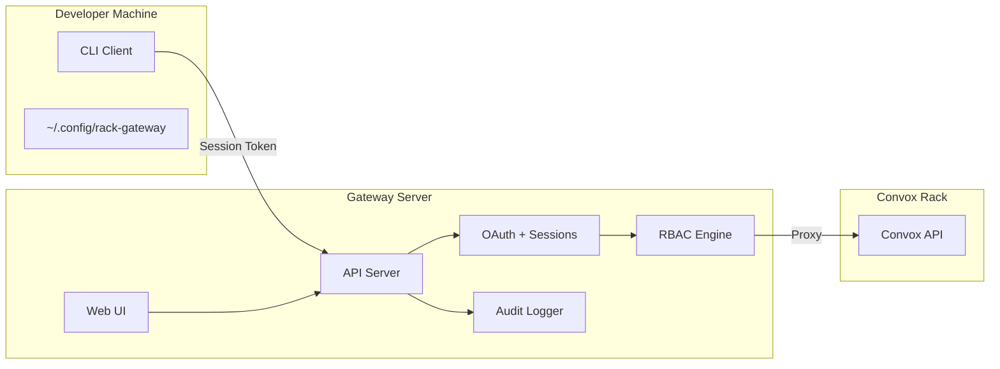

import { CardGrid, LinkCard, Aside } from '@astrojs/starlight/components';

This section covers everything you need to contribute to Rack Gateway development, from setting up your local environment to understanding the codebase architecture.

## Getting Started

<CardGrid>
  <LinkCard
    title="Local Setup"
    description="Set up your development environment with all prerequisites."
    href="/development/local-setup/"
  />
  <LinkCard
    title="Testing"
    description="Run unit tests, integration tests, and E2E tests."
    href="/development/testing/"
  />
  <LinkCard
    title="Contributing"
    description="Contribution guidelines and code standards."
    href="/development/contributing/"
  />
  <LinkCard
    title="API Reference"
    description="OpenAPI specification and API documentation."
    href="/development/api-reference/"
  />
</CardGrid>

## Architecture Overview

Rack Gateway is split into three main components:



### Component Responsibilities

| Component | Location | Purpose |
|-----------|----------|---------|
| **Gateway Server** | `internal/gateway/` | API server with OAuth, RBAC, proxying, and audit logging |
| **CLI Client** | `cmd/rack-gateway/` | Multi-rack aware CLI that authenticates via gateway |
| **Web UI** | `web/` | React SPA for admin interface |
| **Mock OAuth** | `mock-oauth/` | Mock Google OAuth server for testing |

## Project Structure

```
rack-gateway/
├── cmd/
│   ├── gateway/          # Gateway server entrypoint
│   ├── rack-gateway/     # CLI client entrypoint
│   └── mock-convox/      # Mock Convox API for testing
├── internal/
│   ├── gateway/          # Gateway server packages
│   │   ├── app/          # Application setup
│   │   ├── auth/         # OAuth + sessions + MFA
│   │   ├── rbac/         # Role-based access control
│   │   ├── proxy/        # Convox API proxy
│   │   ├── audit/        # Audit logging + redaction
│   │   ├── handlers/     # HTTP handlers
│   │   ├── middleware/   # HTTP middleware
│   │   └── db/           # Database layer
│   ├── cli/              # CLI implementation
│   └── integration/      # Integration tests
├── web/                  # React SPA frontend
│   ├── src/
│   │   ├── api/          # Generated API client
│   │   ├── components/   # React components
│   │   └── pages/        # Page components
│   └── e2e/              # Playwright E2E tests
├── mock-oauth/           # Mock OAuth server
├── docs/                 # This documentation site
└── taskfiles/            # Task runner configuration
```

## Development Workflow

### Daily Development

```bash
# Start the development environment
task dev

# This starts:
# - Gateway API on port 8447
# - Web UI on port 5223
# - Mock OAuth on port 3345
# - Mock Convox on port 5443
# - PostgreSQL database
```

### Making Changes

1. **Create a branch** for your changes
2. **Make your changes** in the appropriate package
3. **Run tests** to verify:
   ```bash
   task go:test    # Go unit tests
   task web:test   # Web unit tests
   ```
4. **Run linters** to check code quality:
   ```bash
   task lint:fix   # Fix linting issues
   ```
5. **Run full CI** before committing:
   ```bash
   task ci         # Complete CI suite
   ```

### Code Generation

Several files are auto-generated:

- **OpenAPI spec**: `internal/gateway/openapi/spec.yaml`
- **TypeScript types**: `web/src/api/types.ts`
- **API client**: `web/src/api/client.ts`

Regenerate with:

```bash
task generate
```

<Aside type="caution">
Never edit generated files directly. Modify the source (Go handlers, OpenAPI annotations) and regenerate.
</Aside>

## Key Technologies

### Backend (Go)

- **Go 1.22+** - Primary backend language
- **Gin** - HTTP framework
- **sqlc** - Type-safe SQL
- **golangci-lint** - Linting with 20+ linters enabled

### Frontend (TypeScript)

- **React 18** - UI framework
- **Vite** - Build tool
- **TanStack Query** - Data fetching
- **Biome** - Linting and formatting

### Testing

- **Go testing** - Unit and integration tests
- **Vitest** - Web unit tests
- **Playwright** - E2E tests

### Infrastructure

- **PostgreSQL** - Primary database
- **Docker** - Container builds
- **Task** - Task runner (like Make, but better)
- **mise** - Environment variable management

## Quick Reference

### Common Task Commands

| Command | Description |
|---------|-------------|
| `task dev` | Start development environment |
| `task ci` | Run full CI suite (lint, test, build) |
| `task lint:fix` | Fix linting issues |
| `task go:test` | Run Go tests |
| `task web:test` | Run web tests |
| `task web:e2e` | Run Playwright E2E tests |
| `task build` | Build all binaries |
| `task generate` | Regenerate code |

### Development Ports

| Service | Port | URL |
|---------|------|-----|
| Gateway API | 8447 | `http://localhost:8447` |
| Web UI | 5223 | `http://localhost:5223` |
| Mock OAuth | 3345 | `http://localhost:3345` |
| Mock Convox | 5443 | `http://localhost:5443` |
| PostgreSQL | 55432 | `localhost:55432` |

### Health Check URLs

```bash
# Gateway health
curl http://localhost:8447/api/v1/health

# Mock OAuth health
curl http://localhost:3345/health

# Mock Convox health
curl http://localhost:5443/health
```

## Next Steps

1. [Set up your local environment](/development/local-setup/)
2. [Understand the testing strategy](/development/testing/)
3. [Review contribution guidelines](/development/contributing/)
4. [Explore the API reference](/development/api-reference/)
