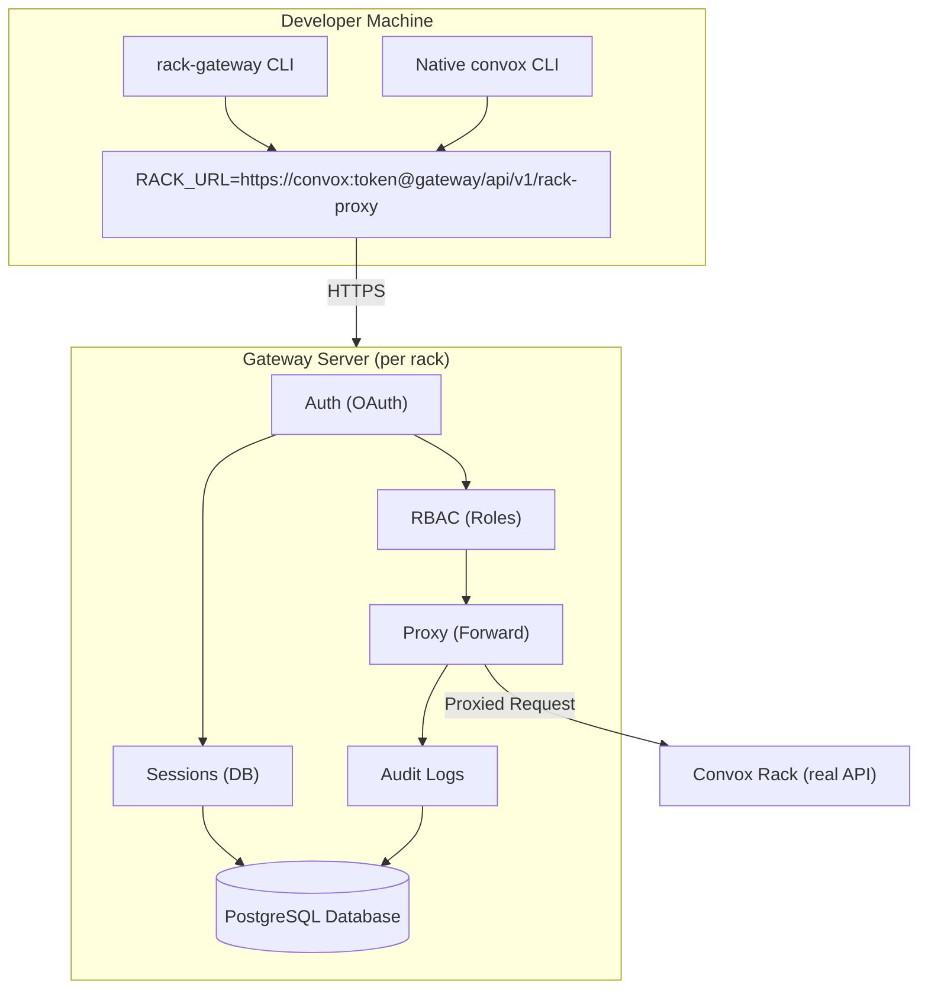
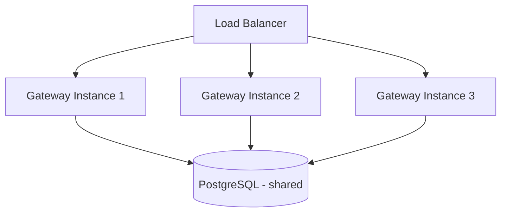

import { Aside } from '@astrojs/starlight/components';

This page explains the architecture of Rack Gateway and how its components interact.

## System Overview

Rack Gateway consists of three main components:

1. **Gateway API Server** - The core proxy that handles authentication, authorization, and request forwarding
2. **Web Admin UI** - A React SPA for user management, token administration, and audit log viewing
3. **CLI Client** - A wrapper around the Convox CLI that manages authentication and multi-rack configuration



## Request Flow

Let's trace a request through the system:

### 1. Developer Authentication

```bash
rack-gateway login staging https://gateway.example.com
```

1. CLI opens browser to gateway's OAuth endpoint
2. User authenticates with Google Workspace
3. Gateway validates domain and creates session
4. Session token returned to CLI
5. CLI stores token in `~/.config/rack-gateway/config.json`

### 2. Command Execution

```bash
rack-gateway apps
# or: convox apps (with RACK_URL set)
```

1. CLI sets `RACK_URL=https://convox:<session-token>@gateway.example.com/api/v1/rack-proxy`
2. Convox CLI sends request to gateway with Basic Auth
3. Gateway extracts token from Basic Auth password
4. Gateway validates session token
5. Gateway checks MFA requirements (if enabled)
6. Gateway checks RBAC permissions for `convox:app:list`
7. If authorized, gateway forwards to real Convox rack
8. Gateway logs the action to audit log
9. Response returned to user

### 3. Audit Log Entry

```json
{
  "timestamp": "2024-01-15T10:30:00Z",
  "user_email": "developer@company.com",
  "method": "GET",
  "path": "/apps",
  "status": 200,
  "latency_ms": 234,
  "rbac_decision": "allow",
  "request_id": "550e8400-e29b-41d4-a716-446655440000"
}
```

## Component Details

### Gateway API Server

The gateway server is a Go application that handles:

| Component | Responsibility |
|-----------|---------------|
| **OAuth Handler** | Google Workspace OAuth 2.0 + PKCE flow |
| **Session Manager** | Database-backed session storage, validation, expiry |
| **RBAC Engine** | Permission checking based on user roles |
| **Proxy** | HTTP/WebSocket forwarding to Convox rack |
| **Audit Logger** | Structured logging with secret redaction |
| **MFA Service** | TOTP, WebAuthn, YubiKey verification |
| **Admin API** | User, token, and settings management |

### Web Admin UI

A React single-page application served by the gateway:

- **User Management**: List, create, update, and disable users
- **API Tokens**: Create and manage CI/CD tokens
- **Audit Logs**: Search and filter audit trail
- **Settings**: Configure MFA, sessions, and integrations
- **Account Security**: Enroll MFA devices, manage trusted devices

### CLI Client

The `rack-gateway` CLI is recommended for interacting with Rack Gateway. It provides:

- **Login/Logout**: OAuth authentication flow with the gateway
- **Multi-Rack**: Configure and switch between multiple gateways
- **Command Wrapper**: Wraps convox commands with authentication
- **MFA Integration**: Handles step-up authentication prompts

<Aside type="note" title="CLI vs Native Convox CLI">
You can use the native Convox CLI by setting `RACK_URL` to the gateway proxy path. The `rack-gateway`
CLI makes OAuth login and multi-rack management easier, but it is not required.
</Aside>

## Database Schema

PostgreSQL stores all persistent state:

```
users
├── id, email, role, created_at
├── mfa_enabled, mfa_enforced_at
└── locked_at, lock_reason

user_sessions
├── id, user_id, token_hash
├── channel (web/cli), device_info
├── expires_at, last_activity_at
└── ip_address, user_agent

api_tokens
├── id, user_id, name, token_hash
├── role, permissions
├── expires_at, last_used_at
└── created_by_email

mfa_methods
├── id, user_id, type (totp/webauthn/yubikey)
├── secret, public_key_credential
└── name, last_used_at

audit.audit_event
├── id, timestamp, user_email
├── action_type, action, status
├── request_id, ip_address
├── rbac_decision, response_time_ms
└── details (redacted as needed)
```

## Security Architecture

### Authentication Layers

1. **OAuth 2.0 + PKCE**: Initial authentication with Google
2. **Session Tokens**: Opaque, database-backed tokens
3. **MFA**: Optional second factor for sensitive operations
4. **API Tokens**: Scoped tokens for CI/CD

### Authorization Model

```
Permission Format: {scope}:{resource}:{action}

Examples:
- convox:app:list      (list applications)
- convox:process:exec  (exec into container)
- gateway:user:create  (create new user)
```

Roles are hierarchical:
- `viewer` < `ops` < `deployer` < `admin`

Each role inherits all permissions from roles below it.

### Audit Trail Security

- **Immutability**: Logs written to append-only storage
- **Secret Redaction**: Passwords, tokens, and keys automatically masked
- **S3 WORM**: Optional cryptographic anchoring to immutable S3 storage
- **Checksums**: Integrity verification for compliance

## Deployment Topology

### Single-Tenant Design

Each gateway instance protects exactly one Convox rack:

```
Production Environment
├── Convox Rack API (internal)
├── Rack Gateway (public or VPN)
└── PostgreSQL Database

Staging Environment
├── Convox Rack API (internal)
├── Rack Gateway (public or VPN)
└── PostgreSQL Database (can be shared)
```

### Network Security

<Aside type="caution" title="Recommended: Use Tailscale">
We strongly recommend using Tailscale or another VPN so that neither the Convox API nor Rack Gateway is exposed to the public internet.
</Aside>

With a private network:
- Gateway accessible only to team members
- No public attack surface
- Zero-trust network model
- Defense-in-depth even if tokens are compromised

#### Making the Convox API Fully Private

By default, Convox exposes its API publicly via nginx ingress. DocSpring maintains a [fork of Convox](https://github.com/DocSpring/convox/tree/docspring) that includes a `private_api` option to disable public access entirely.

See [Private Network Deployment](/deployment/private-network/) for complete setup instructions including:
- Terraform configuration for DocSpring's Convox fork
- Tailscale operator setup and ingress configuration
- ACL examples and verification steps
- Alternative private network options (PrivateLink, VPN, bastion)

## Scalability

The gateway is stateless (session state in database) and can be horizontally scaled:



Typical deployment runs 1-2 instances. The gateway adds minimal latency (typically under 10ms) to requests.

## Next Steps

- [Quick Start](/getting-started/quick-start/): Set up your first gateway
- [System Requirements](/getting-started/system-requirements/): Prerequisites
- [Docker Deployment](/deployment/docker/): Production deployment
