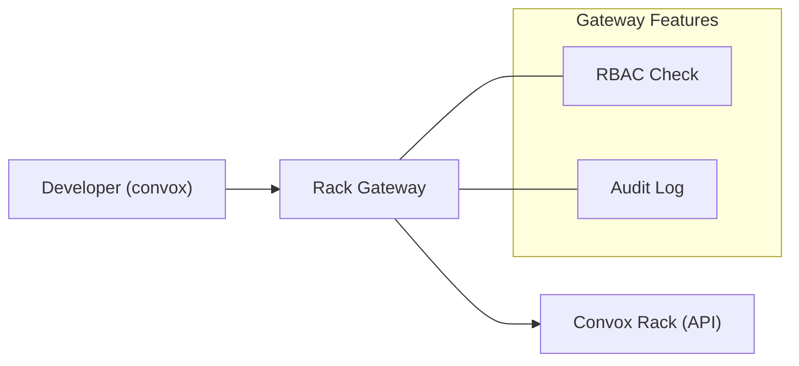

import { Aside, Card, CardGrid } from '@astrojs/starlight/components';

Rack Gateway is an open-source authentication and authorization proxy for self-hosted Convox racks. It adds enterprise-grade security controls to your infrastructure without changing how you use Convox.

## The Problem

When you self-host Convox racks without [Convox Console](https://docs.convox.com/management/console-rack-management), your rack has a primary API token that grants unrestricted access to everything. This token is typically stored in your Terraform state file.

While Convox does support creating [individual user credentials](https://docs.convox.com/reference/cli/rack) with limited permissions, the primary token remains the main security concern:

- **Unrestricted primary access** - Anyone with the Terraform state can do anything
- **No accountability for primary token usage** - Can't tell who used it
- **Limited audit trail** - Actions from the primary token aren't attributed to individuals
- **Compliance gaps** - SOC 2 requires individual access controls with proper audit trails

## The Solution

Rack Gateway sits between your users and the Convox rack, providing:

<CardGrid>
  <Card title="Authentication" icon="star">
    Google Workspace OAuth with domain restrictions. Users sign in with their corporate accounts.
  </Card>
  <Card title="Authorization" icon="setting">
    Role-based access control with four levels: viewer, ops, deployer, and admin.
  </Card>
  <Card title="Audit Logging" icon="document">
    Every API call logged with user attribution, automatic secret redaction, and S3 WORM support.
  </Card>
  <Card title="Multi-Factor Auth" icon="seti:lock">
    TOTP, WebAuthn (security keys), and YubiKey support with step-up authentication.
  </Card>
</CardGrid>

## How It Works

Rack Gateway is a transparent proxy that speaks the Convox API protocol:



1. **User runs a command**: `convox apps` or `rack-gateway convox apps`
2. **Gateway authenticates**: Validates the user's session or API token
3. **Gateway authorizes**: Checks RBAC permissions for the requested action
4. **Gateway proxies**: Forwards the request to the real Convox rack
5. **Gateway logs**: Records the action with user attribution

The real rack token never leaves the gateway. Users only have session tokens that the gateway validates.

## Using the rack-gateway CLI

Users interact with Rack Gateway through the `rack-gateway` CLI:

```bash
# Login (opens browser for OAuth)
rack-gateway login staging https://gateway.example.com

# Run convox commands through the gateway
rack-gateway convox apps
rack-gateway convox deploy
rack-gateway convox logs -a myapp

# Set up a convenient alias
alias cx="rack-gateway convox"
cx apps
cx deploy
```

The CLI:
- Handles OAuth authentication with the gateway
- Manages session tokens securely
- Supports multiple rack configurations
- Wraps convox commands transparently

## Single-Tenant Design

<Aside type="note" title="One Gateway Per Rack">
Each gateway instance is deployed alongside a single Convox rack. It's not a multi-tenant service - it's infrastructure that runs directly next to the API it protects.
</Aside>

This design provides:

- **Maximum security**: No shared infrastructure between racks
- **Simple deployment**: Deploy on the same rack it protects
- **Clear boundaries**: Each environment is completely isolated

```
Production Environment
├── Convox Rack (port 5443)
└── Rack Gateway (port 8447) ──▶ proxies to Rack

Staging Environment
├── Convox Rack (port 5443)
└── Rack Gateway (port 8447) ──▶ proxies to Rack
```

Developers use the `rack-gateway` CLI to switch between gateways, or configure separate `RACK_URL` values for each environment.

## Key Features

### Role-Based Access Control

Four built-in roles provide granular control:

| Role | Capabilities |
|------|-------------|
| **Viewer** | Read-only: list apps, view logs, see releases |
| **Ops** | Viewer + restart apps, manage processes |
| **Deployer** | Ops + create builds, promote releases |
| **Admin** | Full access including user management |

### Audit Logging

Every action is logged with:

- **User identification**: Email address of the authenticated user
- **Action details**: Method, path, parameters
- **Outcome**: Success/failure, status codes
- **Timing**: Timestamps and latency
- **Secret redaction**: Passwords, tokens, and API keys automatically masked

Logs can be exported to CloudWatch, S3 WORM storage (for compliance), or your SIEM.

### Multi-Factor Authentication

Protect sensitive operations with MFA:

- **TOTP**: Google Authenticator, Authy, 1Password
- **WebAuthn**: YubiKey 5, Touch ID, Windows Hello
- **YubiKey OTP**: Hardware token authentication
- **Trusted devices**: Remember devices for 30 days
- **Backup codes**: 10 one-time recovery codes

### Deploy Approvals

Require manual approval for CI/CD deployments:

- Create approval requests from CircleCI or GitHub Actions
- Approve/reject from the web UI or Slack
- Track approval status in audit logs
- Integrate with your existing CI/CD workflow

## Built for Compliance

Rack Gateway was designed with SOC 2 compliance in mind:

- **Access Control (CC6.1)**: RBAC with granular permissions
- **Logical Access (CC6.2)**: OAuth authentication, MFA enforcement
- **Audit Logging (CC7.1)**: Complete audit trail with user attribution
- **Change Management (CC8.1)**: Deploy approvals for controlled releases

See [SOC 2 Compliance](/security/compliance/soc2/) for detailed mapping.

## What's Not Included

Rack Gateway focuses on authentication and authorization. It doesn't provide:

- **Rack management**: Use Terraform or Convox Console for rack lifecycle
- **Monitoring**: Use Datadog, CloudWatch, or your preferred solution
- **Multiple OAuth providers**: Currently Google Workspace only
- **Custom roles**: Use the four built-in roles

For more advanced features, consider [Convox Console](https://docs.convox.com/management/console-rack-management).

## Next Steps

- [Architecture](/getting-started/architecture/): Understand how the components fit together
- [Quick Start](/getting-started/quick-start/): Get running in 5 minutes
- [RBAC Overview](/security/rbac/): Learn about roles and permissions
