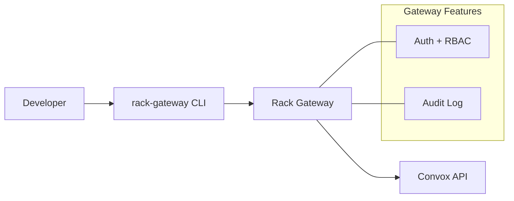

import { Card, CardGrid } from '@astrojs/starlight/components';

## Why Rack Gateway?

Rack Gateway is an open-source, self-hosted authentication and authorization proxy for [Convox](https://convox.com) racks. It provides the security controls you need for SOC 2 compliance without vendor lock-in.

<CardGrid stagger>
  <Card title="Google Workspace OAuth" icon="star">
    Secure single sign-on with domain restrictions. Your team authenticates with their existing Google accounts.
  </Card>
  <Card title="Role-Based Access Control" icon="setting">
    Four built-in roles (viewer, ops, deployer, admin) with granular permissions. Control who can do what on your infrastructure.
  </Card>
  <Card title="Complete Audit Trail" icon="document">
    Every API call is logged with automatic secret redaction. Export to CloudWatch, S3 WORM storage, or your SIEM.
  </Card>
  <Card title="Multi-Factor Authentication" icon="seti:lock">
    TOTP, WebAuthn (security keys), and YubiKey support. Enforce MFA for all users or specific roles.
  </Card>
  <Card title="Deploy Approvals" icon="approve-check">
    Manual approval workflow for CI/CD deployments. Integrates with CircleCI, GitHub, and Slack.
  </Card>
  <Card title="Single-Tenant Design" icon="laptop">
    One gateway per rack. Deployed alongside your Convox API for maximum security and isolation.
  </Card>
</CardGrid>

## How It Works

Rack Gateway acts as a transparent proxy between your developers and the Convox API:



Users install the `rack-gateway` CLI, which handles authentication and wraps Convox commands.

## Quick Example

```bash
# Install the rack-gateway CLI
# (download from releases or build from source)

# Login with Google OAuth
rack-gateway login staging https://gateway.example.com

# Run Convox commands through the gateway
rack-gateway apps
rack-gateway ps
rack-gateway deploy

# Set up a convenient alias
alias cg="rack-gateway"
cg apps
cg logs -a myapp
```

## Built for Compliance

Rack Gateway was built to achieve SOC 2 compliance for production infrastructure. It provides:

- **Immutable audit logs** with cryptographic anchoring to S3 WORM storage
- **Automatic secret redaction** for passwords, tokens, and API keys
- **Session management** with configurable timeouts and revocation
- **MFA enforcement** with step-up authentication for sensitive operations

## Community Edition

Rack Gateway is the open-source "community edition" alternative to the hosted [Convox Console](https://docs.convox.com/management/console-rack-management). While Convox Console offers more advanced features and official support, Rack Gateway provides everything you need for secure, compliant infrastructure management.

<CardGrid>
  <Card title="Getting Started" icon="rocket">
    [Set up Rack Gateway in 5 minutes →](/getting-started/quick-start/)
  </Card>
  <Card title="Architecture" icon="puzzle">
    [Understand how it all fits together →](/getting-started/architecture/)
  </Card>
</CardGrid>
