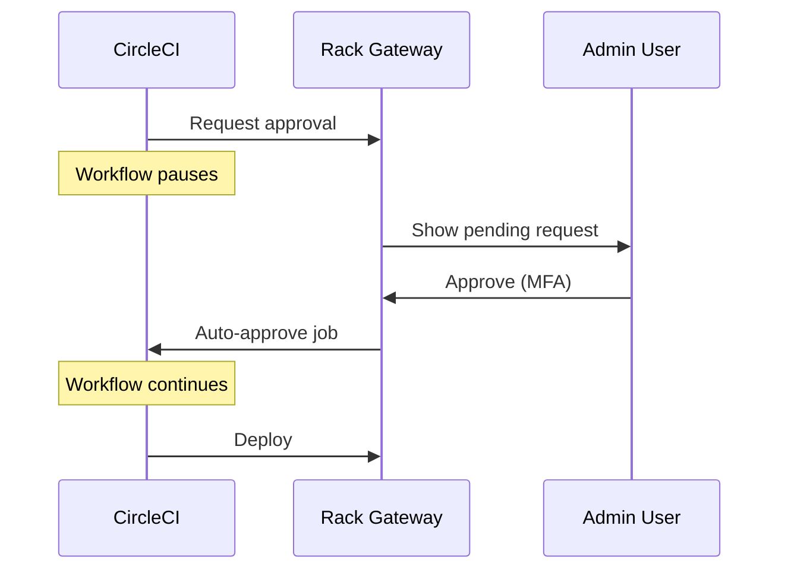
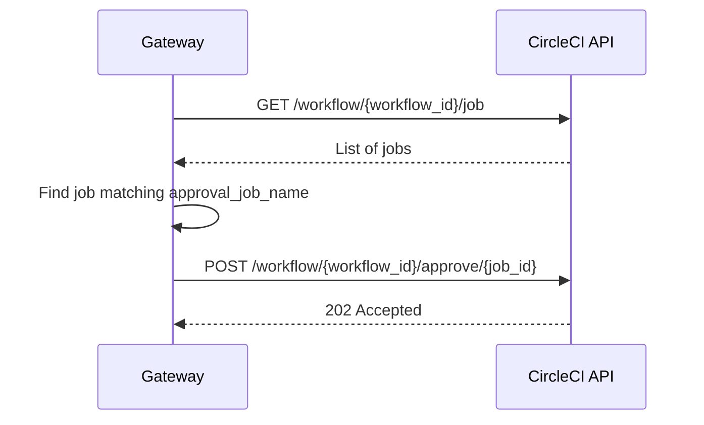

import { Aside, Steps, Tabs, TabItem } from '@astrojs/starlight/components';

Rack Gateway provides native CircleCI integration for automated deploy approvals. When configured, the gateway automatically approves CircleCI workflow jobs after an admin approves the deployment request.

## Overview

The integration streamlines the deployment workflow:



Admins only approve once in the gateway. CircleCI jobs proceed automatically.

## Configuration

### Gateway Environment Variables

```bash
# CircleCI API token with workflow approval permissions
CIRCLECI_TOKEN=your-circleci-api-token
```

**Getting a CircleCI Token:**

<Steps>

1. Visit https://app.circleci.com/settings/user/tokens
2. Click "Create New Token"
3. Name it "Rack Gateway Deploy Approvals"
4. Copy the token immediately

</Steps>

### Per-App Settings

Each app using CircleCI needs these settings:

| Setting | Required | Description | Example |
|---------|----------|-------------|---------|
| `vcs_provider` | Yes | Version control provider | `github` |
| `vcs_repo` | Yes | Repository (org/repo) | `MyOrg/myapp` |
| `ci_provider` | Yes | CI system | `circleci` |
| `circleci_approval_job_name` | Yes | Approval job name | `approve_deploy_prod` |
| `circleci_auto_approve_on_approval` | Yes | Enable auto-approval | `true` |

<Tabs>
<TabItem label="Environment Variables">

```bash
# Per-app settings via environment
RGW_APP_MYAPP_SETTING_VCS_PROVIDER=github
RGW_APP_MYAPP_SETTING_VCS_REPO=MyOrg/myapp
RGW_APP_MYAPP_SETTING_CI_PROVIDER=circleci
RGW_APP_MYAPP_SETTING_CIRCLECI_APPROVAL_JOB_NAME=approve_deploy_production
RGW_APP_MYAPP_SETTING_CIRCLECI_AUTO_APPROVE_ON_APPROVAL=true
```

</TabItem>
<TabItem label="Web UI">

1. Navigate to **Apps**
2. Select your application
3. Open the **Settings** tab
4. Configure CircleCI integration settings
5. Save changes

</TabItem>
</Tabs>

## CircleCI Workflow Configuration

### Complete Example

```yaml
version: 2.1

workflows:
  deploy:
    jobs:
      - test
      - build:
          requires:
            - test

      # Request approval from Rack Gateway
      - request_approval:
          requires:
            - build

      # CircleCI approval job (auto-approved by gateway)
      - approve_deploy_production:
          type: approval
          requires:
            - request_approval

      # Deploy after approval
      - deploy:
          requires:
            - approve_deploy_production

jobs:
  test:
    docker:
      - image: cimg/node:18.0
    steps:
      - checkout
      - run: npm test

  build:
    docker:
      - image: cimg/node:18.0
    steps:
      - checkout
      - run: npm run build

  request_approval:
    docker:
      - image: docspringcom/ci:deploy
    steps:
      - run:
          name: Request deploy approval
          command: |
            rack-gateway deploy-approval request \
              --app myapp \
              --git-commit "$CIRCLE_SHA1" \
              --branch "$CIRCLE_BRANCH" \
              --ci-metadata "{\"workflow_id\":\"$CIRCLE_WORKFLOW_ID\",\"pipeline_number\":<< pipeline.number >>}" \
              --message "Deploy $CIRCLE_BRANCH@${CIRCLE_SHA1:0:7} to production"
          environment:
            RACK_GATEWAY_API_TOKEN: $RACK_GATEWAY_API_TOKEN
            RACK_GATEWAY_URL: $RACK_GATEWAY_URL

  deploy:
    docker:
      - image: docspringcom/ci:deploy
    steps:
      - checkout
      - run:
          name: Deploy via Rack Gateway
          command: rack-gateway deploy --app myapp
          environment:
            RACK_GATEWAY_API_TOKEN: $RACK_GATEWAY_API_TOKEN
            RACK_GATEWAY_URL: $RACK_GATEWAY_URL
```

### Key Points

1. **`request_approval` job**: Uses CLI to create approval request with CI metadata
2. **`approve_deploy_production` job**: CircleCI approval job (type: approval) that blocks workflow
3. **Job name must match**: Approval job name must match `circleci_approval_job_name` setting
4. **CI metadata**: Include `workflow_id` and `pipeline_number`

<Aside type="caution" title="Job Name Match">
The approval job name in `.circleci/config.yml` must **exactly match** the `circleci_approval_job_name` setting. This is case-sensitive.
</Aside>

## CI Metadata Format

The gateway requires specific metadata for auto-approval:

```json
{
  "workflow_id": "$CIRCLE_WORKFLOW_ID",
  "pipeline_number": "<< pipeline.number >>"
}
```

| Field | Source | Purpose |
|-------|--------|---------|
| `workflow_id` | `$CIRCLE_WORKFLOW_ID` | Identify workflow for job approval |
| `pipeline_number` | `<< pipeline.number >>` | Build pipeline URL for display |

<Aside type="note">
`pipeline.number` uses CircleCI's pipeline parameter syntax (`<< >>`), not environment variable syntax (`$`).
</Aside>

## Tailscale Setup

If your gateway is accessible only via Tailscale (recommended), CircleCI needs to connect to your Tailscale network.

### Docker Image

Use a CI image with Tailscale installed:

```yaml
jobs:
  request_approval:
    docker:
      - image: docspringcom/ci:deploy
```

### CircleCI Contexts

Configure these contexts:

**`deploy-app` context** (shared):
- `TAILSCALE_OAUTH_SECRET` - Tailscale OAuth client secret

**Per-environment contexts** (e.g., `convox-production`):
- `RACK_GATEWAY_URL` - Gateway Tailscale hostname
- `RACK_GATEWAY_API_TOKEN` - API token with `cicd` role

### Tailscale Connection

Commands automatically handle Tailscale connection:

```yaml
steps:
  - setup_tailscale
  - run: rack-gateway deploy-approval request ...
```

The `setup_tailscale` command:
1. Starts Tailscale daemon
2. Connects using OAuth secret as ephemeral node
3. Verifies connectivity to gateway

## Auto-Approval Flow

When admin approves in gateway:



### What Gateway Needs

| Source | Data |
|--------|------|
| CI metadata | `workflow_id` |
| App settings | `circleci_approval_job_name` |
| Gateway config | `CIRCLECI_TOKEN` |

## Pipeline URL Display

The gateway builds URLs for display in the web UI:

**Formula:**
```
https://app.circleci.com/pipelines/{vcs_short}/{vcs_repo}/{pipeline_number}
```

**VCS Short Codes:**
- `github` → `gh`
- `bitbucket` → `bb`

**Example:**
```
https://app.circleci.com/pipelines/gh/MyOrg/myapp/1234
```

## Multiple Environments

For multiple deployment environments, use different approval job names:

### Staging Gateway

```bash
RGW_APP_MYAPP_SETTING_CIRCLECI_APPROVAL_JOB_NAME=approve_deploy_staging
```

### Production Gateway

```bash
RGW_APP_MYAPP_SETTING_CIRCLECI_APPROVAL_JOB_NAME=approve_deploy_production
```

### CircleCI Workflow

```yaml
workflows:
  deploy:
    jobs:
      - test
      - build

      # Staging
      - request_approval_staging:
          requires: [build]
      - approve_deploy_staging:
          type: approval
          requires: [request_approval_staging]
      - deploy_staging:
          requires: [approve_deploy_staging]

      # Production
      - request_approval_production:
          requires: [deploy_staging]
      - approve_deploy_production:
          type: approval
          requires: [request_approval_production]
      - deploy_production:
          requires: [approve_deploy_production]
```

## Troubleshooting

### CircleCI Shows "Not Connected"

<Steps>

1. Verify `CIRCLECI_TOKEN` is set on gateway
2. Restart gateway after adding environment variable
3. Check token hasn't expired
4. Verify token permissions

</Steps>

**Test token:**
```bash
curl -H "Circle-Token: YOUR_TOKEN" https://circleci.com/api/v2/me
```

### Job Not Auto-Approved

**Checklist:**

- [ ] `circleci_auto_approve_on_approval` is `true`
- [ ] `circleci_approval_job_name` matches exactly
- [ ] `ci_metadata` includes `workflow_id`
- [ ] `CIRCLECI_TOKEN` has correct permissions
- [ ] App `ci_provider` is set to `circleci`

**Check gateway logs:**
```bash
convox logs --app rack-gateway | grep -i circleci
```

**Common error messages:**

| Error | Cause |
|-------|-------|
| `approval job 'xxx' not found in workflow` | Job name mismatch |
| `403 Forbidden` | Token lacks permissions or expired |
| `workflow not found` | Invalid workflow_id in metadata |

### API Token Permissions

If you see `403 Forbidden`:

1. Token needs `write:builds` scope
2. Regenerate if necessary:
   - Visit https://app.circleci.com/settings/user/tokens
   - Create new token
   - Update `CIRCLECI_TOKEN`
   - Restart gateway

### Wrong Pipeline URL

**Verify settings:**
- `vcs_provider` is correct (`github`)
- `vcs_repo` is in `org/repo` format
- `pipeline_number` is in CI metadata

## Security Considerations

### Token Storage

- Store `CIRCLECI_TOKEN` as environment variable, never in git
- Use Convox secrets or AWS Secrets Manager
- Rotate tokens every 90 days

### Token Permissions

The CircleCI token can approve ANY workflow in your organization:

- Use a dedicated service account
- Monitor approval audit logs
- Restrict token scope to `write:builds` only

### Approval Validation

Gateway validates:
- Request exists and is `pending`
- API token has `cicd` role
- Admin has `admin` role and passes MFA
- CI metadata is valid
- App settings are configured

## Next Steps

- [GitHub Integration](/integrations/deploy-approvals/github/) - PR verification and comments
- [Approval Workflow](/integrations/deploy-approvals/workflow/) - Detailed workflow
- [API Tokens](/security/authentication/api-tokens/) - Token management
