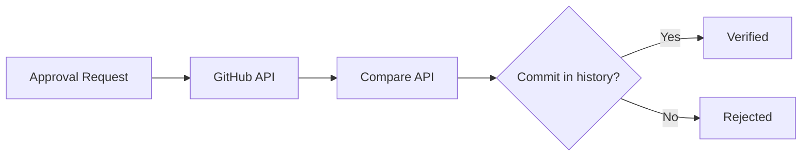
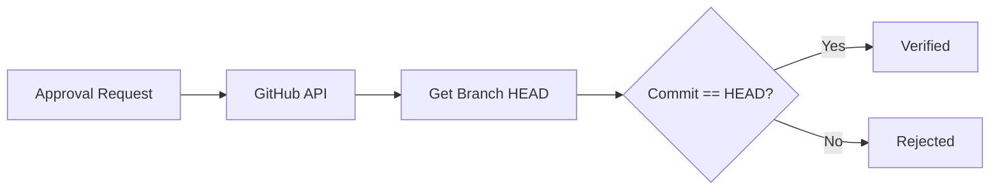
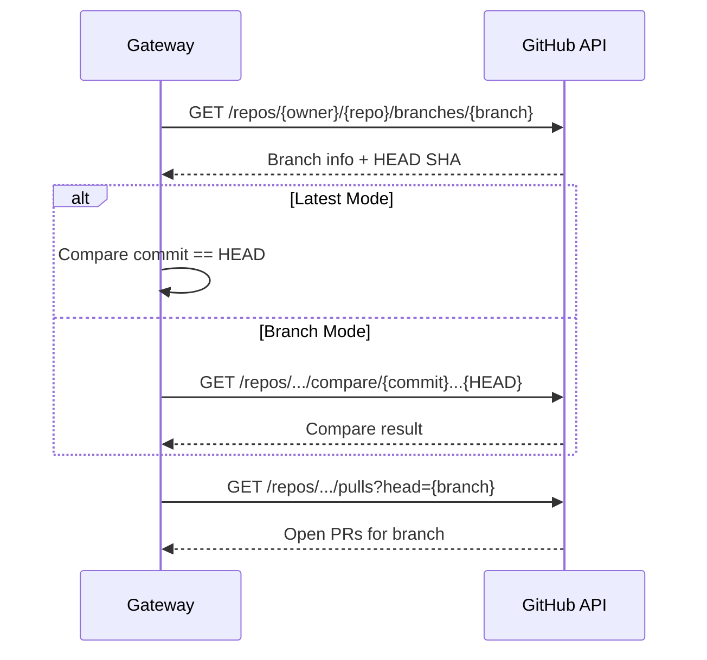
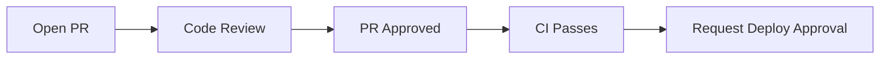
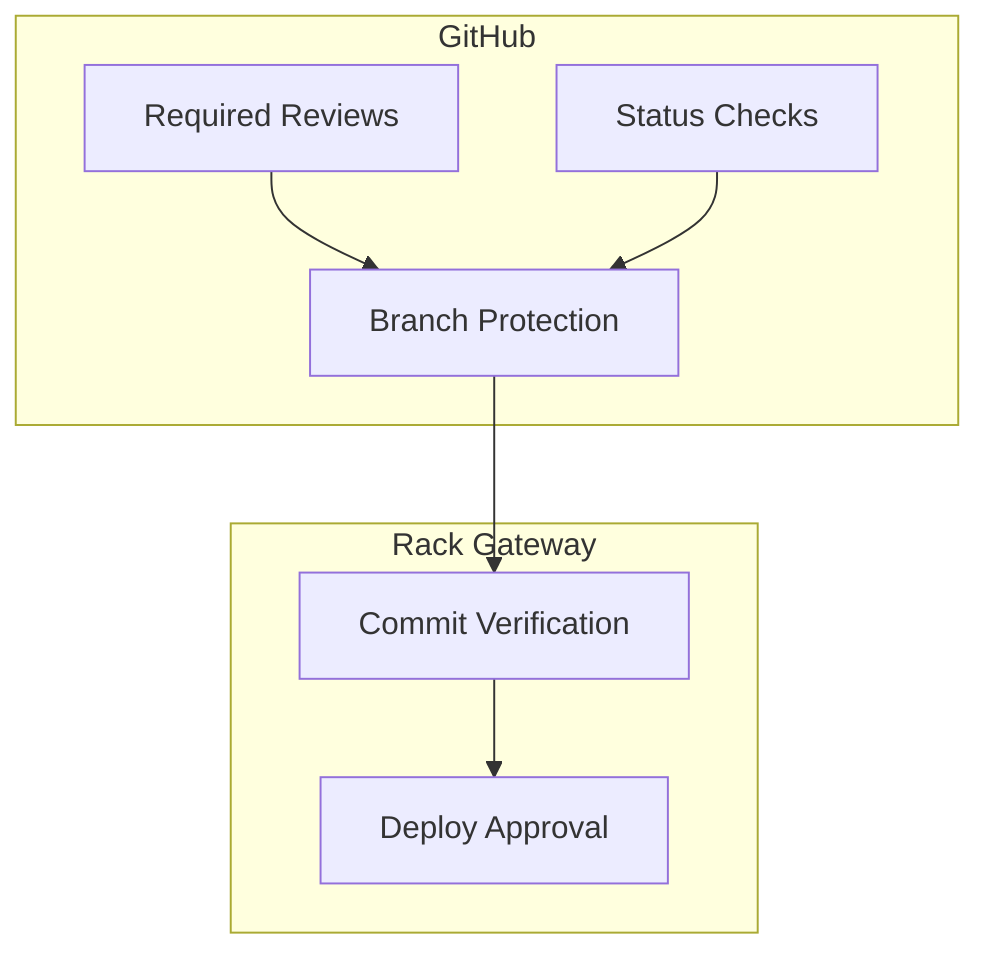

import { Aside, Steps, Tabs, TabItem } from '@astrojs/starlight/components';

Rack Gateway integrates with GitHub for commit verification and pull request comments during the deploy approval workflow.

## Features

- **Commit verification**: Ensure commits exist on the specified branch
- **PR detection**: Automatically find and link pull requests
- **PR comments**: Post status updates on PRs when approvals are requested/approved
- **Branch protection**: Optionally require PRs for deployments

## Configuration

### Gateway Environment Variable

```bash
# GitHub personal access token or app token
GITHUB_TOKEN=ghp_xxxxxxxxxxxxxxxxxxxx
```

### Token Permissions

The token needs these permissions:

| Permission | Scope | Purpose |
|------------|-------|---------|
| `repo` | Read | Verify commits and branches |
| `pull_requests` | Read | Find PRs for branches |
| `issues` | Write | Post PR comments |

<Tabs>
<TabItem label="Personal Access Token">

1. Go to GitHub Settings → Developer settings → Personal access tokens
2. Click "Generate new token (classic)"
3. Select scopes: `repo`, `write:discussion`
4. Generate and copy token

</TabItem>
<TabItem label="GitHub App">

1. Create a GitHub App in your organization
2. Grant permissions: Contents (read), Pull requests (read/write)
3. Install the app on your repository
4. Generate and use installation token

</TabItem>
</Tabs>

### Per-App Settings

| Setting | Description | Example |
|---------|-------------|---------|
| `vcs_provider` | Must be `github` | `github` |
| `vcs_repo` | Repository in `owner/repo` format | `MyOrg/myapp` |
| `verify_git_commit` | Enable commit verification | `true` |
| `verify_git_commit_mode` | Verification mode | `branch` or `latest` |
| `require_pr` | Require open PR for deployment | `true` |

```bash
# Environment variable configuration
RGW_APP_MYAPP_SETTING_VCS_PROVIDER=github
RGW_APP_MYAPP_SETTING_VCS_REPO=MyOrg/myapp
RGW_APP_MYAPP_SETTING_VERIFY_GIT_COMMIT=true
RGW_APP_MYAPP_SETTING_VERIFY_GIT_COMMIT_MODE=branch
RGW_APP_MYAPP_SETTING_REQUIRE_PR=false
```

## Commit Verification

When an approval request is created, the gateway verifies the commit exists on GitHub.

### Verification Modes

<Tabs>
<TabItem label="Branch Mode">

**Mode**: `branch`

Verifies the commit exists anywhere on the specified branch.



**Use when**: You want to deploy any commit from the branch history.

</TabItem>
<TabItem label="Latest Mode">

**Mode**: `latest`

Verifies the commit is the **latest** commit on the branch.



**Use when**: You want to ensure only the tip of the branch can be deployed.

</TabItem>
</Tabs>

### Verification Flow



## Pull Request Detection

The gateway automatically finds PRs for the branch being deployed.

### What Gets Stored

When a PR is found:

| Field | Value |
|-------|-------|
| `pr_url` | Full GitHub PR URL |
| `pr_number` | PR number (extracted) |

### Display in Web UI

The deploy approval request shows:
- PR link (clickable)
- PR number badge
- Commit link to GitHub

## PR Comments

When enabled, the gateway posts comments on PRs during the approval workflow.

### Comment Events

| Event | Comment |
|-------|---------|
| Request created | "Deploy approval requested by [token]. Awaiting admin approval." |
| Request approved | "Deploy approved by [admin]. Deployment proceeding." |
| Request rejected | "Deploy rejected by [admin]. Reason: [notes]" |
| Deployment complete | "Deployment complete. Release: [id]" |

### Example Comment

```markdown
## 🚀 Deploy Approval

**Status**: Approved ✅

**Details**:
- Approved by: admin@example.com
- Approved at: 2024-01-15 10:30:00 UTC
- Approval expires: 2024-01-15 10:45:00 UTC

**Notes**: LGTM, reviewed diff

---
*Posted by Rack Gateway*
```

### Enabling PR Comments

Configure per-app:

```bash
RGW_APP_MYAPP_SETTING_GITHUB_POST_PR_COMMENTS=true
```

<Aside type="note">
PR comments require the `GITHUB_TOKEN` to have `issues:write` permission.
</Aside>

## Requiring Pull Requests

For production environments, you can require an open PR before deployment:

```bash
RGW_APP_MYAPP_SETTING_REQUIRE_PR=true
```

### Behavior

| Scenario | Result |
|----------|--------|
| Open PR exists for branch | Approval request created |
| No open PR | Request rejected with error |
| PR merged/closed | Request rejected with error |

### Use Case

Ensures code review happened before deployment:



## API Usage

### Verify Commit

The gateway uses GitHub's Compare API:

```bash
# Check if commit is on branch
GET /repos/{owner}/{repo}/compare/{commit}...{branch_head}
```

### Find PR

```bash
# Find open PRs for branch
GET /repos/{owner}/{repo}/pulls?head={owner}:{branch}&state=open
```

### Post Comment

```bash
# Post comment on PR (uses issues API)
POST /repos/{owner}/{repo}/issues/{pr_number}/comments
{
  "body": "Deploy approval requested..."
}
```

## Troubleshooting

### "Branch not found"

**Error**: `branch main not found in repository MyOrg/myapp`

**Causes**:
- Wrong repository name
- Branch doesn't exist
- Token lacks repo access

**Resolution**:
- Verify `vcs_repo` setting
- Check branch exists
- Verify token has `repo` scope

### "Commit not found"

**Error**: `commit abc123f not found or not on branch main`

**Causes**:
- Commit doesn't exist
- Commit not on specified branch
- Force push removed commit

**Resolution**:
- Verify commit hash
- Check branch history
- Use correct branch name

### "No PR found" (when required)

**Error**: `no open pull request found for branch feature-x`

**Causes**:
- PR not created yet
- PR already merged/closed
- Wrong branch name

**Resolution**:
- Create PR first
- Check PR status
- Verify branch name matches

### "403 Forbidden"

**Error**: `GitHub API returned status 403`

**Causes**:
- Token expired
- Insufficient permissions
- Rate limit exceeded

**Resolution**:
- Regenerate token
- Check token scopes
- Wait for rate limit reset

## Security Considerations

### Token Security

- Use fine-grained tokens when possible
- Limit token to specific repositories
- Rotate tokens regularly

### Repository Access

- The token can read all repositories it has access to
- Consider using a GitHub App for better access control
- Audit token usage in GitHub settings

### Branch Protection

Combine with GitHub branch protection:

- Require PR reviews before merge
- Require status checks to pass
- Restrict who can push to protected branches



## Best Practices

### For Security

- Enable commit verification for all apps
- Require PRs for production deployments
- Use `latest` mode for critical environments
- Enable PR comments for visibility

### For Workflow

- Keep branch names consistent
- Merge PRs before requesting approval
- Don't force-push after requesting approval
- Close stale PRs promptly

### For Configuration

- Set up GitHub App instead of personal token
- Configure per-environment settings
- Test verification in staging first

## Next Steps

- [CircleCI Integration](/integrations/deploy-approvals/circleci/) - CI auto-approval
- [Approval Workflow](/integrations/deploy-approvals/workflow/) - Complete workflow
- [Security Hardening](/security/hardening/) - Production security
