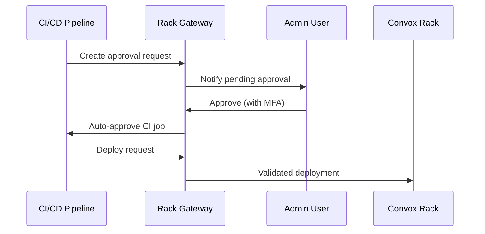
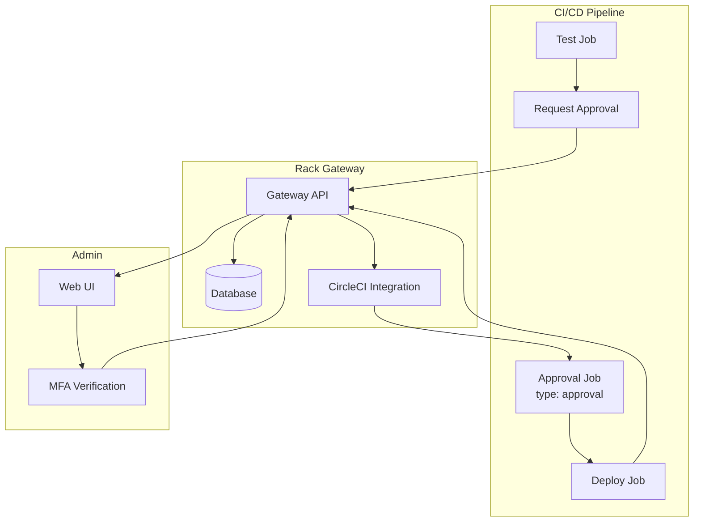
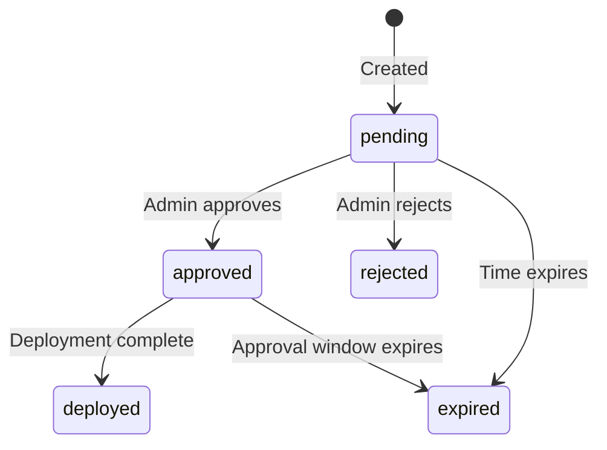

import { Aside, Steps, Tabs, TabItem } from '@astrojs/starlight/components';

Deploy approvals add a manual checkpoint before sensitive Convox deployment actions, ensuring human oversight of production changes.

## Overview

The deploy approval workflow integrates with CI/CD pipelines to enforce admin review:



## How It Works

<Steps>

1. **CI tests pass**

   After tests complete, CI pushes an approval request with git commit and CI metadata

2. **Admin reviews**

   Admin sees pending request in web UI with commit hash, branch, and PR link

3. **Admin approves**

   Approval requires MFA step-up authentication

4. **CI auto-approved**

   Gateway calls CI provider API to unblock the waiting job (if configured)

5. **Deploy validated**

   Gateway validates manifest matches approved commit during deployment

6. **Deployment completes**

   All deployment actions are gated by the approval

</Steps>

## Architecture



## Key Features

### Git Commit Verification

Every approval is tied to a specific git commit hash:

- Approval cannot be reused for different code
- Manifest validation ensures deployed images match approved commit
- Prevents deploying arbitrary code even with compromised CI/CD token

### MFA Step-Up

Approvals require multi-factor authentication:

- Admin must verify MFA when approving
- Prevents approval with compromised session
- Auditable proof of human authorization

### Time-Limited Approvals

Approvals expire after a configurable window (default 15 minutes):

- Prevents stale approvals from being used later
- Encourages timely deployment after approval
- Configurable via `RGW_SETTING_DEPLOY_APPROVAL_WINDOW_MINUTES`

### CI Integration

Native integration with CI providers:

- CircleCI auto-approval via API
- GitHub PR comments for status updates
- Extensible to other providers

## Request Lifecycle

The approval request progresses through these states:



| State | Description |
|-------|-------------|
| `pending` | Waiting for admin review |
| `approved` | Admin approved, CI can proceed |
| `rejected` | Admin rejected, deployment blocked |
| `expired` | Approval or pending state timed out |
| `deployed` | Deployment completed successfully |

## Database Schema

The `deploy_approval_requests` table tracks the complete lifecycle:

| Column | Type | Description |
|--------|------|-------------|
| `public_id` | UUID | External identifier for API access |
| `app` | varchar | Application name |
| `git_commit_hash` | varchar | Git commit SHA (indexed) |
| `git_branch` | varchar | Branch name |
| `pr_url` | text | Pull request URL (from GitHub) |
| `ci_metadata` | JSONB | Provider-specific data |
| `message` | text | Human-readable context |
| `status` | varchar | Current state |
| `target_api_token_id` | bigint | CI/CD token that will use approval |
| `approved_by_user_id` | bigint | Admin who approved |
| `approval_expires_at` | timestamp | When approval expires |

## Configuration

### Global Settings

| Setting | Default | Description |
|---------|---------|-------------|
| `RGW_SETTING_DEPLOY_APPROVALS_ENABLED` | `true` | Enable/disable approval checks |
| `RGW_SETTING_DEPLOY_APPROVAL_WINDOW_MINUTES` | `15` | How long approvals remain valid |

### Per-App Settings

Configure via UI or environment variables:

| Setting | Description |
|---------|-------------|
| `vcs_provider` | Version control (github, bitbucket) |
| `vcs_repo` | Repository in org/repo format |
| `ci_provider` | CI system (circleci) |
| `circleci_approval_job_name` | CircleCI approval job name |
| `circleci_auto_approve_on_approval` | Enable auto-approval |

<Aside type="tip">
Configure per-app settings via environment variables:
```bash
RGW_APP_MYAPP_SETTING_CI_PROVIDER=circleci
RGW_APP_MYAPP_SETTING_CIRCLECI_APPROVAL_JOB_NAME=approve_deploy_prod
```
</Aside>

## CLI Commands

### Create Request

```bash
rack-gateway deploy-approval request \
  --app myapp \
  --git-commit "$CIRCLE_SHA1" \
  --branch "$CIRCLE_BRANCH" \
  --ci-metadata '{"workflow_id":"abc-123","pipeline_number":"42"}' \
  --message "Deploy to production"
```

### Approve Request

```bash
rack-gateway deploy-approval approve <request-id> \
  --notes "Reviewed diff, LGTM"
```

Requires MFA step-up authentication.

### List Pending

```bash
rack-gateway deploy-approval list --status pending
```

### Wait for Approval

```bash
rack-gateway deploy-approval request \
  --git-commit abc123f \
  --message "Deploy" \
  --wait \
  --timeout 20m
```

## RBAC Permissions

| Permission | Description | Roles |
|------------|-------------|-------|
| `gateway:deploy-approval-request:create` | Create requests | CI/CD |
| `gateway:deploy-approval-request:approve` | Approve/reject | Admin (requires MFA) |
| `convox:deploy:deploy_with_approval` | Deploy when approved | CI/CD |

The `deploy_with_approval` permission grants access to all deployment actions when an active approval exists.

## Security Model

Even with a compromised CI/CD token, an attacker cannot:

- Deploy without admin approval
- Deploy different code than approved (manifest validation)
- Bypass pre-deploy command allowlist
- Reuse approvals across commits

**Attack requires:**
- Compromised CI/CD token AND
- Admin approval for attacker's malicious commit AND
- Image tags matching approved commit pattern

## Disabling Approvals

For staging or development racks, you can disable approvals:

```bash
RGW_SETTING_DEPLOY_APPROVALS_ENABLED=false
```

<Aside type="caution">
Only disable approvals in non-production environments where the security/convenience trade-off is acceptable.
</Aside>

## Next Steps

- [Approval Workflow](/integrations/deploy-approvals/workflow/) - Detailed workflow
- [CircleCI Integration](/integrations/deploy-approvals/circleci/) - CircleCI setup
- [GitHub Integration](/integrations/deploy-approvals/github/) - PR comments
