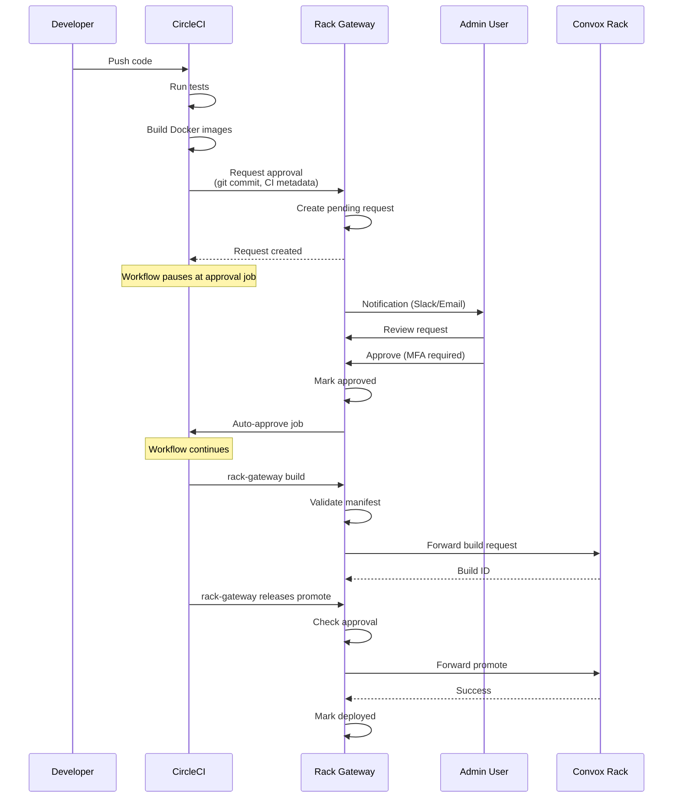
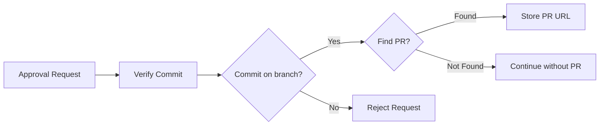
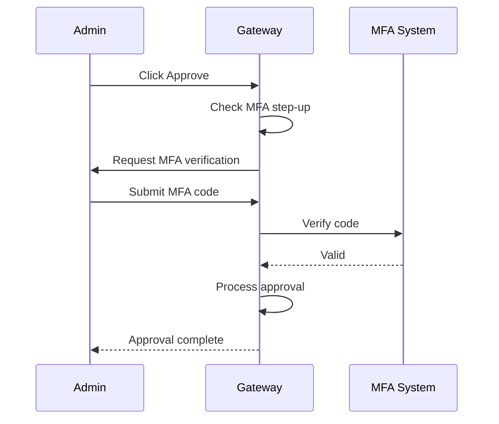
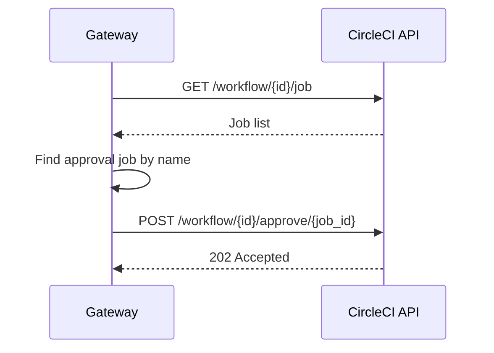
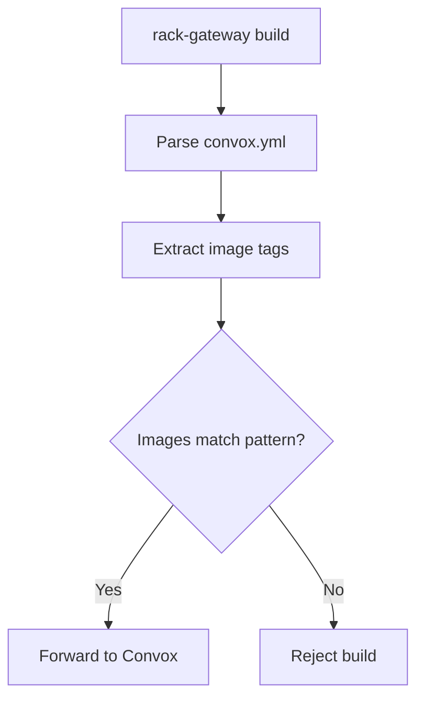
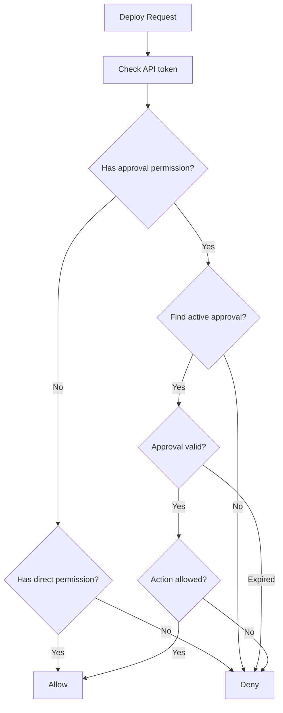

import { Aside, Steps, Tabs, TabItem } from '@astrojs/starlight/components';

This page provides a detailed walkthrough of the deploy approval workflow, from request creation to deployment completion.

## Complete Workflow



## Phase 1: Request Creation

When CI tests pass, the pipeline creates an approval request.

### Request Command

```bash
rack-gateway deploy-approval request \
  --app myapp \
  --git-commit "$CIRCLE_SHA1" \
  --branch "$CIRCLE_BRANCH" \
  --ci-metadata '{"workflow_id":"$CIRCLE_WORKFLOW_ID","pipeline_number":<< pipeline.number >>}' \
  --message "Deploy $CIRCLE_BRANCH to production"
```

### What Gets Stored

| Field | Source | Purpose |
|-------|--------|---------|
| `git_commit_hash` | `--git-commit` | Identifies approved code |
| `git_branch` | `--branch` | Context for reviewers |
| `ci_metadata` | `--ci-metadata` | CI provider integration |
| `message` | `--message` | Human-readable description |
| `target_api_token_id` | Auto-detected | Token that will use approval |
| `app` | `--app` | Application name |

### GitHub Verification

If GitHub integration is configured, the gateway verifies the commit:



Verification modes:
- **latest**: Commit must be the latest on the branch
- **branch**: Commit must exist on the branch (uses git compare API)

## Phase 2: Admin Review

Admins see pending requests in the web UI.

### Request Details

The review UI shows:

- **Git commit hash** - Links to VCS provider
- **Branch name** - Source branch
- **PR link** - If GitHub verification found one
- **CI pipeline** - Links to CircleCI pipeline
- **Message** - Context from CI
- **Created by** - CI/CD token used
- **Time** - When request was created

### Review Actions

| Action | Requires | Result |
|--------|----------|--------|
| **Approve** | MFA step-up | Request approved, CI auto-approved |
| **Reject** | None | Request rejected with notes |
| **Ignore** | None | Request expires automatically |

## Phase 3: Approval

<Steps>

1. **Admin clicks Approve**

   Initiates approval flow

2. **MFA challenge presented**

   Admin must verify with TOTP, WebAuthn, or backup code

3. **MFA verified**

   Server validates the MFA response

4. **Request marked approved**

   Status changes, expiration timer starts

5. **CI auto-approval triggered**

   If configured, gateway calls CI API

</Steps>

### MFA Step-Up Flow



### Approval Notes

Admins can add notes when approving:

```json
{
  "status": "approved",
  "approval_notes": "Reviewed diff, LGTM. PR #123 approved by team.",
  "approved_by_user_id": 42,
  "approved_at": "2024-01-15T10:30:00Z",
  "approval_expires_at": "2024-01-15T10:45:00Z"
}
```

## Phase 4: CI Auto-Approval

If CircleCI integration is configured, the gateway automatically approves the waiting job.

### CircleCI Flow



### Required Configuration

| Setting | Value | Example |
|---------|-------|---------|
| `CIRCLECI_TOKEN` | API token | `your-token` |
| `ci_provider` (per-app) | `circleci` | - |
| `circleci_approval_job_name` | Job name | `approve_deploy_prod` |
| `circleci_auto_approve_on_approval` | `true` | - |

<Aside type="tip">
The approval job name must exactly match the job name in your `.circleci/config.yml`.
</Aside>

## Phase 5: Build Validation

When CI calls `rack-gateway build`, the gateway validates the manifest.

### Manifest Validation



### Image Tag Pattern

Default pattern: `.*:{{GIT_COMMIT}}`

```yaml
# convox.yml
services:
  web:
    image: myorg/app:abc123f-amd64  # Must match approved commit
  worker:
    image: myorg/app:abc123f-amd64
```

The gateway replaces `{{GIT_COMMIT}}` with the approved commit hash and validates all service images match.

### What Gets Tracked

After successful build:

| Field | Value |
|-------|-------|
| `object_url` | S3 URL of build artifact |
| `build_id` | Convox build ID |

## Phase 6: Deploy Validation

Every deployment action validates the approval.

### Gated Actions

| Action | Endpoint | Validation |
|--------|----------|------------|
| Build create | `POST /apps/:app/builds` | Manifest + approval |
| Object upload | `POST /apps/:app/objects` | Approval exists |
| Release promote | `POST /apps/:app/releases/:id/promote` | Release linked to approval |
| Process exec | `POST /apps/:app/processes/:id/exec` | Approval + command allowlist |

### Validation Flow



## Phase 7: Completion

After successful deployment, the request is marked as deployed.

### Final State

```json
{
  "status": "deployed",
  "build_id": "BABC123",
  "release_id": "RABC123",
  "deployed_at": "2024-01-15T10:42:00Z"
}
```

### Audit Trail

The complete workflow generates audit entries:

| Event | Actor | Details |
|-------|-------|---------|
| `deploy_approval_request.create` | CI/CD token | Commit, branch, message |
| `deploy_approval_request.approve` | Admin user | Notes, MFA method |
| `build.create` | CI/CD token | Build ID, manifest |
| `release.promote` | CI/CD token | Release ID |
| `deploy_approval_request.reject` | Admin user | Notes |

## Error Handling

### Common Errors

<Tabs>
<TabItem label="No Approval Found">

```
Error: No active deploy approval found for this commit
```

**Causes:**
- Approval request not created
- Approval expired
- Different commit hash

**Resolution:**
- Create new approval request
- Check commit hash matches exactly

</TabItem>
<TabItem label="Approval Expired">

```
Error: Deploy approval has expired (was approved 20 minutes ago)
```

**Causes:**
- Deployment took too long after approval
- Approval window is too short

**Resolution:**
- Request new approval
- Increase `RGW_SETTING_DEPLOY_APPROVAL_WINDOW_MINUTES`

</TabItem>
<TabItem label="Manifest Validation Failed">

```
Error: Image tag does not match approved commit
```

**Causes:**
- Image tags don't include commit hash
- Wrong commit hash in image tag

**Resolution:**
- Ensure images are tagged with approved commit
- Check image tag pattern matches your convention

</TabItem>
</Tabs>

### Retry Behavior

| Scenario | Behavior |
|----------|----------|
| CI job fails after approval | Approval still valid until expiry |
| Build fails | Can retry build with same approval |
| Promote fails | Can retry promote with same approval |
| Approval expired | Must create new request and get new approval |

## Best Practices

### For CI/CD Pipelines

- Always include accurate CI metadata
- Use descriptive messages with branch and commit
- Set appropriate timeout for `--wait` flag
- Handle approval rejection gracefully

### For Admins

- Review the diff before approving
- Add meaningful notes explaining approval
- Verify the PR is approved by team
- Check CI status before approving

### For Security

- Keep approval window short (15 min recommended)
- Require PR for production deployments
- Review audit logs regularly
- Use MFA for all admin accounts

## Next Steps

- [CircleCI Integration](/integrations/deploy-approvals/circleci/) - Complete CircleCI setup
- [GitHub Integration](/integrations/deploy-approvals/github/) - PR verification and comments
- [RBAC](/security/rbac/) - Permission configuration
