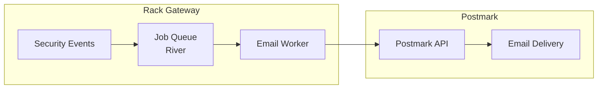
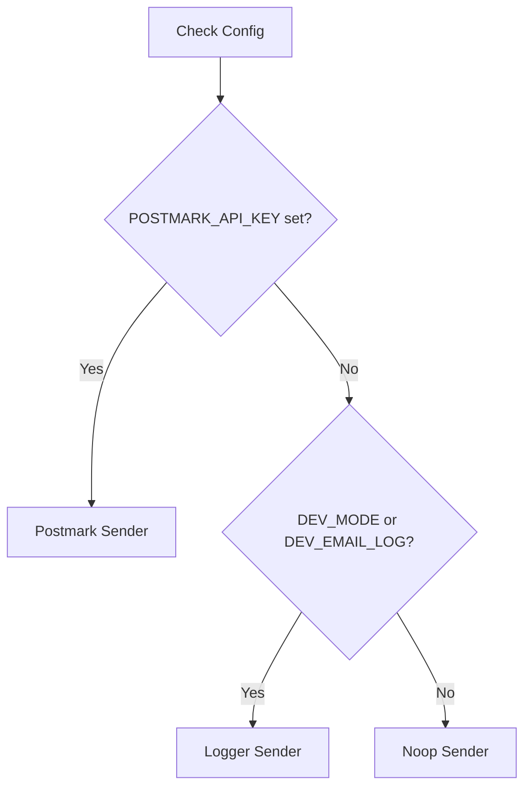

import { Aside, Steps, Tabs, TabItem } from '@astrojs/starlight/components';

Rack Gateway sends email notifications for security events, user management actions, and system alerts using Postmark.

## Features

- **Security Alerts**: Failed logins, MFA failures, rate limits
- **User Notifications**: Welcome emails, role changes, account locks
- **Admin Alerts**: User additions, suspicious activity
- **Async Processing**: Background job queue for reliable delivery

## Architecture



## Setup

### 1. Create Postmark Account

<Steps>

1. Sign up at https://postmarkapp.com
2. Create a new server for Rack Gateway
3. Copy the Server API Token
4. Verify your sender domain

</Steps>

### 2. Configure Environment Variables

```bash
# Required
POSTMARK_API_KEY=your-server-api-token
POSTMARK_FROM_EMAIL=gateway@yourdomain.com

# Optional
POSTMARK_MESSAGE_STREAM=outbound  # Default: outbound
```

<Aside type="note">
The sender email domain must be verified in Postmark.
</Aside>

### 3. Verify Configuration

After restarting the gateway, check logs for email configuration:

```
INFO: Email sender configured (Postmark)
```

Without Postmark configured:

```
INFO: Email sender configured (Noop - emails disabled)
```

## Email Types

### Security Notifications

#### Failed MFA Verification

Sent to the user when MFA verification fails.

| Field | Content |
|-------|---------|
| Subject | Failed MFA Verification Attempt |
| To | User email |
| Content | Time, IP address, user agent |

```
Hello Alice,

We detected a failed multi-factor authentication attempt on your account.

Details:
- Time: 2024-01-15 10:30:00 UTC
- IP Address: 192.168.1.100
- User Agent: Mozilla/5.0...

If this wasn't you, please contact your administrator immediately.
```

#### Failed Login Attempt

Sent when a login attempt fails (after OAuth).

| Field | Content |
|-------|---------|
| Subject | Failed Login Attempt |
| To | User email |
| Content | Time, channel, status, IP, user agent |

#### Rate Limit Exceeded

Sent when a user exceeds rate limits.

**To User:**
| Field | Content |
|-------|---------|
| Subject | Rate Limit Exceeded |
| To | User email |
| Content | Path, time, IP address |

**To Admins:**
| Field | Content |
|-------|---------|
| Subject | Rate Limit Exceeded - User \{email\} |
| To | All admin users |
| Content | User info, path, time, IP |

### User Management

#### Welcome Email

Sent when a new user is added.

| Field | Content |
|-------|---------|
| Subject | Welcome to \{Rack\} Rack Gateway |
| To | New user email |
| Content | Roles, inviter, gateway URL |

```
Hello Alice,

You have been added to the Production Rack Gateway by admin@example.com.

Your assigned roles: deployer, viewer

You can access the gateway at:
https://gateway.example.com

Please log in with your Google Workspace account to get started.

Welcome aboard!
```

#### User Added (Admin Notification)

Sent to all admins when a user is added.

| Field | Content |
|-------|---------|
| Subject | New User Added to \{Rack\} Rack Gateway: \{email\} |
| To | All admin users (BCC) |
| Content | User info, roles, creator, time |

#### Account Locked

Sent when a user account is locked.

| Field | Content |
|-------|---------|
| Subject | Account Locked |
| To | Locked user email |
| Content | Reason, contact instructions |

### Suspicious Activity

#### MFA Auto-Lock

Sent when an account is auto-locked due to MFA failures.

| Field | Content |
|-------|---------|
| Subject | Account Auto-Locked - Too Many MFA Failures |
| To | User and admins |
| Content | Failure count, IP addresses, time |

## Job Queue

Email notifications use River for async processing:

### Job Types

| Job Kind | Description |
|----------|-------------|
| `email:security:failed_mfa` | Failed MFA notification |
| `email:security:failed_login` | Failed login notification |
| `email:security:rate_limit_user` | Rate limit user alert |
| `email:security:rate_limit_admin` | Rate limit admin alert |
| `email:user:welcome` | Welcome email |
| `email:user:added_admin` | Admin notification |
| `email:user:locked` | Account locked |
| `email:security:mfa_autolock` | MFA auto-lock alert |

### Retry Behavior

- Jobs retry on failure
- Exponential backoff
- Max retries configurable

### Monitoring

Check job status in gateway logs:

```
INFO: Email job completed: email:user:welcome
ERROR: Email job failed: postmark send failed: 401 Unauthorized
```

## Development Mode

In development, emails can be logged instead of sent:

```bash
DEV_MODE=true
# or
DEV_EMAIL_LOG=true
```

Emails are logged to stdout:

```
DEBUG [email:summary] to=alice@example.com subject="Welcome to Production Rack Gateway"
DEBUG [email:body] text=... html=...
```

### Dev Outbox

In development, emails are stored in memory for inspection:

```go
// API endpoint for E2E tests
GET /api/v1/dev/emails
```

## Configuration Reference

| Variable | Required | Default | Description |
|----------|----------|---------|-------------|
| `POSTMARK_API_KEY` | Yes | - | Postmark server API token |
| `POSTMARK_FROM_EMAIL` | Yes | - | Verified sender email |
| `POSTMARK_MESSAGE_STREAM` | No | `outbound` | Message stream name |
| `DEV_EMAIL_LOG` | No | `false` | Log emails instead of sending |

## Sender Priority

The gateway selects email sender based on configuration:



| Sender | Behavior |
|--------|----------|
| Postmark | Sends via Postmark API |
| Logger | Logs to stdout (development) |
| Noop | Does nothing (silent) |

## Troubleshooting

### Emails not sending

<Steps>

1. **Verify configuration**
   - Check `POSTMARK_API_KEY` is set
   - Check `POSTMARK_FROM_EMAIL` is set
   - Restart gateway after changes

2. **Check Postmark**
   - Verify domain is verified
   - Check API token is valid
   - Review Postmark activity log

3. **Check gateway logs**
   - Look for email job errors
   - Check for Postmark API errors

</Steps>

### "401 Unauthorized" from Postmark

**Causes:**
- Invalid API token
- Token doesn't match server
- Server disabled

**Resolution:**
- Regenerate Postmark API token
- Verify using correct server token (not account token)

### "422 Inactive recipient"

**Causes:**
- Recipient email bounced previously
- Recipient marked as complaint

**Resolution:**
- Check Postmark suppressions list
- Contact recipient to verify email

### Emails going to spam

**Resolution:**
- Verify sender domain with SPF/DKIM/DMARC
- Use consistent "From" address
- Avoid spam trigger words

## Security Considerations

### Sender Verification

- Always verify your sender domain in Postmark
- Configure SPF, DKIM, and DMARC records
- Use a dedicated subdomain for gateway emails

### Content Security

- Emails contain security-sensitive information
- Never include passwords or tokens in emails
- Keep notification details minimal

### Rate Limiting

- Rate limit security emails to prevent alert fatigue
- Aggregate repeated events where possible
- Don't expose rate limiting in email content

## Best Practices

### For Production

- Use a verified production domain
- Monitor Postmark delivery rates
- Set up Postmark alerts for bounces
- Review suppression list regularly

### For Security

- Keep admin notification list current
- Review security email patterns
- Test email delivery regularly
- Archive emails for compliance if required

### For Users

- Use clear, actionable subject lines
- Include relevant context in body
- Provide next steps or contact info
- Keep emails concise

## Next Steps

- [Slack Integration](/integrations/slack/) - Real-time notifications
- [Audit Trail](/security/compliance/audit-trail/) - Event logging
- [Security Hardening](/security/hardening/) - Production security
