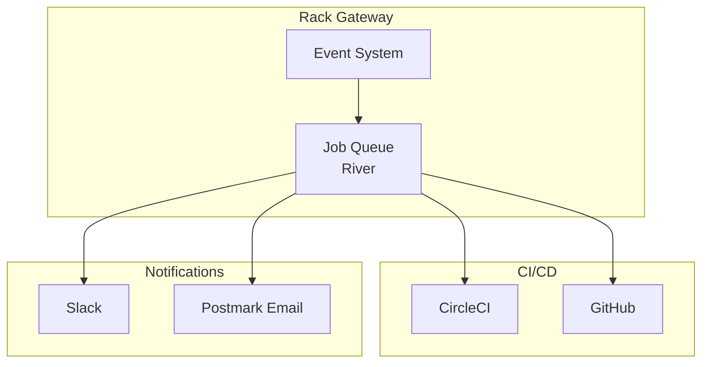

import { Card, CardGrid, Aside, Steps } from '@astrojs/starlight/components';

Rack Gateway integrates with external services for notifications, CI/CD automation, and enhanced security workflows.

## Available Integrations

<CardGrid>
  <Card title="Deploy Approvals" icon="approve-check">
    Require admin approval before CI/CD deployments.

    [Learn more →](/integrations/deploy-approvals/)
  </Card>
  <Card title="Slack" icon="discord">
    Send security and deployment notifications to Slack channels.

    [Learn more →](/integrations/slack/)
  </Card>
  <Card title="Email" icon="email">
    Receive security alerts via email using Postmark.

    [Learn more →](/integrations/email/)
  </Card>
</CardGrid>

## Integration Architecture

## Quick Setup

### Deploy Approvals

Enforce admin review before deployments:

<Steps>

1. **Configure CI/CD token**

   Create an API token with the `cicd` role

2. **Set up CI workflow**

   Add approval request step to your CircleCI config

3. **Enable auto-approval**

   Configure app settings (approval job name, auto-approve)

</Steps>

[Complete setup guide →](/integrations/deploy-approvals/)

### Slack Notifications

Get real-time notifications in Slack:

<Steps>

1. **Create Slack app**

   Use the provided manifest to create your Slack app

2. **Configure credentials**

   Set `SLACK_CLIENT_ID` and `SLACK_CLIENT_SECRET`

3. **Connect via UI**

   Navigate to Integrations and authorize Slack

4. **Configure channels**

   Route different event types to appropriate channels

</Steps>

[Complete setup guide →](/integrations/slack/)

### Email Notifications

Receive security alerts via email:

<Steps>

1. **Create Postmark account**

   Sign up at postmarkapp.com

2. **Configure gateway**

   Set `POSTMARK_API_KEY` and `POSTMARK_FROM_EMAIL`

3. **Automatic notifications**

   Security events are sent automatically

</Steps>

[Complete setup guide →](/integrations/email/)

## Event Types

Integrations can respond to these event categories:

| Category | Examples | Notifications |
|----------|----------|---------------|
| **Authentication** | Login, logout, failed auth | Slack, Email |
| **MFA** | Enrollment, verification failures | Slack, Email |
| **User Management** | User created, roles changed, locked | Slack, Email |
| **API Tokens** | Token created, updated, deleted | Slack |
| **Deploy Approvals** | Request, approve, reject | Slack, CircleCI, GitHub |
| **Security** | Rate limits, suspicious activity | Slack, Email |

## Configuration Reference

| Variable | Integration | Description |
|----------|-------------|-------------|
| `SLACK_CLIENT_ID` | Slack | OAuth client ID |
| `SLACK_CLIENT_SECRET` | Slack | OAuth client secret |
| `POSTMARK_API_KEY` | Email | Postmark API token |
| `POSTMARK_FROM_EMAIL` | Email | Sender email address |
| `CIRCLECI_TOKEN` | CircleCI | API token for job approval |
| `GITHUB_TOKEN` | GitHub | API token for PR comments |

See [Configuration Reference](/configuration/environment-variables/) for complete details.

## Next Steps

- [Deploy Approvals](/integrations/deploy-approvals/) - CI/CD approval workflow
- [Slack](/integrations/slack/) - Slack notifications
- [Email](/integrations/email/) - Email notifications
