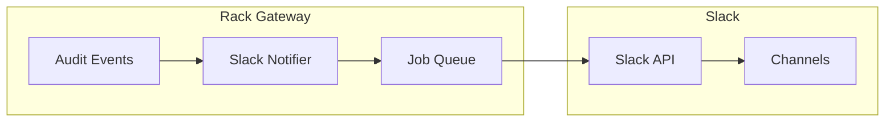

import { Aside, Steps, Tabs, TabItem } from '@astrojs/starlight/components';

Rack Gateway sends audit log notifications to Slack channels for security events, deploy approvals, and other important actions.

## Features

- **OAuth 2.0 Integration**: Secure connection to your Slack workspace
- **Flexible Channel Routing**: Route different event types to different channels
- **Glob Pattern Matching**: Use wildcards to match multiple action types
- **Rich Formatting**: Events formatted with emojis, colors, and structured blocks
- **Test Notifications**: Verify channel configuration with test messages

## Architecture



## Setup

### 1. Create a Slack App

<Steps>

1. Go to https://api.slack.com/apps
2. Click **Create New App** → **From an app manifest**
3. Select your workspace
4. Paste this manifest (update `redirect_urls`):

</Steps>

```json
{
  "display_information": {
    "name": "Rack Gateway",
    "description": "Security and deployment notifications",
    "background_color": "#2c2d30"
  },
  "features": {
    "bot_user": {
      "display_name": "Rack Gateway",
      "always_online": true
    }
  },
  "oauth_config": {
    "redirect_urls": [
      "https://your-gateway-domain.com/api/v1/integrations/slack/oauth/callback"
    ],
    "scopes": {
      "bot": ["channels:read", "chat:write"]
    }
  },
  "settings": {
    "org_deploy_enabled": false,
    "socket_mode_enabled": false,
    "is_hosted": false,
    "token_rotation_enabled": false
  }
}
```

5. Click **Create**
6. Go to **OAuth & Permissions** to find your credentials

### 2. Configure Environment Variables

```bash
SLACK_CLIENT_ID="your-client-id-here"
SLACK_CLIENT_SECRET="your-client-secret-here"
```

<Aside type="caution">
Restart the gateway after setting these variables.
</Aside>

### 3. Connect via Web UI

<Steps>

1. Log in to the gateway web UI as an admin
2. Navigate to **Integrations**
3. Click **Connect to Slack**
4. Authorize the app in your Slack workspace
5. Configure channel routing

</Steps>

## Channel Configuration

### Default Channels

The integration creates two default channel configurations:

**#security** - Security-related events:
- `login.complete` - Successful login attempts
- `login.*_failed` - Failed login attempts
- `mfa.*` - MFA enrollment, verification, backup codes
- `user.update_roles` - User role changes
- `api-token.*` - API token lifecycle

**#infrastructure** - Deployment events:
- `deploy-approval-request.*` - Approval requests
- `release.promote` - Release promotions

### Action Patterns

Use glob patterns to match events:

| Pattern | Matches |
|---------|---------|
| `mfa.*` | All MFA events |
| `auth.*` | All authentication events |
| `api-token.*` | All API token events |
| `user.role.*` | User role changes |
| `deploy-approval-request.*` | All deploy approval events |
| `release.promote` | Release promotions |
| `*.failed` | Any failed action |
| `*.denied` | Any denied action |

### Customizing Channels

<Tabs>
<TabItem label="Add Channel">

1. Click **Add Channel** in Integrations
2. Enter a name (e.g., `#security`)
3. Select the Slack channel from dropdown
4. Add action patterns
5. Save

</TabItem>
<TabItem label="Edit Patterns">

1. Click on existing channel configuration
2. Modify action patterns
3. Multiple patterns supported per channel
4. Save changes

</TabItem>
<TabItem label="Test Channel">

1. Click **Test** next to configured channel
2. A test message is sent immediately
3. Verify message appears in Slack

</TabItem>
</Tabs>

## Message Formatting

### Emoji Indicators

| Emoji | Event Type |
|-------|------------|
| 🔐 | MFA events |
| 🔑 | Authentication and API tokens |
| 🚀 | Deploy approvals |
| 👤 | User role changes |
| 🚨 | Failed/denied actions |
| ❌ | Errors |

### Message Structure

Messages include:
- Action type
- User information
- Status (success, denied, error)
- Timestamp
- Details (when available)
- IP address and user agent

### Example Message

```
🚀 Deploy Approval Request

Action: deploy-approval-request.approved
User: admin@example.com
Status: ✅ Success

Details:
• App: myapp
• Commit: abc123f
• Branch: main

Time: 2024-01-15 10:30:00 UTC
```

## Event Categories

### Security Events

| Event | Description |
|-------|-------------|
| `login.complete` | Successful login |
| `login.oauth_failed` | OAuth authentication failed |
| `login.user_not_authorized` | User not in allowed domain |
| `mfa.enroll` | MFA method enrolled |
| `mfa.verify` | MFA verification attempt |
| `mfa.backup-code-used` | Backup code used |
| `user.locked` | User account locked |

### User Management

| Event | Description |
|-------|-------------|
| `user.created` | New user added |
| `user.update_roles` | User roles changed |
| `user.deleted` | User removed |
| `api-token.created` | API token created |
| `api-token.deleted` | API token deleted |

### Deploy Approvals

| Event | Description |
|-------|-------------|
| `deploy-approval-request.created` | Request created |
| `deploy-approval-request.approved` | Request approved |
| `deploy-approval-request.rejected` | Request rejected |
| `deploy-approval-request.expired` | Request expired |
| `deploy-approval-request.deployed` | Deployment complete |

## Database Schema

The integration uses a single table:

```sql
CREATE TABLE slack_integration (
  id BIGSERIAL PRIMARY KEY,
  workspace_id VARCHAR(255) NOT NULL UNIQUE,
  workspace_name VARCHAR(255),
  bot_token_encrypted TEXT NOT NULL,
  channel_actions JSONB NOT NULL DEFAULT '{}',
  created_at TIMESTAMPTZ NOT NULL DEFAULT NOW(),
  updated_at TIMESTAMPTZ NOT NULL DEFAULT NOW(),
  created_by_user_id BIGINT REFERENCES users(id),
  bot_user_id VARCHAR(255),
  scope TEXT
);
```

Channel actions stored as JSONB:

```json
{
  "security": {
    "id": "C123456",
    "name": "#security",
    "actions": ["mfa.*", "auth.*"]
  },
  "infrastructure": {
    "id": "C789012",
    "name": "#infrastructure",
    "actions": ["deploy-approval-request.*"]
  }
}
```

## API Endpoints

All endpoints require admin authentication:

| Method | Endpoint | Description |
|--------|----------|-------------|
| `POST` | `/api/v1/integrations/slack/oauth/authorize` | Start OAuth flow |
| `GET` | `/api/v1/integrations/slack/oauth/callback` | OAuth callback |
| `GET` | `/api/v1/integrations/slack` | Get integration status |
| `PUT` | `/api/v1/integrations/slack/channels` | Update channels |
| `DELETE` | `/api/v1/integrations/slack` | Disconnect |
| `GET` | `/api/v1/integrations/slack/channels/list` | List available channels |
| `POST` | `/api/v1/integrations/slack/test` | Send test message |

## Security

### Bot Token Security

- Bot tokens are encrypted before database storage
- Encryption uses AES-256-GCM
- Key derived from `APP_SECRET_KEY`

### Access Control

- Only admin users can manage integrations
- All integration changes are logged in audit log
- OAuth flow uses CSRF protection

### Audit Trail

Integration changes generate audit events:
- `integration.slack.connected`
- `integration.slack.disconnected`
- `integration.slack.channels_updated`

## Troubleshooting

### "No integrations configured"

**Causes:**
- `SLACK_CLIENT_ID` or `SLACK_CLIENT_SECRET` not set
- Gateway not restarted after setting variables

**Resolution:**
- Verify environment variables
- Restart gateway
- Check logs for configuration errors

### "Failed to start Slack authorization"

**Causes:**
- Redirect URL mismatch
- Gateway not accessible at configured domain
- OAuth credentials incorrect

**Resolution:**
- Verify redirect URL in Slack app matches gateway domain
- Check gateway is accessible
- Verify OAuth credentials

### Messages not appearing

<Steps>

1. **Check channel configuration**
   - Verify channel is selected in dropdown
   - Ensure action patterns match events

2. **Verify bot permissions**
   - Bot must be invited to channel: `/invite @Rack Gateway`
   - Bot needs `chat:write` permission

3. **Test the integration**
   - Use **Test** button to send test message
   - Check gateway logs for errors

</Steps>

### Bot not in channel list

**Causes:**
- Only public channels shown in dropdown
- Bot not invited to private channels
- `channels:read` scope not granted

**Resolution:**
- For private channels, invite bot first
- Refresh page to reload channel list
- Verify Slack app has required scopes

## Limitations

- **Single Workspace**: Only one Slack workspace per gateway
- **Bot Tokens**: Uses bot tokens, not user tokens
- **Public Channels**: Only sees public channels by default
- **Send-Only**: No interactive buttons or commands

## Best Practices

### Channel Organization

- Use dedicated channels for security alerts
- Separate deployment notifications from security events
- Consider channel for failed/denied actions

### Pattern Configuration

- Start broad, then narrow patterns as needed
- Use `*.failed` to catch all failures
- Test patterns with Test button

### Security

- Limit who can manage integrations (admin only)
- Review channel access regularly
- Monitor integration audit logs

## Next Steps

- [Email Integration](/integrations/email/) - Email notifications
- [Deploy Approvals](/integrations/deploy-approvals/) - Approval workflow
- [Audit Trail](/security/compliance/audit-trail/) - Event logging
