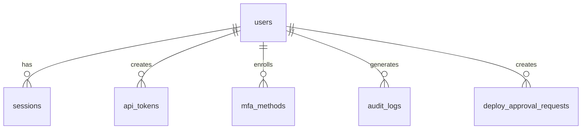

import { Aside, Steps } from '@astrojs/starlight/components';

Rack Gateway uses PostgreSQL for persistent storage. This guide covers database maintenance tasks including migrations, backups, and troubleshooting.

## Database Commands

The `rack-gateway` binary includes maintenance subcommands for database operations.

### Apply Migrations

Apply pending database migrations:

```bash
rack-gateway migrate
```

This command:
- Connects using `DATABASE_URL` or `PG*` environment variables
- Applies migrations in `internal/gateway/db/migrations/`
- Uses `schema_migrations` table to track applied migrations
- Is safe to run repeatedly (idempotent)

<Aside type="tip">
Run `rack-gateway migrate` as part of your deployment process to ensure the schema is up to date before starting the application.
</Aside>

### Reset Database

Reset the database to a clean state (development only):

```bash
# Required safety guards
export RESET_RACK_GATEWAY_DATABASE=DELETE_ALL_DATA
export DEV_MODE=true

rack-gateway reset-db
```

<Aside type="danger">
This command **drops all tables and data**. It requires explicit environment variable guards to prevent accidental execution.
</Aside>

**Safety guards:**
1. `RESET_RACK_GATEWAY_DATABASE=DELETE_ALL_DATA` - Must be set exactly
2. Database must be marked as development, OR set `DISABLE_DATABASE_ENVIRONMENT_CHECK=1`
3. For fresh databases, `DEV_MODE=true` is required

### Check Migration Status

Verify which migrations have been applied:

```bash
# Connect to database and check
psql $DATABASE_URL -c "SELECT * FROM schema_migrations ORDER BY version;"
```

## Backup Procedures

### Automated Backups (AWS RDS)

If using AWS RDS, configure automated backups:

```hcl
# Terraform configuration
resource "aws_db_instance" "gateway" {
  # Automated backups
  backup_retention_period = 30
  backup_window           = "03:00-04:00"

  # Point-in-time recovery
  copy_tags_to_snapshot = true
}
```

### Manual Backup

Create a manual backup using `pg_dump`:

```bash
# Full database backup
pg_dump $DATABASE_URL > rack_gateway_backup_$(date +%Y%m%d).sql

# Compressed backup
pg_dump $DATABASE_URL | gzip > rack_gateway_backup_$(date +%Y%m%d).sql.gz
```

### Restore from Backup

<Steps>

1. **Stop the gateway service**

   ```bash
   convox scale gateway --count 0
   ```

2. **Restore the database**

   ```bash
   psql $DATABASE_URL < rack_gateway_backup_20240115.sql
   ```

3. **Run any pending migrations**

   ```bash
   rack-gateway migrate
   ```

4. **Restart the service**

   ```bash
   convox scale gateway --count 2
   ```

</Steps>

## Schema Overview

The database contains these main tables:

| Table | Purpose |
|-------|---------|
| `users` | User accounts from OAuth |
| `sessions` | Active user sessions |
| `api_tokens` | API tokens for CI/CD |
| `mfa_methods` | User MFA enrollments |
| `audit_logs` | Request audit trail |
| `settings` | Gateway configuration |
| `deploy_approval_requests` | Pending deploy approvals |

### Key Relationships



## Maintenance Tasks

### Cleanup Old Sessions

Sessions expire automatically, but you can manually clean up:

```sql
-- Delete sessions older than 30 days
DELETE FROM sessions
WHERE created_at < NOW() - INTERVAL '30 days';
```

### Cleanup Old Audit Logs

Audit logs are retained according to `LOG_RETENTION_DAYS`:

```sql
-- Check audit log volume
SELECT COUNT(*), DATE(created_at) as day
FROM audit_logs
GROUP BY DATE(created_at)
ORDER BY day DESC
LIMIT 10;

-- Manual cleanup (if needed)
DELETE FROM audit_logs
WHERE created_at < NOW() - INTERVAL '400 days';
```

<Aside type="caution">
Be careful with audit log cleanup. These logs may be required for compliance. Always verify retention requirements before deleting.
</Aside>

### Vacuum and Analyze

Regular maintenance improves performance:

```sql
-- Analyze query statistics
ANALYZE;

-- Reclaim space from deleted rows
VACUUM ANALYZE;
```

For RDS, this happens automatically. For self-managed PostgreSQL, schedule regular maintenance.

## Connection Management

### Connection Pool Settings

Configure connection pooling:

```bash
DB_MAX_OPEN_CONNS=25    # Maximum concurrent connections
DB_MAX_IDLE_CONNS=5     # Idle connections to keep warm
DB_CONN_MAX_LIFETIME=30m # Connection lifetime
DB_CONN_MAX_IDLE_TIME=10m # Idle timeout
```

### Monitoring Connections

```sql
-- Current active connections
SELECT count(*) FROM pg_stat_activity
WHERE datname = 'rack_gateway';

-- Connection details
SELECT usename, application_name, client_addr, state
FROM pg_stat_activity
WHERE datname = 'rack_gateway';
```

## Troubleshooting

### Migration Failures

If a migration fails:

1. Check the error message for the specific issue
2. Fix the underlying problem (permissions, constraints, etc.)
3. Re-run `rack-gateway migrate`

Migrations are transactional—partial failures won't leave the database in an inconsistent state.

### Connection Issues

If the gateway can't connect to the database:

```bash
# Test connectivity
psql $DATABASE_URL -c "SELECT 1;"

# Check if host is reachable
nc -zv $PGHOST $PGPORT

# Verify SSL settings
psql "$DATABASE_URL?sslmode=require" -c "SELECT 1;"
```

### Slow Queries

Identify slow queries:

```sql
-- Enable query logging (if not already)
ALTER SYSTEM SET log_min_duration_statement = '1000';  -- Log queries > 1s

-- Check for long-running queries
SELECT pid, now() - pg_stat_activity.query_start AS duration, query
FROM pg_stat_activity
WHERE state = 'active'
ORDER BY duration DESC;
```

### Disk Space

Check database size:

```sql
SELECT pg_size_pretty(pg_database_size('rack_gateway'));

-- Size by table
SELECT relname, pg_size_pretty(pg_total_relation_size(relid))
FROM pg_catalog.pg_statio_user_tables
ORDER BY pg_total_relation_size(relid) DESC;
```

## Docker Development

When using the Docker development stack:

### Migrate

```bash
task docker:db:migrate
```

### Reset

```bash
task docker:db:reset
```

### Connect to Database

```bash
docker exec -it rack-gateway-postgres-1 psql -U postgres -d gateway_dev
```

## Best Practices

1. **Always run migrations before starting the app** - Include in deployment scripts
2. **Use automated backups** - Configure RDS backup retention
3. **Monitor connection usage** - Prevent connection exhaustion
4. **Keep audit logs** - Don't delete before retention period expires
5. **Test restore procedures** - Verify backups actually work

## Further Reading

- [AWS Infrastructure](/deployment/terraform/aws-infrastructure/) - RDS configuration
- [Production Checklist](/deployment/production-checklist/) - Pre-deployment verification
- [Troubleshooting](/operations/troubleshooting/) - Common issues
