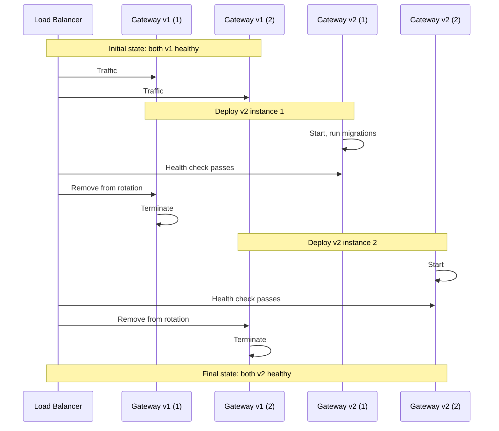

import { Aside, Steps } from '@astrojs/starlight/components';

This guide covers upgrading Rack Gateway to new versions, including planning, execution, and rollback procedures.

## Before Upgrading

### Check Release Notes

Always review the release notes for breaking changes:

1. Visit the [GitHub Releases](https://github.com/docspring/rack-gateway/releases)
2. Read all releases between your current and target version
3. Note any breaking changes or migration requirements

### Verify Current Version

```bash
# Check deployed version
convox ps -a rack-gateway | head -5

# Or via API
curl https://gateway.example.com/api/v1/health
```

### Backup Database

Create a backup before upgrading:

```bash
# RDS snapshot (AWS)
aws rds create-db-snapshot \
  --db-instance-identifier rack-gateway-prod \
  --db-snapshot-identifier rack-gateway-pre-upgrade-$(date +%Y%m%d)

# Or manual backup
pg_dump $DATABASE_URL > backup_pre_upgrade.sql
```

## Upgrade Procedures

### Convox Deployment

<Steps>

1. **Update the image tag**

   Edit `convox.yml`:
   ```yaml
   services:
     gateway:
       image: docker.io/docspringcom/rack-gateway:v1.2.0
   ```

2. **Review environment changes**

   Check if new environment variables are required:
   ```bash
   # Compare current env with docs
   convox env -a rack-gateway
   ```

3. **Deploy**

   ```bash
   convox deploy -a rack-gateway
   ```

4. **Verify deployment**

   ```bash
   # Check health
   curl https://gateway.example.com/api/v1/health

   # Check logs for errors
   convox logs -a rack-gateway --since 5m
   ```

</Steps>

### Docker Deployment

<Steps>

1. **Pull new image**

   ```bash
   docker pull docker.io/docspringcom/rack-gateway:v1.2.0
   ```

2. **Stop current container**

   ```bash
   docker-compose down
   ```

3. **Update docker-compose.yml**

   ```yaml
   services:
     gateway:
       image: docker.io/docspringcom/rack-gateway:v1.2.0
   ```

4. **Run migrations**

   ```bash
   docker-compose run --rm gateway rack-gateway migrate
   ```

5. **Start new version**

   ```bash
   docker-compose up -d
   ```

6. **Verify**

   ```bash
   curl http://localhost:8443/api/v1/health
   docker-compose logs -f
   ```

</Steps>

### Kubernetes Deployment

<Steps>

1. **Update deployment**

   ```yaml
   apiVersion: apps/v1
   kind: Deployment
   spec:
     template:
       spec:
         containers:
           - name: gateway
             image: docker.io/docspringcom/rack-gateway:v1.2.0
   ```

2. **Apply migration job**

   ```bash
   kubectl apply -f migration-job.yaml
   kubectl wait --for=condition=complete job/rack-gateway-migrate
   ```

3. **Roll out deployment**

   ```bash
   kubectl apply -f deployment.yaml
   kubectl rollout status deployment/rack-gateway
   ```

4. **Verify**

   ```bash
   kubectl get pods -l app=rack-gateway
   kubectl logs -l app=rack-gateway --tail=100
   ```

</Steps>

## Zero-Downtime Upgrades

For high-availability deployments:

### Prerequisites

- At least 2 gateway instances
- Load balancer with health checks
- Rolling deployment strategy

### Procedure



### Convox Rolling Deployment

Convox handles this automatically with proper configuration:

```yaml
services:
  gateway:
    scale:
      count: 3
    deployment:
      minimum: 2    # Keep 2 running during deploy
```

## Database Migrations

Migrations run automatically or can be run manually:

### Automatic (Recommended)

Configure the gateway to run migrations on startup:
```bash
# Migrations run before server starts
# This is the default behavior
```

### Manual

For more control, run migrations separately:

```bash
# Run migration job
convox run gateway rack-gateway migrate

# Then deploy
convox deploy
```

### Rollback Migrations

<Aside type="danger">
Rolling back migrations can cause data loss. Only do this if absolutely necessary and you have a backup.
</Aside>

1. Restore from backup if needed
2. Deploy the previous version
3. Migrations are forward-only; previous versions must be compatible

## Rollback Procedures

### Quick Rollback (Convox)

```bash
# List previous releases
convox releases -a rack-gateway

# Rollback to previous release
convox releases rollback RELEASE_ID -a rack-gateway
```

### Image Rollback

```bash
# Update to previous image
convox env set IMAGE_TAG=v1.1.0 -a rack-gateway
convox deploy -a rack-gateway
```

### Database Rollback

If a migration caused issues:

1. Stop the gateway
2. Restore database from backup
3. Deploy previous version

```bash
# Stop gateway
convox scale gateway --count 0 -a rack-gateway

# Restore database (example for RDS)
aws rds restore-db-instance-from-db-snapshot \
  --db-instance-identifier rack-gateway-restored \
  --db-snapshot-identifier rack-gateway-pre-upgrade-20240115

# Update DATABASE_URL to point to restored instance
# Deploy previous version
```

## Version Compatibility

### API Compatibility

Rack Gateway maintains backward compatibility within major versions:

| Version Range | Compatibility |
|--------------|---------------|
| v1.x → v1.y | API compatible |
| v1.x → v2.x | Check migration guide |

### CLI Compatibility

The CLI should match the gateway major version:

| Gateway | CLI | Compatible |
|---------|-----|------------|
| v1.2.0 | v1.0.0 | Yes |
| v1.2.0 | v2.0.0 | Check release notes |

### Database Compatibility

Database migrations are additive within major versions. Rollback requires:

1. Previous version must be able to read new schema
2. Or restore from backup

## Upgrade Checklist

Before upgrading:

- [ ] Read release notes for all versions
- [ ] Backup database
- [ ] Note any new required environment variables
- [ ] Schedule maintenance window (if not zero-downtime)
- [ ] Notify users of potential brief interruption

After upgrading:

- [ ] Verify health endpoints
- [ ] Check application logs for errors
- [ ] Test critical functionality (login, deploy)
- [ ] Monitor error rates for 24 hours
- [ ] Update documentation with new version

## Troubleshooting Upgrades

### Upgrade Stuck

```bash
# Check pod/container status
convox ps -a rack-gateway

# Check events
convox logs -a rack-gateway --since 5m
```

### Health Check Failing

```bash
# Test health endpoint directly
convox run gateway -- curl localhost:8443/api/v1/health

# Check startup logs
convox logs -a rack-gateway | grep -i "start\|error"
```

### Database Migration Error

```bash
# Check migration status
convox run gateway -- rack-gateway migrate --dry-run

# View detailed error
convox run gateway -- rack-gateway migrate --verbose
```

## Further Reading

- [Database Maintenance](/operations/database-maintenance/) - Backup and restore procedures
- [Monitoring](/operations/monitoring/) - Verify upgrade success
- [Troubleshooting](/operations/troubleshooting/) - Resolve upgrade issues
