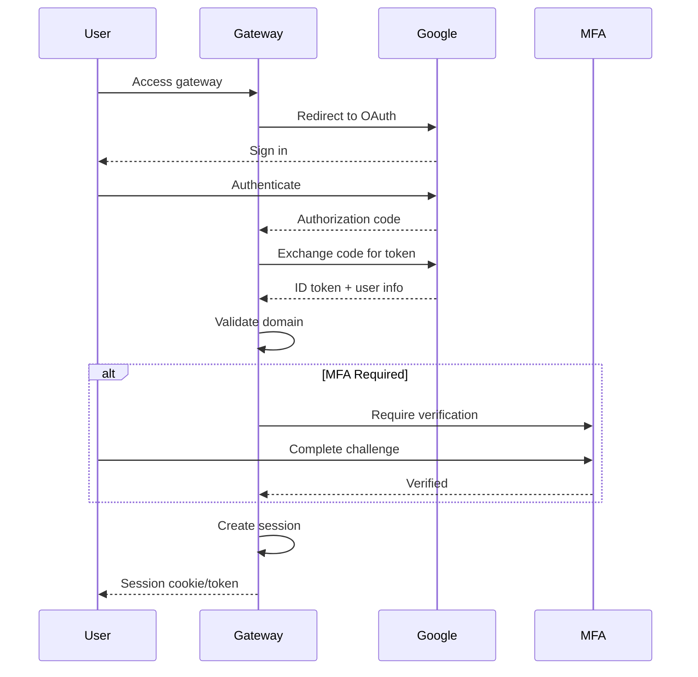
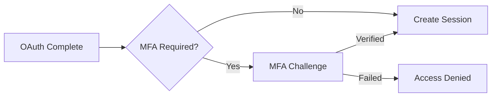

import { Aside, Card, CardGrid } from '@astrojs/starlight/components';

Rack Gateway uses a multi-layered authentication system combining OAuth 2.0 for identity, session tokens for authorization, and optional multi-factor authentication for additional security.

## Authentication Methods

<CardGrid>
  <Card title="OAuth 2.0" icon="star">
    **For human users**

    Google Workspace OAuth with PKCE for secure sign-in. Domain restrictions ensure only authorized users can access.

    [Learn more →](/security/authentication/oauth-flow/)
  </Card>
  <Card title="API Tokens" icon="seti:lock">
    **For automation**

    Long-lived tokens for CI/CD pipelines, scripts, and integrations. Each token has an assigned role.

    [Learn more →](/security/authentication/api-tokens/)
  </Card>
</CardGrid>

## Authentication Flow



## Web vs CLI Authentication

The gateway supports two authentication channels:

| Aspect | Web Browser | CLI |
|--------|-------------|-----|
| **OAuth Flow** | Standard code flow | PKCE code flow |
| **Session Storage** | HTTP-only cookie | Local config file |
| **Session Lifetime** | Configurable (default 5 min idle) | 90 days |
| **MFA** | Browser-based prompts | Terminal prompts |
| **CSRF Protection** | Required (cookie-based) | Not needed (token-based) |

### Web Authentication

1. User clicks "Sign in with Google"
2. Redirected to Google OAuth consent screen
3. After approval, redirected back with authorization code
4. Gateway exchanges code for ID token
5. Session created and stored in HTTP-only cookie
6. If MFA enabled, prompted for verification

### CLI Authentication

1. User runs `rack-gateway login`
2. CLI generates PKCE code verifier and challenge
3. Browser opens to Google OAuth with challenge
4. After approval, Google redirects back to the gateway callback
5. CLI polls the gateway to complete login
6. Gateway exchanges code + verifier for ID token and issues a session
7. Session token stored in `~/.config/rack-gateway/config.json`

## Session Management

Sessions are the primary authentication mechanism after initial OAuth:

- **Token-based**: Opaque tokens stored in database, hashed
- **Revocable**: Sessions can be revoked at any time
- **Sliding expiration**: Activity refreshes the session
- **Device tracking**: IP address and user agent logged

See [Sessions](/security/authentication/sessions/) for details.

## Security Features

### Domain Restriction

Only users from your Google Workspace domain can authenticate:

```yaml
# Environment variable
GOOGLE_ALLOWED_DOMAIN=yourcompany.com
```

Users from other domains receive an error during OAuth callback.

### Email Verification

The gateway verifies that:
- Email is verified in Google's ID token
- Email domain matches the allowed domain
- User account exists and is not locked/suspended

### Token Hashing

Session tokens are never stored in plaintext:

```
Stored: SHA-256(session_token)
Client: session_token (raw)
```

Even if the database is compromised, tokens cannot be recovered.

### CSRF Protection

Web requests require CSRF tokens to prevent cross-site request forgery:

- Token derived from session using HMAC
- Validated on all state-changing requests
- Automatically handled by the web UI

## MFA Integration

MFA adds a second factor after OAuth authentication:



MFA can be:
- **Required for all users** (recommended for production)
- **Required for specific roles** (e.g., admins only)
- **Optional** (user choice)

See [MFA Overview](/user-guide/mfa/) for setup details.

## Token vs Session Authentication

| Characteristic | Session (Human) | API Token (Automation) |
|---------------|-----------------|------------------------|
| **Creation** | OAuth flow | Admin creates in UI |
| **Lifetime** | Short (idle timeout) | Long (until revoked) |
| **Revocation** | Logout or admin action | Delete token |
| **MFA** | Required if enabled | N/A |
| **CSRF** | Required (web) | Not required |
| **Use Case** | Interactive access | CI/CD, scripts |

## Configuration

Key authentication settings:

| Setting | Description | Default |
|---------|-------------|---------|
| `GOOGLE_CLIENT_ID` | OAuth client ID | Required |
| `GOOGLE_CLIENT_SECRET` | OAuth client secret | Required |
| `GOOGLE_ALLOWED_DOMAIN` | Allowed email domain | Required |
| `APP_SECRET_KEY` | Secret for sessions/CSRF | Required |
| `RGW_SETTING_SESSION_TIMEOUT_MINUTES` | Idle session timeout | 5 |

See [Configuration](/configuration/environment-variables/) for complete reference.

## Security Checklist

- [ ] HTTPS enabled with valid certificate
- [ ] `GOOGLE_ALLOWED_DOMAIN` set to your domain
- [ ] `APP_SECRET_KEY` is strong and unique
- [ ] Session timeout appropriate for your security needs
- [ ] MFA enabled for privileged users
- [ ] Audit logging configured

## Next Steps

- [OAuth Flow](/security/authentication/oauth-flow/) - OAuth implementation details
- [Sessions](/security/authentication/sessions/) - Session management
- [API Tokens](/security/authentication/api-tokens/) - Token security
- [MFA Overview](/user-guide/mfa/) - Multi-factor authentication
