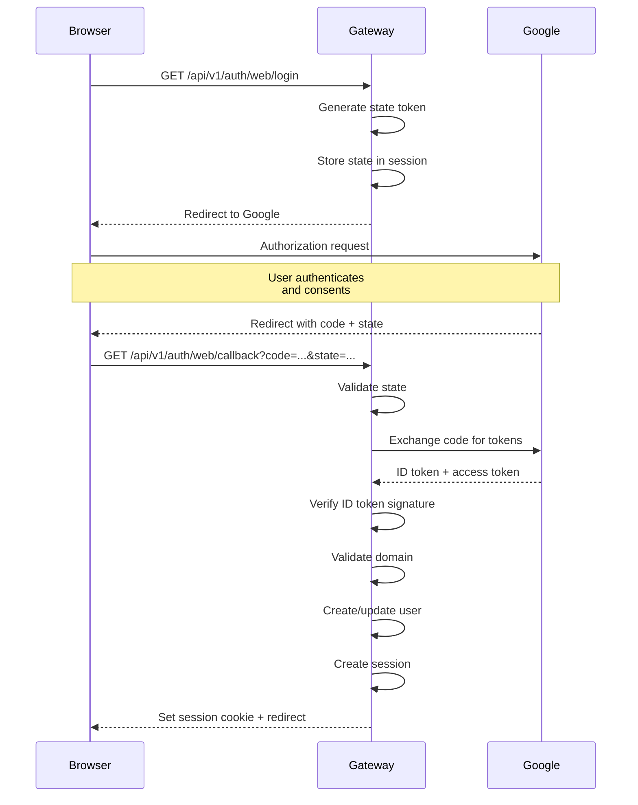
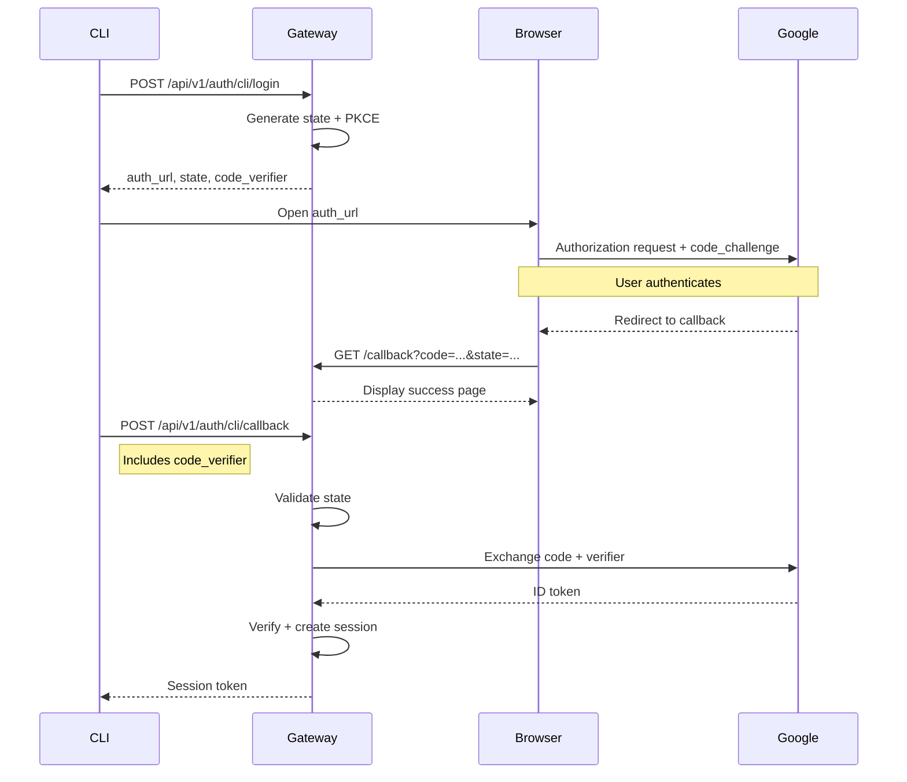

import { Aside, Steps, Tabs, TabItem } from '@astrojs/starlight/components';

Rack Gateway uses Google OAuth 2.0 with OpenID Connect (OIDC) for authentication. The implementation uses vetted libraries and follows security best practices including PKCE for CLI flows.

## OAuth Configuration

### Google Cloud Setup

<Steps>

1. **Create OAuth Client**

   In Google Cloud Console → APIs & Services → Credentials:
   - Click "Create Credentials" → "OAuth client ID"
   - Application type: "Web application"
   - Name: "Rack Gateway"

2. **Configure Redirect URIs**

   Add authorized redirect URIs:
   ```
   https://gateway.example.com/api/v1/auth/web/callback
   https://gateway.example.com/api/v1/auth/cli/callback
   ```

3. **Set Environment Variables**

   ```bash
   GOOGLE_CLIENT_ID=your-client-id.apps.googleusercontent.com
   GOOGLE_CLIENT_SECRET=your-client-secret
   GOOGLE_ALLOWED_DOMAIN=yourcompany.com
   ```

</Steps>

<Aside type="caution" title="Domain Restriction">
Always set `GOOGLE_ALLOWED_DOMAIN` to restrict authentication to your organization. Without this, anyone with a Google account could attempt to authenticate.
</Aside>

## Web OAuth Flow

The web flow uses standard OAuth 2.0 authorization code flow:



### Web Flow Parameters

| Parameter | Value | Purpose |
|-----------|-------|---------|
| `response_type` | `code` | Request authorization code |
| `scope` | `openid profile email` | Request user info |
| `state` | Random 32 bytes | CSRF protection |
| `access_type` | `online` | No refresh token needed |
| `prompt` | `select_account` | Always show account picker |
| `hd` | Allowed domain | Filter to organization accounts |

## CLI OAuth Flow (with PKCE)

The CLI uses OAuth 2.0 with PKCE (Proof Key for Code Exchange) for enhanced security:



### Why PKCE?

PKCE prevents authorization code interception attacks:

1. **Code verifier**: High-entropy random string (128 bytes)
2. **Code challenge**: SHA-256 hash of verifier
3. **Verification**: Google verifies the verifier matches the challenge

Even if an attacker intercepts the authorization code, they cannot exchange it without the code verifier.

### PKCE Parameters

| Parameter | Description |
|-----------|-------------|
| `code_verifier` | 128-byte random string (base64url encoded) |
| `code_challenge` | SHA-256(code_verifier), base64url encoded |
| `code_challenge_method` | Always `S256` |

## Token Verification

The gateway verifies Google's ID token using the `go-oidc` library:

<Steps>

1. **Signature verification**

   Validates the JWT signature against Google's public keys (fetched from OIDC discovery)

2. **Issuer validation**

   Confirms the token was issued by `https://accounts.google.com`

3. **Audience validation**

   Confirms the token was issued for our client ID

4. **Expiration check**

   Ensures the token hasn't expired

5. **Domain validation**

   Extracts email from claims and validates domain

</Steps>

### ID Token Claims

Claims extracted from Google's ID token:

```json
{
  "iss": "https://accounts.google.com",
  "aud": "your-client-id.apps.googleusercontent.com",
  "sub": "unique-user-id",
  "email": "user@yourcompany.com",
  "email_verified": true,
  "name": "User Name",
  "hd": "yourcompany.com"
}
```

| Claim | Description | Validation |
|-------|-------------|------------|
| `email` | User's email address | Required, domain checked |
| `email_verified` | Email verification status | Must be true |
| `name` | Display name | Used for user record |
| `hd` | Hosted domain | Must match allowed domain |

## Error Handling

### Common OAuth Errors

<Tabs>
<TabItem label="Domain Not Allowed">

**Error**: "email domain not allowed"

**Cause**: User attempted to sign in with an email outside the allowed domain.

**Solution**: Ensure users sign in with their organization email.

</TabItem>
<TabItem label="Invalid State">

**Error**: "state mismatch"

**Cause**: The state parameter from Google doesn't match the stored state. Possible CSRF attack or expired session.

**Solution**: Restart the login flow.

</TabItem>
<TabItem label="Token Exchange Failed">

**Error**: "failed to exchange code for token"

**Cause**: Invalid authorization code or client credentials.

**Solution**: Verify OAuth client configuration in Google Cloud Console.

</TabItem>
<TabItem label="Provider Unavailable">

**Error**: "failed to create OIDC provider"

**Cause**: Cannot reach Google's OIDC discovery endpoint.

**Solution**: Check network connectivity. The gateway retries with exponential backoff (up to 20 seconds).

</TabItem>
</Tabs>

### Error Response Format

OAuth errors return structured JSON:

```json
{
  "error": "domain_not_allowed",
  "error_description": "Email domain not allowed: user@external.com"
}
```

## Security Considerations

### State Parameter

- Generated using cryptographically secure random bytes
- 32 bytes, base64url encoded
- Stored server-side and validated on callback
- Prevents CSRF attacks

### Token Storage

- ID tokens are verified and discarded immediately
- Session tokens (not OAuth tokens) are stored hashed
- No refresh tokens stored for web flow

### Redirect URI Validation

- Redirect URIs must exactly match those registered in Google Cloud Console
- No wildcards or pattern matching
- Separate URIs for web and CLI flows

### HTTPS Required

<Aside type="caution" title="Production Requirement">
OAuth flows require HTTPS in production. Google will reject OAuth requests to non-HTTPS redirect URIs (except localhost for development).
</Aside>

## Testing OAuth

### Local Development

For local development, use the mock OAuth server:

```bash
# Uses mock OAuth server at localhost:3345
task dev
```

The mock server simulates Google OAuth without requiring real credentials.

### Integration Testing

For integration testing against real Google OAuth:

1. Create a separate OAuth client for testing
2. Add `http://localhost:8447/api/v1/auth/*/callback` as redirect URIs
3. Use test accounts from your Google Workspace

## Troubleshooting

### "redirect_uri_mismatch"

The redirect URI in your request doesn't match any authorized URI in Google Cloud Console.

1. Check the exact URI (including protocol and path)
2. Ensure no trailing slashes mismatch
3. Verify the `GATEWAY_URL` environment variable

### "invalid_client"

Client ID or secret is incorrect.

1. Verify `GOOGLE_CLIENT_ID` matches the Cloud Console
2. Verify `GOOGLE_CLIENT_SECRET` is correct
3. Ensure the OAuth client hasn't been deleted

### Account Picker Not Showing

If users aren't seeing the account picker:

1. Verify `prompt=select_account` is in the auth URL
2. Check if the browser has cached credentials
3. Try incognito/private browsing

## Next Steps

- [Sessions](/security/authentication/sessions/) - Session management after OAuth
- [API Tokens](/security/authentication/api-tokens/) - Token-based authentication for automation
- [Configuration](/configuration/oauth-setup/) - Complete OAuth setup guide
