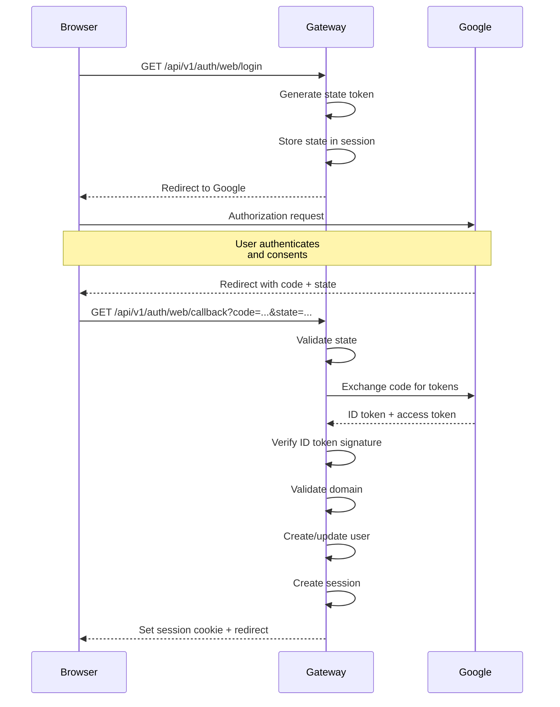
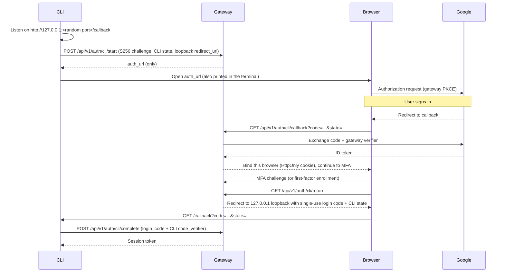

import { Aside, Steps, Tabs, TabItem } from '@astrojs/starlight/components';

Rack Gateway uses Google OAuth 2.0 with OpenID Connect (OIDC) for authentication. The implementation uses vetted libraries and follows security best practices including PKCE for CLI flows.

## OAuth Configuration

### Google Cloud Setup

<Steps>

1. **Create OAuth Client**

   In Google Cloud Console → APIs & Services → Credentials:
   - Click "Create Credentials" → "OAuth client ID"
   - Application type: "Web application"
   - Name: "Rack Gateway"

2. **Configure Redirect URIs**

   Add authorized redirect URIs:
   ```
   https://gateway.example.com/api/v1/auth/web/callback
   https://gateway.example.com/api/v1/auth/cli/callback
   ```

3. **Set Environment Variables**

   ```bash
   GOOGLE_CLIENT_ID=your-client-id.apps.googleusercontent.com
   GOOGLE_CLIENT_SECRET=your-client-secret
   GOOGLE_ALLOWED_DOMAIN=yourcompany.com
   ```

</Steps>

<Aside type="caution" title="Domain Restriction">
Always set `GOOGLE_ALLOWED_DOMAIN` to restrict authentication to your organization. Without this, anyone with a Google account could attempt to authenticate.
</Aside>

## Web OAuth Flow

The web flow uses standard OAuth 2.0 authorization code flow:


```mermaid
sequenceDiagram
    participant Browser
    participant Gateway
    participant Google

    Browser->>Gateway: GET /api/v1/auth/web/login
    Gateway->>Gateway: Generate state token
    Gateway->>Gateway: Store state in session
    Gateway-->>Browser: Redirect to Google

    Browser->>Google: Authorization request
    Note over Browser,Google: User authenticates<br/>and consents
    Google-->>Browser: Redirect with code + state

    Browser->>Gateway: GET /api/v1/auth/web/callback?code=...&state=...
    Gateway->>Gateway: Validate state
    Gateway->>Google: Exchange code for tokens
    Google-->>Gateway: ID token + access token
    Gateway->>Gateway: Verify ID token signature
    Gateway->>Gateway: Validate domain
    Gateway->>Gateway: Create/update user
    Gateway->>Gateway: Create session
    Gateway-->>Browser: Set session cookie + redirect
```

### Web Flow Parameters

| Parameter | Value | Purpose |
|-----------|-------|---------|
| `response_type` | `code` | Request authorization code |
| `scope` | `openid profile email` | Request user info |
| `state` | Random 32 bytes | CSRF protection |
| `access_type` | `online` | No refresh token needed |
| `prompt` | `select_account` | Always show account picker |
| `hd` | Allowed domain | Filter to organization accounts |

## CLI Login Flow (RFC 8252 loopback, with PKCE)

The CLI logs in with the [RFC 8252](https://www.rfc-editor.org/rfc/rfc8252) loopback flow. Two PKCE pairs
are involved: the gateway's own pair for the Google leg, and the CLI's pair, which proves that only the
CLI that started the login can finish it.


```mermaid
sequenceDiagram
    participant CLI
    participant Gateway
    participant Browser
    participant Google

    CLI->>CLI: Listen on http://127.0.0.1:<random port>/callback
    CLI->>Gateway: POST /api/v1/auth/cli/start (S256 challenge, CLI state, loopback redirect_uri)
    Gateway-->>CLI: auth_url (only)

    CLI->>Browser: Open auth_url (also printed in the terminal)
    Browser->>Google: Authorization request (gateway PKCE)
    Note over Browser,Google: User signs in
    Google-->>Browser: Redirect to callback
    Browser->>Gateway: GET /api/v1/auth/cli/callback?code=...&state=...
    Gateway->>Google: Exchange code + gateway verifier
    Google-->>Gateway: ID token
    Gateway-->>Browser: Bind this browser (HttpOnly cookie), continue to MFA

    Browser->>Gateway: MFA challenge (or first-factor enrollment)
    Browser->>Gateway: GET /api/v1/auth/cli/return
    Gateway-->>Browser: Redirect to 127.0.0.1 loopback with single-use login code + CLI state
    Browser->>CLI: GET /callback?code=...&state=...

    CLI->>Gateway: POST /api/v1/auth/cli/complete (login_code + CLI code_verifier)
    Gateway-->>CLI: Session token
```

### What protects the login

- **Loopback redirect only.** `/auth/cli/start` only accepts a redirect URI of the form
  `http://127.0.0.1:<port>/callback` (or `http://[::1]:<port>/callback`). The login code is only ever sent to
  that address, so a login link someone else started delivers its code to *your* machine, never theirs.
- **Exchange before binding.** The gateway exchanges Google's authorization code at the callback, and only
  when that succeeds binds the login to the browser with an HttpOnly, SameSite=Lax cookie (path
  `/api/v1/auth/cli`). Every later browser step (MFA form, MFA submit, return, cancel) requires that cookie.
  The Google code is never stored.
- **Single-use login code.** The login code is 256 bits of randomness, stored only as a SHA-256 hash, valid
  for 2 minutes, issued once per login, and deleted when redeemed (a failed redemption also burns it).
- **CLI PKCE.** Redeeming the login code also requires the CLI's code verifier, which never leaves the CLI.
- **Time limit.** The whole login must finish within 10 minutes.
- **First-factor enrollment.** A user with no MFA factor can enroll one during the login, but only in the
  browser bound to the login.
- **Visible initiator.** The MFA page shows the device name and IP that started the login, and the user gets
  a "New CLI Login" email when a CLI session is created. **Cancel Login** ends the login on the gateway and
  tells the waiting CLI.

### PKCE parameters (CLI pair)

| Parameter | Description |
|-----------|-------------|
| `code_verifier` | 64 random bytes, base64url encoded (86 characters); kept by the CLI |
| `code_challenge` | SHA-256(code_verifier), base64url encoded (43 characters) |
| `code_challenge_method` | Always `S256` |

### Same-machine requirement

The browser must run on the same machine as the CLI, because the login code is delivered to
`127.0.0.1`. To log in from a remote host (for example over SSH), forward the CLI's port: start
`rack-gateway login --no-open`, note the port in the printed "Waiting for the browser to return to
http://127.0.0.1:<port>/callback" line, and run `ssh -L <port>:127.0.0.1:<port> <host>` from the machine with
the browser before opening the printed login URL there.

### Upgrading

The gateway and CLI must both support the loopback flow. After upgrading the gateway, install the matching
rack-gateway CLI: an older CLI is told to upgrade, and a newer CLI refuses to log in to an older gateway.

## Token Verification

The gateway verifies Google's ID token using the `go-oidc` library:

<Steps>

1. **Signature verification**

   Validates the JWT signature against Google's public keys (fetched from OIDC discovery)

2. **Issuer validation**

   Confirms the token was issued by `https://accounts.google.com`

3. **Audience validation**

   Confirms the token was issued for our client ID

4. **Expiration check**

   Ensures the token hasn't expired

5. **Domain validation**

   Extracts email from claims and validates domain

</Steps>

### ID Token Claims

Claims extracted from Google's ID token:

```json
{
  "iss": "https://accounts.google.com",
  "aud": "your-client-id.apps.googleusercontent.com",
  "sub": "unique-user-id",
  "email": "user@yourcompany.com",
  "email_verified": true,
  "name": "User Name",
  "hd": "yourcompany.com"
}
```

| Claim | Description | Validation |
|-------|-------------|------------|
| `email` | User's email address | Required, domain checked |
| `email_verified` | Email verification status | Must be true |
| `name` | Display name | Used for user record |
| `hd` | Hosted domain | Must match allowed domain |

## Error Handling

### Common OAuth Errors

<Tabs>
<TabItem label="Domain Not Allowed">

**Error**: "email domain not allowed"

**Cause**: User attempted to sign in with an email outside the allowed domain.

**Solution**: Ensure users sign in with their organization email.

</TabItem>
<TabItem label="Invalid State">

**Error**: "state mismatch"

**Cause**: The state parameter from Google doesn't match the stored state. Possible CSRF attack or expired session.

**Solution**: Restart the login flow.

</TabItem>
<TabItem label="Token Exchange Failed">

**Error**: "failed to exchange code for token"

**Cause**: Invalid authorization code or client credentials.

**Solution**: Verify OAuth client configuration in Google Cloud Console.

</TabItem>
<TabItem label="Provider Unavailable">

**Error**: "failed to create OIDC provider"

**Cause**: Cannot reach Google's OIDC discovery endpoint.

**Solution**: Check network connectivity. The gateway retries with exponential backoff (up to 20 seconds).

</TabItem>
</Tabs>

### Error Response Format

OAuth errors return structured JSON:

```json
{
  "error": "domain_not_allowed",
  "error_description": "Email domain not allowed: user@external.com"
}
```

## Security Considerations

### State Parameter

- Generated using cryptographically secure random bytes
- 32 bytes, base64url encoded
- Stored server-side and validated on callback
- Prevents CSRF attacks

### Token Storage

- ID tokens are verified and discarded immediately
- Session tokens (not OAuth tokens) are stored hashed
- No refresh tokens stored for web flow

### Redirect URI Validation

- Redirect URIs must exactly match those registered in Google Cloud Console
- No wildcards or pattern matching
- Separate URIs for web and CLI flows

### HTTPS Required

<Aside type="caution" title="Production Requirement">
OAuth flows require HTTPS in production. Google will reject OAuth requests to non-HTTPS redirect URIs (except localhost for development).
</Aside>

## Testing OAuth

### Local Development

For local development, use the mock OAuth server:

```bash
# Uses mock OAuth server at localhost:3345
task dev
```

The mock server simulates Google OAuth without requiring real credentials.

### Integration Testing

For integration testing against real Google OAuth:

1. Create a separate OAuth client for testing
2. Add `http://localhost:8447/api/v1/auth/*/callback` as redirect URIs
3. Use test accounts from your Google Workspace

## Troubleshooting

### "redirect_uri_mismatch"

The redirect URI in your request doesn't match any authorized URI in Google Cloud Console.

1. Check the exact URI (including protocol and path)
2. Ensure no trailing slashes mismatch
3. Verify the `GATEWAY_URL` environment variable

### "invalid_client"

Client ID or secret is incorrect.

1. Verify `GOOGLE_CLIENT_ID` matches the Cloud Console
2. Verify `GOOGLE_CLIENT_SECRET` is correct
3. Ensure the OAuth client hasn't been deleted

### Account Picker Not Showing

If users aren't seeing the account picker:

1. Verify `prompt=select_account` is in the auth URL
2. Check if the browser has cached credentials
3. Try incognito/private browsing

## Next Steps

- [Sessions](/security/authentication/sessions/) - Session management after OAuth
- [API Tokens](/security/authentication/api-tokens/) - Token-based authentication for automation
- [Configuration](/configuration/oauth-setup/) - Complete OAuth setup guide
