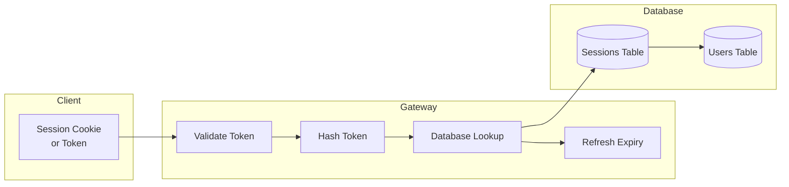
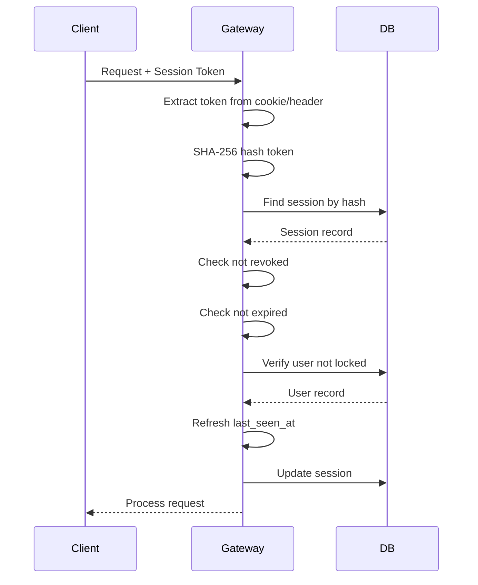
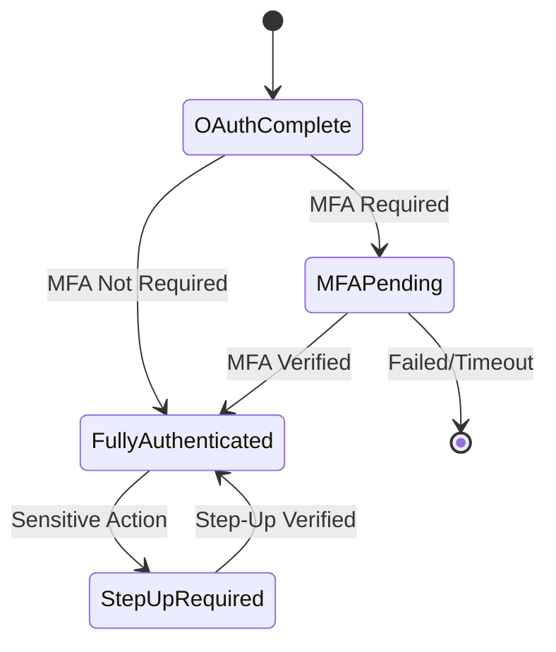

import { Aside, Steps } from '@astrojs/starlight/components';

Rack Gateway uses database-backed sessions to maintain authentication state after OAuth login. Sessions are designed for security, auditability, and revocability.

## Session Architecture



## Session Characteristics

| Property | Web Sessions | CLI Sessions |
|----------|--------------|--------------|
| **Storage** | HTTP-only cookie | Config file |
| **Default Lifetime** | 5 minutes idle | 90 days |
| **Expiration Type** | Sliding (activity-based) | Fixed |
| **CSRF Required** | Yes | No |
| **MFA Support** | Full | Full |

## Session Creation

Sessions are created after successful OAuth authentication:

<Steps>

1. **Generate token**

   32 bytes of cryptographically secure random data, base64url encoded

2. **Hash for storage**

   Token is SHA-256 hashed before database storage

3. **Record metadata**

   - Channel (web or cli)
   - IP address
   - User agent
   - Device information
   - MFA status

4. **Set expiration**

   Based on configured timeout and channel type

</Steps>

### Session Token Format

```
Raw token:    QnJ4R2pKM...  (43 characters, base64url)
Stored hash:  a4b2c8d9...   (64 characters, hex SHA-256)
```

The raw token is never stored. Even with database access, sessions cannot be hijacked.

## Session Validation

Every authenticated request validates the session:



### Validation Checks

| Check | Description | Action on Failure |
|-------|-------------|-------------------|
| Token exists | Session found in database | 401 Unauthorized |
| Not revoked | `revoked_at` is null | 401 Unauthorized |
| Not expired | `expires_at` > now | 401 + auto-revoke |
| Not idle | `last_seen_at` + TTL > now | 401 + auto-revoke |
| User exists | Associated user found | 401 + auto-revoke |
| User not locked | `locked_at` is null | 401 + auto-revoke |
| User not suspended | `suspended` is false | 401 + auto-revoke |

## Session Expiration

### Idle Timeout (Web)

Web sessions use sliding expiration based on activity:

```
Session Created: 10:00 AM
Last Activity:   10:03 AM
Timeout:         5 minutes
Expires:         10:08 AM (not 10:05!)
```

Each request refreshes the expiration, allowing continuous use without re-authentication.

### Absolute Timeout (CLI)

CLI sessions have a fixed 90-day lifetime:

- Longer lifetime for automation convenience
- Activity does not extend expiration
- Token must be refreshed by re-authenticating

### Configuring Timeout

```bash
# Set idle timeout to 15 minutes
SESSION_TIMEOUT_MINUTES=15
```

The timeout is stored with each session, so existing sessions keep their original timeout when settings change.

## Session Revocation

Sessions can be revoked through multiple mechanisms:

### User-Initiated Logout

```bash
# CLI logout
rack-gateway logout

# Web UI: Click user menu → Sign Out
```

### Admin Revocation

Administrators can revoke user sessions:

1. Web UI → Users → Select User → Sessions
2. Click "Revoke" on specific session or "Revoke All"

### Automatic Revocation

Sessions are automatically revoked when:

- Session expires (idle or absolute timeout)
- User account is locked
- User account is suspended
- Password/MFA is reset (optional)

### Programmatic Revocation

```go
// Revoke by session ID
sessionManager.RevokeByID(sessionID, &revokedByUserID)

// Revoke all sessions for a user
sessionManager.RevokeAllForUser(userID, &revokedByUserID)
```

## Session Metadata

Each session stores metadata for security and auditing:

| Field | Description |
|-------|-------------|
| `user_id` | Associated user |
| `token_hash` | SHA-256 of session token |
| `channel` | `web` or `cli` |
| `device_id` | Optional device identifier |
| `device_name` | User-provided device name |
| `ip_address` | Last seen IP address |
| `user_agent` | Last seen user agent |
| `created_at` | Session creation time |
| `last_seen_at` | Last activity timestamp |
| `expires_at` | Expiration timestamp |
| `revoked_at` | Revocation timestamp (null if active) |
| `mfa_verified_at` | MFA verification timestamp |
| `recent_step_up_at` | Recent step-up auth timestamp |

### Device Tracking

Sessions track device information for the user to identify their active sessions:

```json
{
  "device_id": "browser-firefox-001",
  "device_name": "Firefox on MacOS",
  "ip_address": "192.168.1.100",
  "user_agent": "Mozilla/5.0 (Macintosh; ...)"
}
```

Users can view their active sessions in the web UI under Account → Security → Active Sessions.

## MFA and Sessions

### MFA Verification

When MFA is required, sessions track verification status:



| Session Field | Purpose |
|---------------|---------|
| `mfa_verified_at` | Timestamp of initial MFA verification |
| `trusted_device_id` | Reference to trusted device (if remembered) |
| `recent_step_up_at` | Timestamp of recent step-up verification |

### Step-Up Authentication

For sensitive actions, users may need to re-verify MFA even within an active session:

- Configurable step-up window (default: 10 minutes)
- After step-up, `recent_step_up_at` is updated
- Subsequent sensitive actions within window don't require re-verification

## CSRF Protection

Web sessions require CSRF tokens:

### Token Derivation

```
CSRF Token = HMAC-SHA256(secret, "csrf|" + session_token)
```

The CSRF token is derived from the session token using HMAC, ensuring:
- Each session has a unique CSRF token
- Token cannot be guessed without knowing the session
- Validation is fast (no database lookup)

### Validation

Web requests include CSRF token in header:
```
X-CSRF-Token: <token>
```

API requests with bearer tokens don't require CSRF (token-based auth is inherently CSRF-safe).

## Session Cleanup

Expired and revoked sessions are automatically cleaned up:

- Background job runs periodically
- Removes sessions where `expires_at < now - 7 days`
- Preserves recent revoked sessions for audit purposes

<Aside type="note">
Revoked sessions are kept for 7 days to support audit log correlation. After that, they're permanently deleted.
</Aside>

## Security Best Practices

### Session Timeout Selection

| Use Case | Recommended Timeout |
|----------|---------------------|
| High-security production | 5 minutes |
| Standard production | 15 minutes |
| Internal/trusted network | 30 minutes |
| Development | 1 hour |

### Monitoring Sessions

Monitor for anomalies:
- Multiple concurrent sessions from different IPs
- Sessions from unusual geolocations
- Rapid session creation/destruction

### Incident Response

If a session is compromised:

<Steps>

1. **Revoke immediately**

   Admin revokes the specific session or all user sessions

2. **Lock account (if needed)**

   Lock the user account to prevent new sessions

3. **Review audit logs**

   Check what actions were taken with the compromised session

4. **Rotate secrets (if needed)**

   If actions accessed sensitive data, rotate affected credentials

5. **Unlock and notify**

   After securing, unlock account and notify user

</Steps>

## Next Steps

- [OAuth Flow](/security/authentication/oauth-flow/) - How sessions are created
- [API Tokens](/security/authentication/api-tokens/) - Alternative to sessions for automation
- [MFA Overview](/user-guide/mfa/) - Multi-factor authentication
