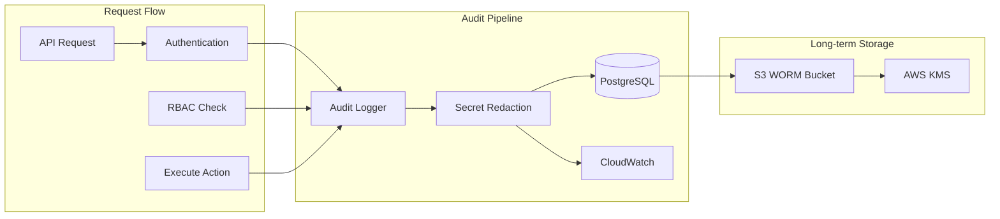
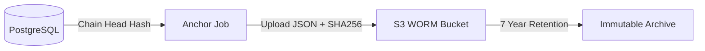

import { Aside, Steps, Tabs, TabItem } from '@astrojs/starlight/components';

Rack Gateway maintains a complete audit trail of all actions, providing the evidence needed for compliance audits and security investigations.

## Audit Architecture



## Audit Log Entry

Every API request generates an audit log entry:

```json
{
  "ts": "2024-01-15T10:30:00Z",
  "user_email": "developer@example.com",
  "user_name": "Alice Developer",
  "api_token_name": "ci-deploy",
  "action_type": "convox",
  "action": "deploy.create",
  "resource": "myapp",
  "resource_type": "app",
  "command": "releases promote RABCDEF",
  "status": "success",
  "rbac_decision": "allow",
  "http_status": 200,
  "latency_ms": 1250,
  "ip_address": "192.168.1.100",
  "user_agent": "rack-gateway/1.0.0",
  "request_id": "req-uuid-1234"
}
```

### Entry Fields

| Field | Description | Example |
|-------|-------------|---------|
| `ts` | Timestamp (UTC, RFC3339) | `2024-01-15T10:30:00Z` |
| `user_email` | User's email address | `alice@example.com` |
| `user_name` | User's display name | `Alice Developer` |
| `api_token_name` | Token name (if used) | `ci-deploy` |
| `action_type` | Category: convox, auth, users, tokens, admin | `convox` |
| `action` | Specific action | `deploy.create`, `user.create` |
| `resource` | Target resource | `myapp` |
| `resource_type` | Resource category | `app`, `build`, `release` |
| `command` | Full command executed | `releases promote RABCDEF` |
| `status` | Outcome | `success`, `denied`, `error` |
| `rbac_decision` | Access decision | `allow`, `deny` |
| `http_status` | HTTP response code | `200`, `403`, `500` |
| `latency_ms` | Request duration | `1250` |
| `ip_address` | Client IP | `192.168.1.100` |
| `user_agent` | Client identifier | `rack-gateway/1.0.0` |
| `request_id` | Unique request ID | `req-uuid-1234` |

## Secret Redaction

Sensitive data is automatically redacted before logging:

### Redacted Patterns

| Pattern | Example | Redacted As |
|---------|---------|-------------|
| Secrets/tokens/passwords | `PASSWORD=hunter2` | `PASSWORD=[REDACTED]` |
| Auth headers/cookies | `Authorization: Bearer ...` | `[REDACTED]` |
| API/client secrets | `CLIENT_SECRET=...` | `[REDACTED]` |

### Redaction Rules

```go
// Built-in redaction patterns
var redactPatterns = []string{
    `(?i)(secret|token|password|key|authorization|cookie|set-cookie|session)`,
    `(?i)(api[-_]?key|api[-_]?secret|client[-_]?secret)`,
    `(?i)(bearer|jwt|auth)`,
}
```

<Aside type="tip">
Redaction happens before any logging, including stdout and database storage. Secrets never appear in logs.
</Aside>

## Storage Layers

### PostgreSQL (Primary)

Audit logs are stored in PostgreSQL under the `audit.audit_event` table. The table is
append-only and protected by row-level security to prevent tampering.

### CloudWatch (Stream)

Logs are also written to stdout in structured JSON format for CloudWatch ingestion:

- Real-time streaming
- CloudWatch Logs Insights queries
- Integration with CloudWatch Alarms
- Cross-account log aggregation

### S3 WORM (Archival)

For compliance requirements, the gateway writes periodic **anchors** to S3 Object Lock.
Anchors capture the chain head hash and metadata (not full log exports).



See [Data Retention](/security/compliance/data-retention/) for S3 WORM configuration.

## Querying Audit Logs

### Web UI

1. Navigate to **Audit Logs** in the sidebar
2. Use filters to narrow results:
   - User
   - Date range
   - Action type
   - RBAC decision (allow/deny)
3. Click entries to view full details
4. Export for compliance reports

### SQL Queries

For advanced queries, access the database directly:

<Tabs>
<TabItem label="Recent Activity">

```sql
SELECT
    timestamp,
    user_email,
    action,
    resource,
    status,
    rbac_decision
FROM audit.audit_event
WHERE timestamp > NOW() - INTERVAL '7 days'
ORDER BY timestamp DESC
LIMIT 100;
```

</TabItem>
<TabItem label="Denied Requests">

```sql
SELECT
    timestamp,
    user_email,
    action,
    resource,
    ip_address
FROM audit.audit_event
WHERE rbac_decision = 'deny'
  AND timestamp > NOW() - INTERVAL '30 days'
ORDER BY timestamp DESC;
```

</TabItem>
<TabItem label="User Activity Summary">

```sql
SELECT
    user_email,
    COUNT(*) as total_actions,
    COUNT(*) FILTER (WHERE status = 'success') as successful,
    COUNT(*) FILTER (WHERE rbac_decision = 'deny') as denied,
    MAX(created_at) as last_activity
FROM audit_logs
WHERE created_at > NOW() - INTERVAL '30 days'
GROUP BY user_email
ORDER BY total_actions DESC;
```

</TabItem>
<TabItem label="Deploy Activity">

```sql
SELECT
    DATE_TRUNC('day', created_at) as day,
    COUNT(*) as deploys,
    COUNT(DISTINCT user_email) as deployers
FROM audit_logs
WHERE action IN ('deploy', 'promote')
  AND status = 'success'
  AND created_at > NOW() - INTERVAL '30 days'
GROUP BY DATE_TRUNC('day', created_at)
ORDER BY day DESC;
```

</TabItem>
</Tabs>

## What Gets Logged

### Always Logged

| Category | Actions |
|----------|---------|
| **Authentication** | Login, logout, MFA verification |
| **RBAC Decisions** | Allow/deny for every request |
| **Deployments** | Build, promote, rollback |
| **Environment** | Get, set, unset variables |
| **User Management** | Create, update, delete, lock |
| **Token Management** | Create, delete tokens |
| **Settings** | Configuration changes |

### Logged with Redaction

| Category | What's Redacted |
|----------|-----------------|
| **Environment Variables** | Values |
| **API Tokens** | Token strings |
| **Build Logs** | Secrets in output |
| **Request Bodies** | Sensitive fields |

### Not Logged

| Category | Reason |
|----------|--------|
| **Health Checks** | Too frequent, not useful |
| **Static Assets** | No security value |
| **Internal Metrics** | System-level only |

## Notifications

Audit events can trigger notifications:

### Slack Integration

Configure Slack notifications for security events:

```bash
# Environment variable
SLACK_WEBHOOK_URL=https://hooks.slack.com/services/T.../B.../...
```

Events that trigger notifications:
- Failed login attempts
- RBAC denials
- User account locks
- Admin actions

### Email Alerts

Email notifications for critical events:

```bash
# Environment variables
POSTMARK_API_KEY=your-api-key
NOTIFICATION_EMAIL=security@example.com
```

## Log Integrity

### Tamper Detection

Audit logs include integrity measures:

1. **Request ID**: Unique, non-sequential identifier
2. **Timestamps**: Server-generated, not client-provided
3. **User context**: Extracted from verified session/token

### S3 WORM Protection

For immutable storage:

- Object Lock in Compliance mode
- Minimum 7-year retention
- Legal hold capability
- SHA-256 checksums stored

## Compliance Use Cases

### SOC 2 Audits

Evidence for Common Criteria:

| Criterion | Evidence |
|-----------|----------|
| CC6.1 | Access logs showing authentication |
| CC6.2 | RBAC decision logs |
| CC6.3 | Session management logs |
| CC7.1 | Configuration change logs |
| CC7.2 | Deploy and change logs |

### Security Investigations

For incident response:

<Steps>

1. **Identify timeframe**

   When did the incident occur?

2. **Find affected users**

   ```sql
   SELECT DISTINCT user_email
   FROM audit_logs
   WHERE created_at BETWEEN '2024-01-15 00:00:00' AND '2024-01-16 00:00:00';
   ```

3. **Trace actions**

   ```sql
   SELECT *
   FROM audit_logs
   WHERE user_email = 'suspect@example.com'
   ORDER BY created_at;
   ```

4. **Check for anomalies**

   Unusual times, IPs, or action patterns

5. **Export evidence**

   Full logs with request IDs for forensics

</Steps>

## Best Practices

### Log Retention

- **Hot storage (PostgreSQL)**: 90 days for fast queries
- **Cold storage (S3)**: 7+ years for compliance
- **Real-time (CloudWatch)**: 30 days for monitoring

### Monitoring

Set up alerts for:
- Multiple failed logins
- High rate of RBAC denials
- Admin actions outside business hours
- Unusual deployment patterns

### Regular Review

- Daily: Security team reviews failed logins
- Weekly: Review admin actions
- Monthly: Full access review
- Quarterly: Compliance report generation

## Next Steps

- [Data Retention](/security/compliance/data-retention/) - Configure retention policies
- [SOC 2](/security/compliance/soc2/) - SOC 2 control mapping
- [Hardening](/security/hardening/) - Security hardening guide
