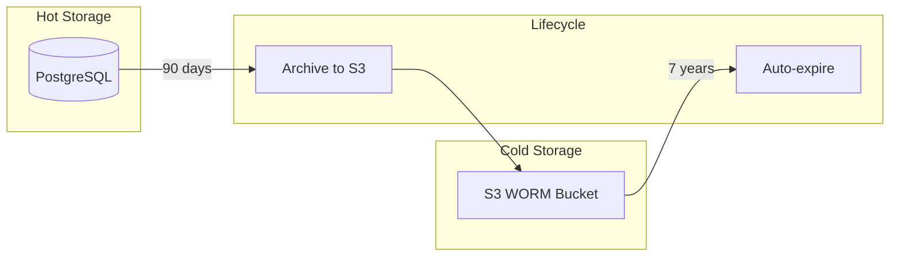
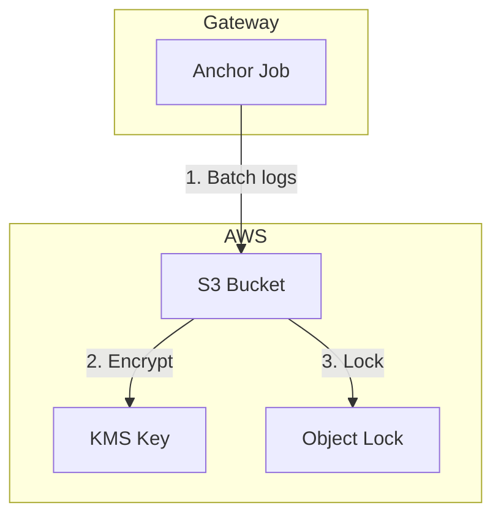
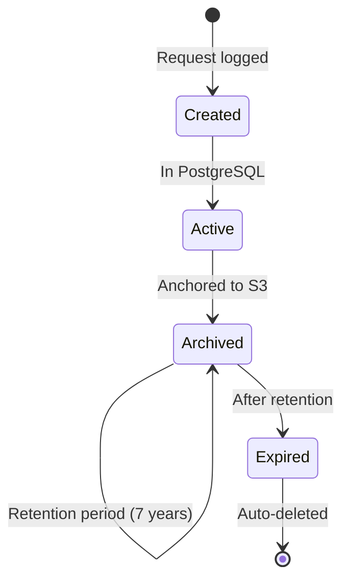
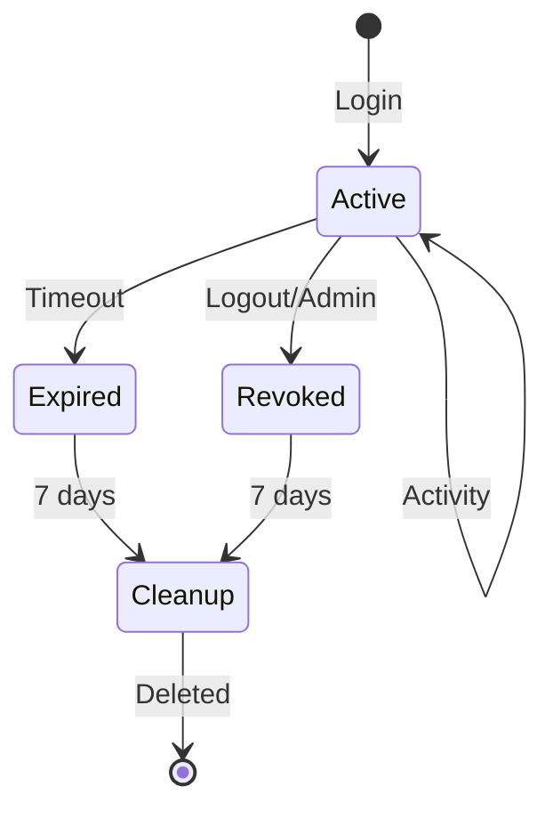

import { Aside, Steps } from '@astrojs/starlight/components';

Rack Gateway supports configurable data retention policies and immutable S3 WORM (Write Once Read Many) storage for compliance requirements.

## Retention Overview



## Data Types and Retention

| Data Type | Hot Storage | Cold Storage | Total Retention |
|-----------|-------------|--------------|-----------------|
| **Audit logs** | 90 days | 7 years | 7 years |
| **User sessions** | 7 days after expiry | Not archived | 7 days |
| **API tokens** | Until deleted | Not archived | User-controlled |
| **User records** | Indefinite | Not archived | Indefinite |
| **Build records** | Proxied | N/A | Convox controls |

## PostgreSQL Retention

### Audit Logs

Audit logs are retained in PostgreSQL for fast querying:

```sql
-- Default: 90 days of audit logs
SELECT COUNT(*) FROM audit_logs
WHERE created_at > NOW() - INTERVAL '90 days';

-- Cleanup job removes older records
DELETE FROM audit_logs
WHERE created_at < NOW() - INTERVAL '90 days'
  AND archived_to_s3 = true;
```

### Session Records

Expired and revoked sessions are cleaned up:

```sql
-- Keep for 7 days after expiry/revocation
DELETE FROM user_sessions
WHERE (expires_at < NOW() - INTERVAL '7 days')
   OR (revoked_at < NOW() - INTERVAL '7 days');
```

### Configuring Retention

Set retention periods via environment variables:

```bash
# Audit log retention in PostgreSQL (days)
AUDIT_LOG_RETENTION_DAYS=90

# Session cleanup delay (days after expiry)
SESSION_CLEANUP_DELAY_DAYS=7
```

## S3 WORM Storage

For compliance requirements like SOC 2, audit logs can be archived to S3 with Object Lock protection.

### What is WORM?

Write Once Read Many (WORM) storage ensures:

- **Immutability**: Objects cannot be modified after creation
- **Retention**: Objects cannot be deleted until retention expires
- **Legal hold**: Objects can be locked indefinitely for legal purposes

### Architecture



### Terraform Configuration

Configure S3 WORM storage with Terraform:

```hcl
resource "aws_s3_bucket" "audit_anchor" {
  bucket = "rack-gateway-audit-anchor-${var.environment}"

  # Object Lock requires versioning
  versioning {
    enabled = true
  }

  # Object Lock configuration
  object_lock_configuration {
    object_lock_enabled = "Enabled"
  }
}

# Set default retention for new objects
resource "aws_s3_bucket_object_lock_configuration" "audit_anchor" {
  bucket = aws_s3_bucket.audit_anchor.id

  rule {
    default_retention {
      mode = "COMPLIANCE"
      years = 7
    }
  }
}

# Server-side encryption with KMS
resource "aws_s3_bucket_server_side_encryption_configuration" "audit_anchor" {
  bucket = aws_s3_bucket.audit_anchor.id

  rule {
    apply_server_side_encryption_by_default {
      kms_master_key_id = aws_kms_key.audit_anchor.arn
      sse_algorithm     = "aws:kms"
    }
    bucket_key_enabled = true
  }
}

# KMS key for encryption
resource "aws_kms_key" "audit_anchor" {
  description             = "Audit anchor encryption key"
  deletion_window_in_days = 30
  enable_key_rotation     = true
}
```

### Environment Configuration

Configure the gateway to use S3 WORM:

```bash
# S3 bucket name
AUDIT_ANCHOR_S3_BUCKET=rack-gateway-audit-anchor-production

# AWS region
AUDIT_ANCHOR_S3_REGION=us-east-1

# KMS key ID (optional, uses bucket default if not set)
AUDIT_ANCHOR_KMS_KEY_ID=arn:aws:kms:us-east-1:123456789:key/abc123

# Anchor job schedule (cron)
AUDIT_ANCHOR_SCHEDULE="0 * * * *"  # Hourly
```

### Anchor Process

<Steps>

1. **Batch collection**

   Anchor job collects audit logs since last anchor

2. **JSON export**

   Logs exported as JSON with metadata

3. **SHA-256 hash**

   Content hash calculated for integrity verification

4. **S3 upload**

   Object uploaded with hash in metadata

5. **Object Lock**

   S3 applies retention lock automatically

6. **Database update**

   Records marked as archived

</Steps>

### Verification

Verify anchored logs:

```bash
# List anchored objects
aws s3api list-objects-v2 \
  --bucket rack-gateway-audit-anchor-production \
  --prefix "audit/" \
  --query 'Contents[].{Key:Key,Size:Size,LastModified:LastModified}'

# Check object lock status
aws s3api get-object-retention \
  --bucket rack-gateway-audit-anchor-production \
  --key "audit/2024/01/15/batch-001.json"

# Verify content hash
aws s3api head-object \
  --bucket rack-gateway-audit-anchor-production \
  --key "audit/2024/01/15/batch-001.json" \
  --query 'Metadata.sha256'
```

## Compliance Mode vs Governance Mode

AWS S3 Object Lock offers two modes:

| Aspect | Compliance Mode | Governance Mode |
|--------|-----------------|-----------------|
| **Deletion** | Nobody can delete | Root can bypass |
| **Modification** | Nobody can modify | Root can bypass |
| **Retention reduction** | Not allowed | Root can reduce |
| **Use case** | Regulatory compliance | Internal policy |

<Aside type="caution" title="Use Compliance Mode for SOC 2">
For SOC 2 and similar regulatory requirements, always use Compliance mode. Governance mode allows bypass and may not satisfy auditor requirements.
</Aside>

## Legal Hold

For legal proceedings, objects can be placed on indefinite hold:

```bash
# Apply legal hold
aws s3api put-object-legal-hold \
  --bucket rack-gateway-audit-anchor-production \
  --key "audit/2024/01/15/batch-001.json" \
  --legal-hold Status=ON

# Check legal hold status
aws s3api get-object-legal-hold \
  --bucket rack-gateway-audit-anchor-production \
  --key "audit/2024/01/15/batch-001.json"
```

Legal hold:
- Prevents deletion even after retention expires
- Must be explicitly removed
- Independent of retention period

## Data Lifecycle

### Audit Log Lifecycle



### Session Lifecycle



## Backup and Recovery

### PostgreSQL Backups

- Automated backups via AWS RDS
- Point-in-time recovery
- Cross-region replication (optional)

### S3 Versioning

All objects in the WORM bucket have versioning enabled:

- Full version history
- Accidental overwrite protection
- Recovery to any version

### Disaster Recovery

| Component | RPO | RTO |
|-----------|-----|-----|
| PostgreSQL (RDS) | 5 min | 15 min |
| S3 WORM | Real-time | Immediate |
| Configuration | Git | Minutes |

## Compliance Checklist

### S3 WORM Setup

- [ ] S3 bucket created with Object Lock enabled
- [ ] Compliance mode retention (7 years)
- [ ] KMS encryption enabled
- [ ] Versioning enabled
- [ ] Bucket policy restricts access
- [ ] CloudTrail logging enabled

### Gateway Configuration

- [ ] `AUDIT_ANCHOR_S3_BUCKET` set
- [ ] `AUDIT_ANCHOR_S3_REGION` set
- [ ] Anchor job scheduled
- [ ] Test anchor verified

### Verification

- [ ] Objects have correct retention
- [ ] Content hashes match
- [ ] Legal hold tested
- [ ] Recovery procedure documented

## Troubleshooting

### "Access Denied" on S3 Upload

Check IAM permissions:

```json
{
  "Version": "2012-10-17",
  "Statement": [
    {
      "Effect": "Allow",
      "Action": [
        "s3:PutObject",
        "s3:PutObjectRetention",
        "s3:GetObject",
        "s3:ListBucket"
      ],
      "Resource": [
        "arn:aws:s3:::rack-gateway-audit-anchor-*",
        "arn:aws:s3:::rack-gateway-audit-anchor-*/*"
      ]
    },
    {
      "Effect": "Allow",
      "Action": [
        "kms:Encrypt",
        "kms:GenerateDataKey"
      ],
      "Resource": "arn:aws:kms:*:*:key/*"
    }
  ]
}
```

### "Object Lock must be enabled"

Object Lock can only be enabled at bucket creation. Create a new bucket:

1. Create new bucket with Object Lock
2. Migrate existing objects
3. Update configuration
4. Delete old bucket

### Anchor Job Not Running

Check job logs:

```bash
# View recent anchor job runs
rack-gateway audit anchor-status

# Run anchor manually
rack-gateway audit anchor-run --dry-run
rack-gateway audit anchor-run
```

## Next Steps

- [Audit Trail](/security/compliance/audit-trail/) - Audit logging details
- [SOC 2](/security/compliance/soc2/) - SOC 2 alignment guide
- [Terraform](/deployment/terraform/) - Infrastructure setup
