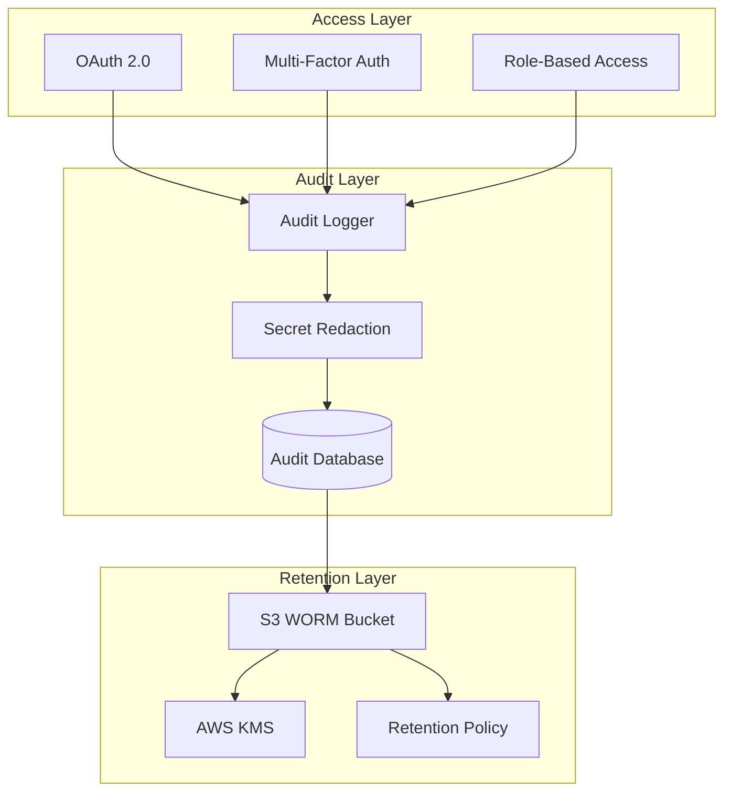

import { Aside, Card, CardGrid } from '@astrojs/starlight/components';

Rack Gateway is designed with compliance in mind, providing the controls and audit capabilities needed for SOC 2, HIPAA, and other regulatory frameworks.

## Compliance Features

<CardGrid>
  <Card title="Audit Logging" icon="document">
    Complete, immutable audit trail of all actions with automatic secret redaction.

    [Learn more →](/security/compliance/audit-trail/)
  </Card>
  <Card title="Access Controls" icon="seti:lock">
    Role-based access control with least privilege enforcement.

    [Learn more →](/security/rbac/)
  </Card>
  <Card title="Data Protection" icon="star">
    Encryption at rest and in transit, with optional S3 WORM storage.

    [Learn more →](/security/compliance/data-retention/)
  </Card>
  <Card title="SOC 2 Alignment" icon="approve-check">
    Controls mapped to SOC 2 Trust Services Criteria.

    [Learn more →](/security/compliance/soc2/)
  </Card>
</CardGrid>

## Compliance Architecture



## Key Compliance Controls

### Authentication and Access

| Control | Implementation | Evidence |
|---------|----------------|----------|
| Unique user identification | Google OAuth with email | User records |
| Multi-factor authentication | TOTP, WebAuthn, YubiKey | MFA enrollment records |
| Access control | RBAC with 5 roles | Role assignments |
| Session management | Configurable timeouts | Session records |
| Password policy | Delegated to Google Workspace | N/A (no local passwords) |

### Audit and Monitoring

| Control | Implementation | Evidence |
|---------|----------------|----------|
| Activity logging | All API requests logged | Audit log entries |
| User actions | Who did what, when | Audit trail |
| Access attempts | Successful and failed | RBAC decisions |
| Secret protection | Automatic redaction | Redacted logs |
| Log integrity | S3 WORM storage | Object Lock |

### Data Protection

| Control | Implementation | Evidence |
|---------|----------------|----------|
| Encryption in transit | TLS 1.2+ required | HTTPS configuration |
| Encryption at rest | AWS KMS for S3 | KMS key policy |
| Data retention | Operator-managed retention | Retention policy docs |
| Data deletion | Manual purge | Database procedures |

## Compliance Checklist

### Before Production

- [ ] OAuth configured with domain restriction
- [ ] MFA enabled for all privileged users
- [ ] RBAC roles assigned appropriately
- [ ] Audit logging configured and tested
- [ ] S3 WORM bucket configured (if required)
- [ ] Session timeout set appropriately
- [ ] HTTPS enabled with valid certificate
- [ ] Access review process documented

### Ongoing Operations

- [ ] Regular access reviews (quarterly)
- [ ] Audit log review process
- [ ] Token rotation schedule
- [ ] Incident response plan
- [ ] User onboarding/offboarding process
- [ ] Change management process

## Supported Frameworks

Rack Gateway provides controls that support compliance with:

| Framework | Alignment Level | Key Features |
|-----------|-----------------|--------------|
| **SOC 2 Type II** | Strong | Full audit trail, RBAC, MFA, encryption |
| **HIPAA** | Partial | Access controls, audit logging, encryption |
| **PCI DSS** | Partial | Access controls, logging, secure configuration |
| **ISO 27001** | Partial | Information security controls |
| **GDPR** | Partial | Access controls, audit trail |

<Aside type="note">
Rack Gateway provides security controls, but compliance also depends on how you configure and operate the system. Work with your compliance team to ensure proper implementation.
</Aside>

## Evidence Collection

For compliance audits, Rack Gateway provides:

### Automated Evidence

- **Audit logs**: Complete activity history
- **User records**: All users with roles and status
- **Session records**: Authentication history
- **Token records**: API token usage and lifecycle
- **Configuration**: Current security settings

### Manual Evidence

- Access review documentation
- Incident response records
- Change management records
- Training records

## Audit Log Queries

Use the admin API or direct SQL:

```bash
# API: last 7 days for a user
curl -H "Authorization: Bearer TOKEN" \
  "https://gateway.example.com/api/v1/audit-logs?user=alice@example.com&range=7d"
```

## Compliance Reporting

### User Access Report

| Field | Description |
|-------|-------------|
| User email | Unique identifier |
| Role | Current role assignment |
| Last login | Most recent authentication |
| MFA status | Enrolled methods |
| API tokens | Number of active tokens |

### Activity Report

| Field | Description |
|-------|-------------|
| Date range | Reporting period |
| Total events | Number of audit entries |
| Unique users | Active users |
| Top actions | Most common operations |
| Denied requests | RBAC denials |

## Next Steps

- [SOC 2](/security/compliance/soc2/) - SOC 2 control mapping
- [Audit Trail](/security/compliance/audit-trail/) - Detailed audit logging
- [Data Retention](/security/compliance/data-retention/) - Retention policies
