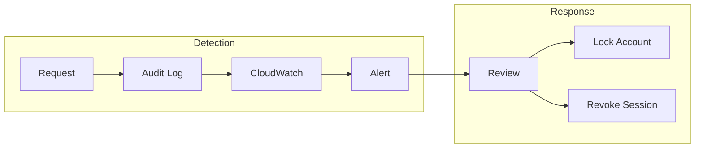

import { Aside, Steps } from '@astrojs/starlight/components';

Rack Gateway provides security controls that align with SOC 2 Type II Trust Services Criteria. This guide maps gateway features to SOC 2 requirements.

<Aside type="note">
Rack Gateway is a security tool that supports your SOC 2 compliance efforts. Achieving SOC 2 certification requires additional organizational controls, policies, and procedures beyond what any single tool provides.
</Aside>

## Trust Services Criteria Overview

SOC 2 is organized into five Trust Services Categories:

| Category | Description | Gateway Support |
|----------|-------------|-----------------|
| **Security (CC)** | Protection against unauthorized access | Strong |
| **Availability (A)** | System availability as committed | Partial |
| **Processing Integrity (PI)** | Complete and accurate processing | Partial |
| **Confidentiality (C)** | Protection of confidential information | Strong |
| **Privacy (P)** | Personal information protection | Partial |

## Common Criteria (Security)

### CC1: Control Environment

| Criterion | Requirement | Gateway Implementation |
|-----------|-------------|----------------------|
| CC1.1 | Demonstrate commitment to integrity and ethics | Documentation, access controls |
| CC1.2 | Board oversight | Audit logs for review |
| CC1.3 | Establish structure and authority | RBAC role hierarchy |
| CC1.4 | Commitment to competence | N/A (organizational) |
| CC1.5 | Accountability | User attribution in audit logs |

### CC2: Communication and Information

| Criterion | Requirement | Gateway Implementation |
|-----------|-------------|----------------------|
| CC2.1 | Information quality | Structured audit logging |
| CC2.2 | Internal communication | Slack/email notifications |
| CC2.3 | External communication | N/A (organizational) |

### CC3: Risk Assessment

| Criterion | Requirement | Gateway Implementation |
|-----------|-------------|----------------------|
| CC3.1 | Specify objectives | Configurable security settings |
| CC3.2 | Identify risks | RBAC denials logged |
| CC3.3 | Consider fraud | Anomaly detection in logs |
| CC3.4 | Identify changes | Change tracking in audit logs |

### CC5: Control Activities

| Criterion | Requirement | Gateway Implementation |
|-----------|-------------|----------------------|
| CC5.1 | Select control activities | RBAC, MFA, session management |
| CC5.2 | Select technology controls | OAuth, encryption, audit logging |
| CC5.3 | Deploy policies | Configurable security policies |

### CC6: Logical and Physical Access

| Criterion | Requirement | Gateway Implementation | Evidence |
|-----------|-------------|----------------------|----------|
| CC6.1 | Logical access security | OAuth + MFA authentication | Authentication logs |
| CC6.2 | User access provisioning | RBAC role assignments | User/role records |
| CC6.3 | Access removal | Session revocation, account lock | Revocation logs |
| CC6.4 | Access review | User/token listing and audit | Access reports |
| CC6.5 | Restrict access | Private network deployment | Network configuration |
| CC6.6 | Manage credentials | Token hashing, rotation | Token management |
| CC6.7 | Restrict privileged access | Admin role restrictions | RBAC configuration |
| CC6.8 | Prevent malicious software | N/A (SaaS model) | - |

**Key Controls for CC6:**

<Steps>

1. **Authentication (CC6.1)**

   - Google OAuth 2.0 with PKCE
   - Domain restriction to organization
   - Session tokens with idle timeout

2. **Authorization (CC6.2)**

   - Role-based access control
   - Five distinct roles (viewer → admin)
   - Inheritance-based permissions

3. **De-provisioning (CC6.3)**

   - Immediate session revocation
   - Account lock capability
   - API token deletion

4. **Review (CC6.4)**

   - User list with roles
   - Active session visibility
   - API token inventory

</Steps>

### CC7: System Operations

| Criterion | Requirement | Gateway Implementation | Evidence |
|-----------|-------------|----------------------|----------|
| CC7.1 | Detect security events | Real-time audit logging | Audit logs |
| CC7.2 | Monitor infrastructure | CloudWatch integration | Metrics/alarms |
| CC7.3 | Evaluate events | RBAC decision logging | Decision logs |
| CC7.4 | Respond to incidents | Lock accounts, revoke sessions | Incident records |
| CC7.5 | Recover from incidents | Session revocation, re-auth | Recovery actions |

**Key Controls for CC7:**



### CC8: Change Management

| Criterion | Requirement | Gateway Implementation |
|-----------|-------------|----------------------|
| CC8.1 | Manage changes | Deploy approval workflow |

**Deploy Approvals for Change Control:**

- CI/CD deployments require human approval
- Approvers separate from deployers
- Full audit trail of approvals

### CC9: Risk Mitigation

| Criterion | Requirement | Gateway Implementation |
|-----------|-------------|----------------------|
| CC9.1 | Risk mitigation | Defense in depth |
| CC9.2 | Consider vendors | N/A (self-hosted) |

## Confidentiality Criteria

### C1: Confidential Information

| Criterion | Requirement | Gateway Implementation |
|-----------|-------------|----------------------|
| C1.1 | Identify confidential data | Environment variable protection |
| C1.2 | Dispose of confidential data | Token/session cleanup |

**Protection Mechanisms:**

- Automatic secret redaction in logs
- Protected environment variables
- Token hashing (secrets never stored in plaintext)
- HTTPS-only communication

## Evidence Collection

### Automated Evidence

Rack Gateway automatically generates evidence:

| Evidence Type | Source | Frequency |
|--------------|--------|-----------|
| Authentication logs | Audit database | Per request |
| RBAC decisions | Audit database | Per request |
| User access records | Users table | On change |
| Role assignments | Users table | On change |
| Token inventory | API tokens table | On change |
| Session records | Sessions table | On change |
| Configuration changes | Audit database | On change |

### Evidence Queries

```bash
# User access for period
rack-gateway audit search --from "2024-01-01" --to "2024-03-31" \
  --format json > access-evidence.json

# RBAC denials (access violations)
rack-gateway audit search --decision deny --days 90 \
  --format json > denials.json

# Admin actions
rack-gateway audit search --role admin --days 90 \
  --format json > admin-actions.json

# User list with roles
rack-gateway users list --format json > user-inventory.json

# API token inventory
rack-gateway api-tokens list --all --format json > token-inventory.json
```

### Reports for Auditors

| Report | Description | Query Period |
|--------|-------------|--------------|
| User Access Report | All users with roles | Current snapshot |
| Activity Report | Actions by user | 90-day rolling |
| Denied Access Report | Failed authorization | 90-day rolling |
| Admin Activity Report | Privileged operations | 90-day rolling |
| Token Report | API token inventory | Current snapshot |
| Session Report | Active sessions | Current snapshot |

## Implementation Checklist

### Access Controls (CC6)

- [ ] OAuth configured with Google Workspace
- [ ] Domain restriction enabled
- [ ] MFA required for privileged roles
- [ ] RBAC roles assigned appropriately
- [ ] Session timeout configured (≤15 min recommended)
- [ ] API tokens have appropriate roles
- [ ] Unused tokens reviewed/removed

### Monitoring (CC7)

- [ ] Audit logging enabled
- [ ] CloudWatch integration configured
- [ ] Alerts for failed logins
- [ ] Alerts for RBAC denials
- [ ] Weekly log review process
- [ ] Incident response runbook

### Change Management (CC8)

- [ ] Deploy approvals enabled
- [ ] Approvers != Deployers
- [ ] CI/CD uses dedicated tokens
- [ ] Change log maintained

### Confidentiality (C1)

- [ ] Protected env vars configured
- [ ] HTTPS enforced
- [ ] Tokens not in source control
- [ ] Secrets redacted in logs

## Auditor FAQ

**Q: How are users authenticated?**
A: OAuth 2.0 with Google Workspace, with optional MFA via TOTP or WebAuthn.

**Q: How is access controlled?**
A: Role-based access control with five roles in a hierarchy. Each request is checked against the user's role.

**Q: How are privileged users managed?**
A: Admin role is restricted to few users. All admin actions are logged.

**Q: How are access requests logged?**
A: All API requests are logged with user, action, resource, decision, and timestamp.

**Q: How long are logs retained?**
A: 90 days in database, 7+ years in S3 WORM storage.

**Q: How are secrets protected in logs?**
A: Automatic regex-based redaction before logging. Patterns include passwords, tokens, and keys.

**Q: How is the audit log protected from tampering?**
A: S3 Object Lock in Compliance mode with 7-year retention prevents modification or deletion.

## Next Steps

- [Audit Trail](/security/compliance/audit-trail/) - Detailed audit logging
- [Data Retention](/security/compliance/data-retention/) - Retention policies
- [RBAC](/security/rbac/) - Role-based access control
