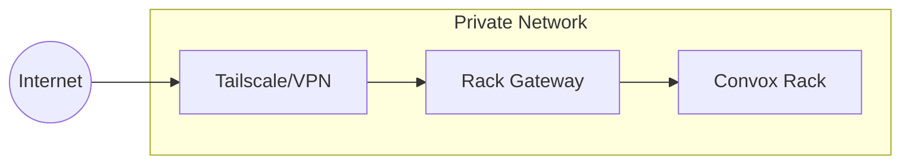

import { Aside, Steps } from '@astrojs/starlight/components';

This guide covers security best practices for hardening your Rack Gateway deployment.

## Network Security

### Private Network Deployment

Deploy the gateway on a private network, not exposed to the public internet:



**Options:**
- [Tailscale](/deployment/private-network/) - Zero-config VPN
- AWS VPN - Site-to-site VPN
- AWS PrivateLink - Private connectivity

<Aside type="caution" title="Do Not Expose Publicly">
The gateway should never be directly exposed to the public internet. Always use a VPN or private network solution.
</Aside>

### TLS Configuration

All traffic should use TLS:

```bash
# Required environment variables
GATEWAY_URL=https://gateway.example.com

# TLS certificate (for standalone deployment)
TLS_CERT_FILE=/etc/ssl/certs/gateway.crt
TLS_KEY_FILE=/etc/ssl/private/gateway.key
```

When deployed on Convox, TLS is handled by the load balancer.

### Firewall Rules

Restrict network access:

| Port | Source | Destination | Protocol |
|------|--------|-------------|----------|
| 443 | VPN/Tailscale | Gateway | HTTPS |
| 5432 | Gateway | RDS | PostgreSQL |
| 443 | Gateway | Convox API | HTTPS |

Block all other inbound traffic to the gateway.

## Authentication Hardening

### OAuth Configuration

Secure your OAuth setup:

```bash
# Required: Restrict to your domain
GOOGLE_ALLOWED_DOMAIN=yourcompany.com

# Strong secret key (generate with: openssl rand -base64 32)
APP_SECRET_KEY=<random-32-byte-value>
```

<Aside type="tip">
Generate secrets using a cryptographically secure method:
```bash
openssl rand -base64 32
```
</Aside>

### MFA Enforcement

Require MFA for all users or privileged roles:

| Setting | Recommended Value | Notes |
|---------|-------------------|-------|
| MFA Required | All users | Or at minimum, admins/deployers |
| Step-up Window | 10 minutes | Shorter for higher security |
| Trusted Device TTL | 7 days | Or disable for highest security |

### Session Security

Configure secure session settings:

```bash
# Short idle timeout (5-15 minutes recommended)
SESSION_TIMEOUT_MINUTES=5

# Secure cookies (automatic in production)
SECURE_COOKIES=true
```

## RBAC Hardening

### Role Assignment

Follow least privilege principles:

| User Type | Role | Notes |
|-----------|------|-------|
| Most engineers | Viewer | Start here, upgrade as needed |
| Active developers | Deployer | Only if deploying regularly |
| On-call/SRE | Ops | Debug without deploy access |
| CI/CD pipelines | CI/CD token | Never Deployer or Admin |
| Platform admins | Admin | 2-3 people maximum |

### API Token Security

Secure your API tokens:

<Steps>

1. **Use CI/CD role for automation**

   Never give deployer or admin to CI/CD pipelines

2. **Rotate tokens regularly**

   Production tokens: quarterly minimum

3. **Use separate tokens per environment**

   Different tokens for staging vs production

4. **Monitor token usage**

   Review unused tokens monthly

5. **Delete unused tokens immediately**

   Don't keep "just in case" tokens

</Steps>

### Admin Access

Restrict administrative access:

- Maximum 2-3 admin users
- Require MFA for all admins
- Review admin actions weekly
- Document who has admin access and why

## Secrets Management

### Environment Variables

Protect sensitive environment variables:

```bash
# Mark variables as protected (hidden in UI)
PROTECTED_ENV_VARS=DATABASE_URL,API_KEY,SECRET_KEY

# Never log these patterns
REDACT_PATTERNS=password,secret,token,key,credential
```

### Secret Storage

Store secrets securely:

| Secret | Storage Location | Notes |
|--------|-----------------|-------|
| `GOOGLE_CLIENT_SECRET` | AWS Secrets Manager | Or Convox environment |
| `APP_SECRET_KEY` | AWS Secrets Manager | Critical - rotate annually |
| `DATABASE_URL` | Convox environment | With password |
| API tokens | CI/CD secrets | GitHub/CircleCI secrets |

Never store secrets in:
- Git repositories
- Environment files checked into git
- Logs or audit trails
- Error messages

## Database Security

### PostgreSQL Configuration

Secure your database:

```hcl
# RDS configuration (Terraform)
resource "aws_db_instance" "gateway" {
  # Encryption at rest
  storage_encrypted = true
  kms_key_id        = aws_kms_key.rds.arn

  # Network isolation
  publicly_accessible = false
  vpc_security_group_ids = [aws_security_group.rds.id]

  # Audit logging
  enabled_cloudwatch_logs_exports = ["postgresql"]
}
```

### Database Access

Restrict database access:

- Gateway application only (no direct access)
- Separate admin credentials for migrations
- VPC-only access (no public endpoint)
- Encrypted connections (require SSL)

## Audit and Monitoring

### Audit Configuration

Enable comprehensive auditing:

```bash
# Enable all audit features
AUDIT_ENABLED=true
AUDIT_LOG_REQUESTS=true
AUDIT_LOG_RESPONSES=false  # Don't log response bodies
```

### S3 WORM for Compliance

For compliance requirements:

```bash
AUDIT_ANCHOR_S3_BUCKET=audit-anchor-production
AUDIT_ANCHOR_S3_REGION=us-east-1
```

See [Data Retention](/security/compliance/data-retention/) for full configuration.

### Security Alerting

Configure alerts for security events:

```bash
# Slack notifications
SLACK_WEBHOOK_URL=https://hooks.slack.com/...
SLACK_NOTIFY_SECURITY_EVENTS=true

# Email alerts
POSTMARK_API_KEY=your-key
SECURITY_ALERT_EMAIL=security@example.com
```

**Alert on:**
- Multiple failed login attempts
- RBAC denials
- Admin actions
- Account locks
- Token creation/deletion

## Deployment Hardening

### Container Security

Secure your container deployment:

```yaml
# convox.yml
services:
  gateway:
    # Run as non-root user
    user: "65534:65534"

    # Read-only filesystem
    volumes:
      - /tmp:rw

    # Resource limits
    cpu: 256
    memory: 512
```

### Health Checks

Configure health checks without exposing sensitive information:

```yaml
services:
  gateway:
    health:
      path: /api/v1/health
      interval: 30
      timeout: 5
```

The health endpoint should not require authentication and should not expose internal details.

## Security Checklist

### Pre-Production

- [ ] Gateway on private network (VPN/Tailscale)
- [ ] HTTPS enforced with valid certificate
- [ ] OAuth domain restriction configured
- [ ] MFA required for privileged users
- [ ] Session timeout ≤ 15 minutes
- [ ] Admin users ≤ 3
- [ ] CI/CD uses CI/CD role tokens
- [ ] Database encrypted and VPC-only
- [ ] Audit logging enabled
- [ ] S3 WORM configured (if required)
- [ ] Security alerts configured
- [ ] Incident response runbook created

### Ongoing

- [ ] Weekly admin action review
- [ ] Monthly token audit
- [ ] Quarterly access review
- [ ] Annual secret rotation
- [ ] Regular security scanning
- [ ] Incident response testing

## Security Headers

The gateway sets secure HTTP headers:

| Header | Value | Purpose |
|--------|-------|---------|
| `Strict-Transport-Security` | `max-age=31536000` | Force HTTPS |
| `X-Content-Type-Options` | `nosniff` | Prevent MIME sniffing |
| `X-Frame-Options` | `DENY` | Prevent clickjacking |
| `Content-Security-Policy` | Strict policy | Prevent XSS |
| `X-XSS-Protection` | `1; mode=block` | XSS filter |

### Content Security Policy

The gateway uses a strict CSP:

```
default-src 'self';
script-src 'self' 'nonce-xxx';
style-src 'self' 'nonce-xxx';
img-src 'self' data:;
font-src 'self';
connect-src 'self';
frame-ancestors 'none';
```

## Incident Response

### Compromised Account

<Steps>

1. Lock the account immediately
2. Revoke all sessions
3. Review audit logs for suspicious activity
4. Rotate any accessed secrets
5. Investigate root cause
6. Unlock after re-verification

</Steps>

### Compromised Token

<Steps>

1. Delete the token immediately
2. Review audit logs for token usage
3. Create replacement token
4. Update affected systems
5. Investigate how token was exposed

</Steps>

### Suspected Breach

<Steps>

1. Lock all non-admin accounts
2. Revoke all sessions
3. Rotate all secrets
4. Enable enhanced logging
5. Review last 30 days of audit logs
6. Engage security team / incident response

</Steps>

## Next Steps

- [Private Network](/deployment/private-network/) - VPN deployment
- [SOC 2](/security/compliance/soc2/) - Compliance alignment
- [Audit Trail](/security/compliance/audit-trail/) - Audit logging
