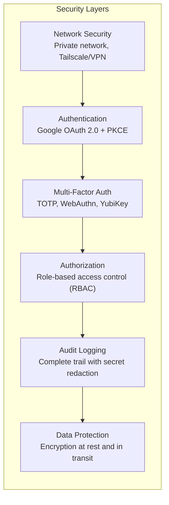

import { Card, CardGrid, Aside } from '@astrojs/starlight/components';

Rack Gateway was designed from the ground up with security and compliance in mind. This section covers the security architecture, access controls, and compliance features.

## Security Architecture

Rack Gateway provides multiple layers of security:

## Security Features

<CardGrid>
  <Card title="Authentication" icon="star">
    Google Workspace OAuth 2.0 with PKCE flow, domain restrictions, and secure session management.

    [Learn more →](/security/authentication/)
  </Card>
  <Card title="RBAC" icon="setting">
    Four hierarchical roles with granular permissions controlling access to Convox operations.

    [Learn more →](/security/rbac/)
  </Card>
  <Card title="Audit Logging" icon="document">
    Immutable audit trail with automatic secret redaction and optional S3 WORM storage.

    [Learn more →](/security/compliance/audit-trail/)
  </Card>
  <Card title="Compliance" icon="approve-check">
    Built for SOC 2 compliance with proper access controls, logging, and data retention.

    [Learn more →](/security/compliance/)
  </Card>
</CardGrid>

## Key Security Principles

### Defense in Depth

Multiple independent security controls ensure that a failure in one layer doesn't compromise the system:

| Layer | Protection | If Bypassed |
|-------|-----------|-------------|
| Network | Private network access | Authentication blocks |
| Authentication | OAuth + session tokens | MFA blocks |
| MFA | Second factor verification | RBAC limits scope |
| RBAC | Permission restrictions | Audit logs provide evidence |
| Audit | Complete activity record | Forensic investigation |

### Least Privilege

Users receive only the permissions they need:

- **Viewer**: Read-only access to non-sensitive data
- **Ops**: Operational access without deployment capabilities
- **Deployer**: Deployment access without administrative powers
- **Admin**: Full access for administrators only

### Secure Defaults

Rack Gateway ships with secure defaults:

- Sessions expire after inactivity
- HTTPS required in production
- Secrets automatically redacted from logs
- CSRF protection enabled
- Secure cookie settings

## Threat Model

Rack Gateway protects against common threats:

| Threat | Protection |
|--------|------------|
| **Credential theft** | OAuth (no passwords stored), MFA |
| **Session hijacking** | Secure cookies, session validation |
| **Privilege escalation** | Strict RBAC enforcement |
| **Insider threats** | Audit logging, RBAC separation |
| **Token leakage** | Short-lived sessions, API token scoping |
| **Replay attacks** | Token validation, session tracking |
| **Man-in-the-middle** | TLS required, certificate validation |

## Security Sections

### [Role-Based Access Control](/security/rbac/)

- [Overview](/security/rbac/) - RBAC concepts and design
- [Roles](/security/rbac/roles/) - Role definitions and capabilities
- [Permissions](/security/rbac/permissions/) - Complete permission reference
- [Best Practices](/security/rbac/best-practices/) - RBAC implementation patterns

### [Authentication](/security/authentication/)

- [Overview](/security/authentication/) - Authentication architecture
- [OAuth Flow](/security/authentication/oauth-flow/) - OAuth 2.0 + PKCE details
- [Sessions](/security/authentication/sessions/) - Session management
- [API Tokens](/security/authentication/api-tokens/) - Token security

### [Compliance](/security/compliance/)

- [Overview](/security/compliance/) - Compliance framework
- [SOC 2](/security/compliance/soc2/) - SOC 2 alignment guide
- [Audit Trail](/security/compliance/audit-trail/) - Audit logging details
- [Data Retention](/security/compliance/data-retention/) - Retention policies

### [Security Hardening](/security/hardening/)

Best practices for hardening your Rack Gateway deployment.

## Security Checklist

Before going to production, verify:

- [ ] HTTPS configured with valid certificates
- [ ] Gateway on private network (Tailscale/VPN recommended)
- [ ] Google OAuth configured with domain restrictions
- [ ] MFA enforcement enabled for all users
- [ ] Audit logging configured with S3 WORM storage
- [ ] Session timeout configured appropriately
- [ ] API tokens scoped with minimal permissions
- [ ] Protected environment variables configured
- [ ] Security notifications enabled
- [ ] Regular access reviews scheduled

See [Production Checklist](/deployment/production-checklist/) for complete deployment verification.

## Reporting Security Issues

If you discover a security vulnerability in Rack Gateway:

1. **Do not** open a public GitHub issue
2. Email security concerns to the maintainers
3. Include detailed reproduction steps
4. Allow time for a fix before public disclosure

We appreciate responsible disclosure and will acknowledge security researchers in release notes.
