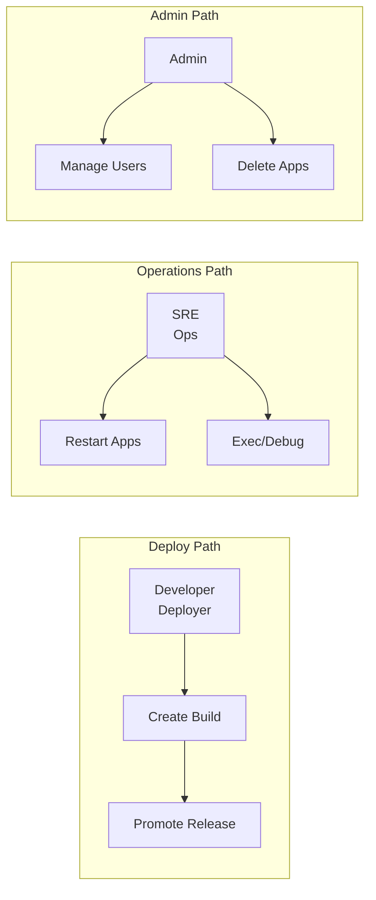
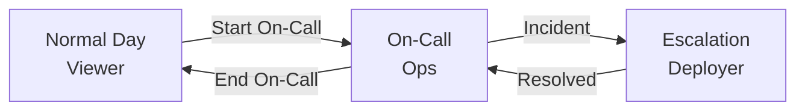

import { Aside, Steps, Card, CardGrid } from '@astrojs/starlight/components';

This guide covers recommended patterns for managing roles and permissions in Rack Gateway.

## Principle of Least Privilege

<CardGrid>
  <Card title="Start Restrictive" icon="warning">
    Begin with Viewer role and upgrade only when needed. It's easier to add permissions than to remove them.
  </Card>
  <Card title="Just-In-Time Access" icon="rocket">
    Grant elevated access temporarily when needed, then revoke. Use API tokens with limited scope for automation.
  </Card>
</CardGrid>

### Role Selection Guidelines

| User Type | Recommended Role | Rationale |
|-----------|------------------|-----------|
| New team member | Viewer | Observe first, learn the system |
| Developer (feature work) | Deployer | Deploy but not delete |
| On-call engineer | Ops | Debug without deploy access |
| CI/CD pipeline | CI/CD (token) | Minimal automation scope |
| Platform admin | Admin | Full access when needed |
| External auditor | Viewer | Read-only compliance review |

## Separation of Duties

Rack Gateway's role hierarchy naturally separates concerns:



### Recommended Team Structure

<Aside type="tip" title="Typical Setup">
For a team of 10 engineers:
- 2-3 Admins (lead engineers, security team)
- 5-6 Deployers (active developers)
- 2-3 Ops (SRE, on-call rotation)
- Remaining as Viewers
</Aside>

**Anti-patterns to avoid:**
- Making everyone an Admin "for convenience"
- Giving Deployer access to all engineers regardless of responsibility
- Using personal credentials in CI/CD pipelines

## API Token Management

### Token Role Selection

| Use Case | Recommended Role | Why |
|----------|------------------|-----|
| CI/CD deployment | CI/CD | Limited scope, requires approval |
| Monitoring/alerting | Viewer | Read-only access to status |
| Automated testing | Viewer | Just needs to list/read |
| Emergency scripts | Ops | Restart capability only |

### Token Lifecycle

<Steps>

1. **Create with specific purpose**

   Name tokens descriptively: `ci-production-deploy`, `monitoring-datadog`, `emergency-restart`

   ```bash
   rack-gateway api-token create --name "ci-production-deploy" --role cicd
   ```

2. **Set appropriate role**

   Always use the minimum required role. CI/CD tokens should use the `cicd` role, not `deployer`.

3. **Store securely**

   - Use secrets management (AWS Secrets Manager, HashiCorp Vault)
   - Never commit tokens to git
   - Rotate tokens periodically

4. **Monitor usage**

   Review token activity in audit logs. Investigate tokens that haven't been used in 90+ days.

5. **Revoke when no longer needed**

   Delete tokens immediately when pipelines are decommissioned.

</Steps>

<Aside type="caution" title="Token Permissions">
Remember: A token's permissions come from its assigned role, not from the user who created it. An admin can create a viewer-level token.
</Aside>

### Token Best Practices

| Do | Don't |
|----|-------|
| Use CI/CD role for pipelines | Use Deployer role for automation |
| Name tokens descriptively | Use generic names like "token-1" |
| Rotate tokens quarterly | Keep tokens indefinitely |
| Use separate tokens per environment | Share tokens across staging/production |
| Audit unused tokens monthly | Ignore token activity |

## Environment Separation

### Per-Environment Gateways

Deploy separate gateway instances for each environment:

```
Production Gateway → Production Rack
Staging Gateway    → Staging Rack
Development Gateway → Dev Rack
```

Benefits:
- Complete isolation between environments
- Different admin sets per environment
- Independent audit trails
- Separate MFA policies

### Role Differences by Environment

| Environment | Admin Count | Deployer Scope | MFA Required |
|-------------|-------------|----------------|--------------|
| Production | 2-3 only | Experienced devs | Yes |
| Staging | 3-5 | All developers | Optional |
| Development | 5+ | All developers | No |

## Audit and Review Practices

### Regular Access Reviews

<Steps>

1. **Monthly: Token audit**

   - Review all API tokens
   - Identify unused tokens (&gt;30 days)
   - Verify token roles match current needs

2. **Quarterly: Role review**

   - Review all user roles
   - Identify users who changed teams
   - Downgrade inactive users to Viewer

3. **Annually: Full access audit**

   - Document all admin users
   - Review role assignments vs job functions
   - Update for organizational changes

</Steps>

### Using Audit Logs

Query audit logs to identify access patterns:

```bash
# Find all admin actions in the last 7 days
rack-gateway audit search --role admin --days 7

# Find failed permission checks
rack-gateway audit search --decision deny --days 30

# Find all actions by a specific user
rack-gateway audit search --user developer@example.com --days 90
```

<Aside type="note">
Audit logs are essential for SOC 2 compliance. Ensure they're configured with appropriate retention and stored in immutable storage.
</Aside>

## MFA Enforcement by Role

Configure MFA requirements based on role privileges:

| Role | MFA Recommendation | Step-Up Auth |
|------|-------------------|--------------|
| Admin | Required always | Yes, for all actions |
| Deployer | Required always | Yes, for env changes |
| Ops | Recommended | Yes, for exec |
| Viewer | Optional | No |
| CI/CD (token) | N/A (token auth) | N/A |

### Step-Up Authentication

For sensitive operations, require re-authentication even within an active session:

- Environment variable changes
- Application deletion
- User role changes
- API token creation

## Incident Response

### Compromised User Account

<Steps>

1. **Immediate**: Lock the user account

   ```bash
   # In web UI: Users → Select User → Lock Account
   ```

2. **Revoke sessions**: Force logout all active sessions

3. **Audit**: Review all actions by the user in last 30 days

4. **Remediate**: Change any secrets the user had access to

5. **Investigate**: Determine how the compromise occurred

6. **Restore**: Unlock account after re-verification

</Steps>

### Compromised API Token

<Steps>

1. **Immediate**: Delete the token

   ```bash
   # In web UI: API Tokens → Select Token → Delete
   ```

2. **Audit**: Review all actions by the token

3. **Update**: Generate new token with fresh credentials

4. **Rotate**: Update all systems using the old token

5. **Investigate**: Determine how the token was exposed

</Steps>

## Common Patterns

### On-Call Rotation



Implementation:
- Base role: Viewer for all engineers
- On-call: Temporary upgrade to Ops
- Escalation: Temporary upgrade to Deployer for hotfixes

### Feature Teams

Different teams may need different access levels:

| Team | Base Role | Notes |
|------|-----------|-------|
| Platform | Admin | Manages infrastructure |
| Backend | Deployer | Full deploy access |
| Frontend | Deployer | Full deploy access |
| QA | Viewer | Read-only for testing |
| Security | Admin | Audit and review |

### Contractor Access

For external contractors:

1. Start with Viewer role
2. Upgrade to specific role only for duration of engagement
3. Immediately downgrade when engagement ends
4. Audit all actions during engagement

## Checklist

Before going to production:

- [ ] No more than 3 admin users
- [ ] CI/CD uses dedicated tokens with CI/CD role
- [ ] MFA enabled for all admin and deployer users
- [ ] API tokens have descriptive names
- [ ] Audit logging configured with retention policy
- [ ] Access review process documented
- [ ] Incident response runbook created
- [ ] Unused tokens identified and deleted

## Next Steps

- [Roles](/security/rbac/roles/) - Detailed role definitions
- [Permissions](/security/rbac/permissions/) - Complete permission reference
- [Audit Trail](/security/compliance/audit-trail/) - Audit logging details
