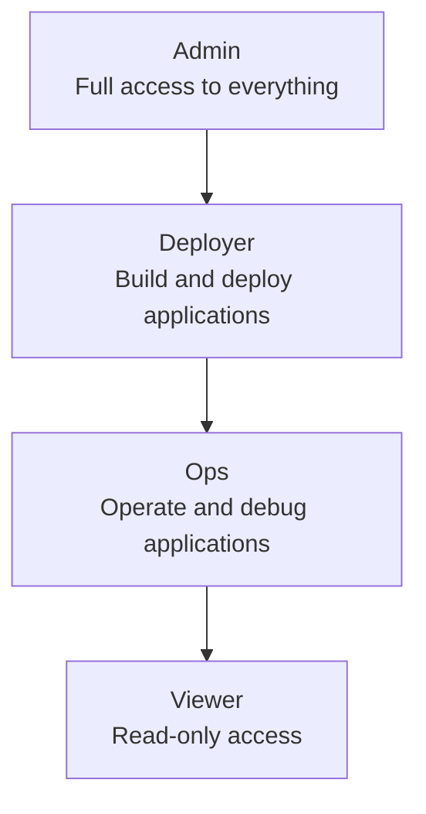

import { Aside } from '@astrojs/starlight/components';

Rack Gateway uses Role-Based Access Control (RBAC) to manage what users can do. Each user is assigned a role that determines their permissions.

## The Four Roles

Rack Gateway has four built-in roles arranged in a hierarchy:



Each role inherits all permissions from the roles below it.

## Role Capabilities

| Role | Can Do | Cannot Do |
|------|--------|-----------|
| **Viewer** | List apps, view logs, see builds, read processes | Any write operations |
| **Ops** | All Viewer + restart apps, exec into containers, manage processes | Build, deploy, create apps |
| **Deployer** | All Ops + build, deploy, create/update apps, manage environment | Delete apps, user management |
| **Admin** | Everything including user management, settings, destructive operations | Nothing restricted |

## Permission Format

Permissions follow a consistent format:

```
{scope}:{resource}:{action}
```

Examples:
- `convox:app:list` - List applications
- `convox:process:exec` - Execute commands in containers
- `convox:build:create` - Create new builds
- `gateway:user:create` - Create gateway users

## Role Details

### Viewer

Read-only access for monitoring and observability.

**Allowed operations:**
- List applications
- View application status and processes
- Read logs
- View builds (not releases - they contain secrets)
- View rack information

**Use case:** Stakeholders who need visibility but shouldn't make changes.

### Ops

Operational access for incident response and debugging.

**Inherits:** All Viewer permissions

**Additional operations:**
- Restart applications
- Execute commands in containers (`exec`)
- Start and stop processes
- Scale applications (within limits)

**Use case:** On-call engineers and operations staff.

### Deployer

Deployment access for engineers who ship code.

**Inherits:** All Ops permissions

**Additional operations:**
- Create builds
- Promote releases
- Create and update applications
- Manage environment variables
- Manage resources

**Use case:** Software engineers and DevOps.

### Admin

Full administrative access.

**Inherits:** All Deployer permissions

**Additional operations:**
- Delete applications
- Manage users and roles
- Configure gateway settings
- View and manage all API tokens
- Access audit logs
- Perform destructive operations

**Use case:** Platform administrators and security team.

## How RBAC Works

When a request comes through the gateway:

```
Request → Extract User → Check Role → Map to Permission → Allow/Deny
```

1. **Extract User** - Identify the user from session or API token
2. **Check Role** - Look up the user's role
3. **Map to Permission** - Convert the API endpoint to a permission
4. **Allow/Deny** - Check if the role grants the permission

### Example: Deploying an App

```bash
rack-gateway deploy -a myapp
```

1. User identified as `developer@company.com`
2. User has role `deployer`
3. Deploy maps to `convox:release:promote`
4. Deployer role includes this permission → **Allowed**

### Example: Deleting an App

```bash
rack-gateway apps delete myapp
```

1. User identified as `developer@company.com`
2. User has role `deployer`
3. Delete maps to `convox:app:delete`
4. Deployer role does NOT include this → **Denied**

## API Tokens and RBAC

API tokens have their own role assignment:

```bash
# Create a deployer-level token for CI/CD
rack-gateway api-token create --name "CI/CD" --role deployer
```

The token's role determines what operations it can perform, independent of who created it.

<Aside type="note" title="Token Scope">
An admin can create a viewer-level token. The token's capabilities are limited by its assigned role, not the creator's role.
</Aside>

## Assigning Roles

Roles are assigned by administrators through the web UI:

1. Go to **Users**
2. Click on a user
3. Select their role from the dropdown
4. Save changes

Role changes take effect immediately for new requests.

## RBAC and Audit Logging

All RBAC decisions are logged:

```json
{
  "timestamp": "2024-01-15T10:30:00Z",
  "user_email": "developer@company.com",
  "method": "DELETE",
  "path": "/apps/myapp",
  "rbac_decision": "deny",
  "required_permission": "convox:app:delete",
  "user_role": "deployer"
}
```

This provides a complete trail of access decisions for compliance.

## Best Practices

1. **Start with Viewer** - Give new users viewer access, upgrade as needed
2. **Separate Ops and Deploy** - Not everyone who deploys needs exec access
3. **Limit Admins** - Only a few trusted users should be admins
4. **Use API Tokens for CI/CD** - Don't use personal sessions in automation
5. **Regular Reviews** - Periodically review who has what role

See [RBAC Best Practices](/security/rbac/best-practices/) for detailed guidance.

## Next Steps

- [Roles](/security/rbac/roles/) - Detailed role definitions
- [Permissions](/security/rbac/permissions/) - Complete permission reference
- [Best Practices](/security/rbac/best-practices/) - Implementation patterns
