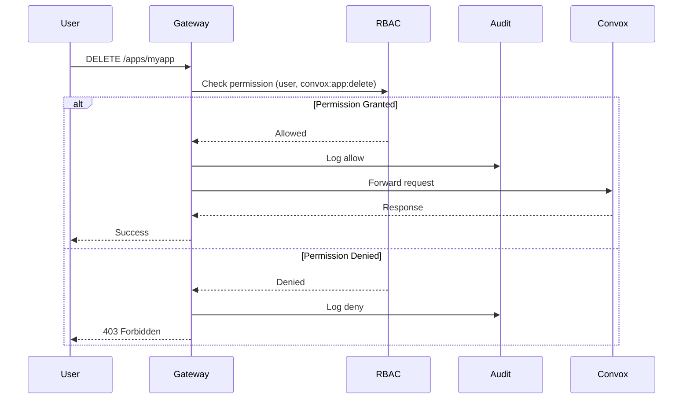

import { Aside, Tabs, TabItem } from '@astrojs/starlight/components';

Rack Gateway uses a structured permission system based on scopes, resources, and actions.

## Permission Format

Every permission follows a three-part format:

```
{scope}:{resource}:{action}
```

**Examples:**
- `convox:app:list` - List Convox applications
- `convox:process:exec` - Execute commands in containers
- `gateway:user:create` - Create gateway users
- `gateway:deploy_approval_request:read` - View deploy approval requests

## Scopes

Permissions are organized into four scopes:

| Scope | Description |
|-------|-------------|
| `convox` | Operations passed through to the Convox API |
| `gateway` | Operations implemented within the gateway itself |
| `auth` | Authentication-related operations |
| `security` | Security-specific operations |

## Resources

### Convox Resources

Resources that map to Convox API operations:

| Resource | Description |
|----------|-------------|
| `app` | Applications |
| `build` | Docker image builds |
| `cert` | SSL/TLS certificates |
| `deploy` | Deployment operations |
| `env` | Environment variables |
| `instance` | EC2/container instances |
| `log` | Application logs |
| `object` | Build artifacts and objects |
| `process` | Running processes/containers |
| `rack` | Rack configuration |
| `registry` | Docker registries |
| `release` | Application releases |
| `resource` | Convox resources (databases, etc.) |

### Gateway Resources

Resources specific to the gateway:

| Resource | Description |
|----------|-------------|
| `api_token` | API tokens for automation |
| `deploy_approval_request` | Deploy approval requests |
| `integration` | Third-party integrations |
| `job` | Background jobs |
| `secret` | Gateway secrets |
| `setting` | Gateway configuration settings |
| `user` | Gateway users |

### Auth Resources

Authentication and MFA resources:

| Resource | Description |
|----------|-------------|
| `auth` | Authentication sessions |
| `mfa_backup_codes` | MFA recovery codes |
| `mfa_method` | MFA methods (TOTP, WebAuthn) |
| `mfa_preferences` | MFA preferences |
| `mfa_verification` | MFA verification challenges |
| `trusted_device` | Trusted device tokens |

## Actions

| Action | Description |
|--------|-------------|
| `add` | Add item to a collection |
| `approve` | Approve a request |
| `create` | Create a new resource |
| `delete` | Delete a resource |
| `deploy_with_approval` | Deploy requiring prior approval |
| `exec` | Execute commands |
| `generate` | Generate credentials/codes |
| `import` | Import external resources |
| `keyroll` | Rotate keys/credentials |
| `list` | List resources |
| `manage` | General management operations |
| `promote` | Promote a release |
| `read` | Read/view a resource |
| `remove` | Remove item from collection |
| `restart` | Restart a service |
| `set` | Set a value |
| `start` | Start a resource |
| `stop` | Stop a resource |
| `terminate` | Terminate a resource |
| `unset` | Remove a value |
| `update` | Update a resource |
| `update_name` | Update only the name |

## Complete Permission Reference

### Convox Scope (`convox:*`)

<Tabs>
<TabItem label="Apps">

| Permission | Description | Roles |
|------------|-------------|-------|
| `convox:app:list` | List all applications | viewer, ops, deployer, cicd, admin |
| `convox:app:read` | View application details | viewer, ops, deployer, cicd, admin |
| `convox:app:create` | Create new application | admin |
| `convox:app:update` | Update application settings | deployer, admin |
| `convox:app:delete` | Delete application | admin |
| `convox:app:restart` | Restart application | ops, deployer, admin |

</TabItem>
<TabItem label="Builds">

| Permission | Description | Roles |
|------------|-------------|-------|
| `convox:build:list` | List builds | viewer, ops, deployer, admin |
| `convox:build:read` | View build details | viewer, ops, deployer, admin |
| `convox:build:create` | Create new build | deployer, admin |

</TabItem>
<TabItem label="Releases">

| Permission | Description | Roles |
|------------|-------------|-------|
| `convox:release:list` | List releases | ops, deployer, admin |
| `convox:release:read` | View release details | deployer, admin |
| `convox:release:create` | Create release | deployer, admin |
| `convox:release:promote` | Promote release to production | deployer, admin |

<Aside type="note">
Releases contain environment variable snapshots, so viewing releases is more restricted than viewing builds.
</Aside>

</TabItem>
<TabItem label="Environment">

| Permission | Description | Roles |
|------------|-------------|-------|
| `convox:env:read` | View environment variables | ops, deployer, admin |
| `convox:env:set` | Set environment variables | deployer, admin |
| `convox:env:unset` | Remove environment variables | deployer, admin |

<Aside type="caution" title="Sensitive Data">
Environment variables often contain secrets (API keys, database passwords). Only grant `env:read` to users who need to debug configuration issues.
</Aside>

</TabItem>
<TabItem label="Processes">

| Permission | Description | Roles |
|------------|-------------|-------|
| `convox:process:list` | List running processes | viewer, ops, deployer, cicd, admin |
| `convox:process:read` | View process details | viewer, ops, deployer, cicd, admin |
| `convox:process:start` | Start a process | ops, deployer, admin |
| `convox:process:exec` | Execute command in container | ops, deployer, admin |
| `convox:process:terminate` | Terminate a process | ops, deployer, admin |

</TabItem>
<TabItem label="Infrastructure">

| Permission | Description | Roles |
|------------|-------------|-------|
| `convox:instance:list` | List instances | viewer, ops, deployer, cicd, admin |
| `convox:instance:read` | View instance details | viewer, ops, deployer, cicd, admin |
| `convox:rack:read` | View rack configuration | viewer, ops, deployer, cicd, admin |
| `convox:log:read` | Stream logs | viewer, ops, deployer, admin |
| `convox:object:create` | Upload build artifacts | deployer, admin |

</TabItem>
</Tabs>

### Gateway Scope (`gateway:*`)

<Tabs>
<TabItem label="Users">

| Permission | Description | Roles |
|------------|-------------|-------|
| `gateway:user:list` | List all users | admin |
| `gateway:user:read` | View user details | admin |
| `gateway:user:create` | Create new user | admin |
| `gateway:user:update` | Update user (roles, status) | admin |
| `gateway:user:delete` | Delete user | admin |

</TabItem>
<TabItem label="API Tokens">

| Permission | Description | Roles |
|------------|-------------|-------|
| `gateway:api_token:list` | List all API tokens | admin |
| `gateway:api_token:read` | View token details | admin |
| `gateway:api_token:create` | Create new token | admin |
| `gateway:api_token:delete` | Delete/revoke token | admin |

<Aside type="note">
Users can always manage their own API tokens. These permissions control access to other users' tokens.
</Aside>

</TabItem>
<TabItem label="Deploy Approvals">

| Permission | Description | Roles |
|------------|-------------|-------|
| `gateway:deploy_approval_request:create` | Create approval request | deployer, cicd, admin |
| `gateway:deploy_approval_request:read` | View approval status | deployer, cicd, admin |
| `gateway:deploy_approval_request:approve` | Approve/reject request | admin |
| `convox:deploy:deploy_with_approval` | Execute approved deploy | cicd, admin |

</TabItem>
<TabItem label="Settings">

| Permission | Description | Roles |
|------------|-------------|-------|
| `gateway:setting:{key}` | Modify specific setting | admin |
| `gateway:setting_group:{group}` | Modify a setting group | admin |

Settings are controlled by key or group. See [Settings](/user-guide/web-ui/settings/) for available keys.

</TabItem>
<TabItem label="Integrations">

| Permission | Description | Roles |
|------------|-------------|-------|
| `gateway:integration:list` | List integrations | admin |
| `gateway:integration:read` | View integration config | admin |
| `gateway:integration:create` | Create integration | admin |
| `gateway:integration:update` | Update integration | admin |
| `gateway:integration:delete` | Delete integration | admin |

</TabItem>
</Tabs>

### Auth Scope (`auth:*`)

These permissions control MFA and authentication operations:

| Permission | Description | Notes |
|------------|-------------|-------|
| `auth:mfa_method:create` | Enroll new MFA method | Self-service |
| `auth:mfa_method:update` | Update MFA method | Self-service |
| `auth:mfa_method:delete` | Remove MFA method | Self-service |
| `auth:mfa_backup_codes:generate` | Generate backup codes | Self-service |
| `auth:mfa_verification:create` | Initiate MFA challenge | System |
| `auth:trusted_device:create` | Trust a device | Self-service |
| `auth:trusted_device:delete` | Remove trusted device | Self-service |

<Aside type="tip">
Auth permissions are typically handled automatically by the gateway during MFA flows. Users don't need explicit role grants for self-service MFA operations.
</Aside>

## Wildcard Permissions

Admin role uses wildcard permissions:

| Permission | Matches |
|------------|---------|
| `convox:*:*` | All Convox operations |
| `gateway:*:*` | All Gateway operations |

Wildcards match any value in that position:
- `convox:app:*` would match all app actions
- `convox:*:read` would match all read actions

<Aside type="caution" title="Admin Only">
Wildcard permissions are reserved for the admin role. Custom roles cannot use wildcards.
</Aside>

## Permission Checking

When a request arrives, the gateway:

1. **Identifies the user** from session or API token
2. **Maps the endpoint** to a permission (e.g., `DELETE /apps/myapp` → `convox:app:delete`)
3. **Checks role** against the required permission
4. **Logs the decision** to audit trail



## Endpoint to Permission Mapping

Common API endpoints and their required permissions:

| Endpoint | Method | Permission |
|----------|--------|------------|
| `/api/v1/rack-proxy/apps` | GET | `convox:app:list` |
| `/api/v1/rack-proxy/apps/:name` | GET | `convox:app:read` |
| `/api/v1/rack-proxy/apps/:name` | DELETE | `convox:app:delete` |
| `/api/v1/rack-proxy/apps/:name/builds` | POST | `convox:build:create` |
| `/api/v1/rack-proxy/apps/:name/processes` | GET | `convox:process:list` |
| `/api/v1/rack-proxy/apps/:name/processes/:id/exec` | POST | `convox:process:exec` |
| `/api/v1/apps/:app/env` | GET | `convox:env:read` |
| `/api/v1/apps/:app/env` | PUT | `convox:env:set` |
| `/api/v1/rack-proxy/apps/:name/releases/:id/promote` | POST | `convox:release:promote` |

## Next Steps

- [Roles](/security/rbac/roles/) - Role definitions and capabilities
- [Best Practices](/security/rbac/best-practices/) - Implementation patterns
