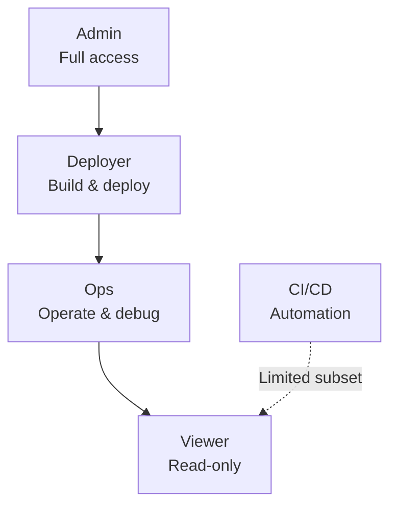
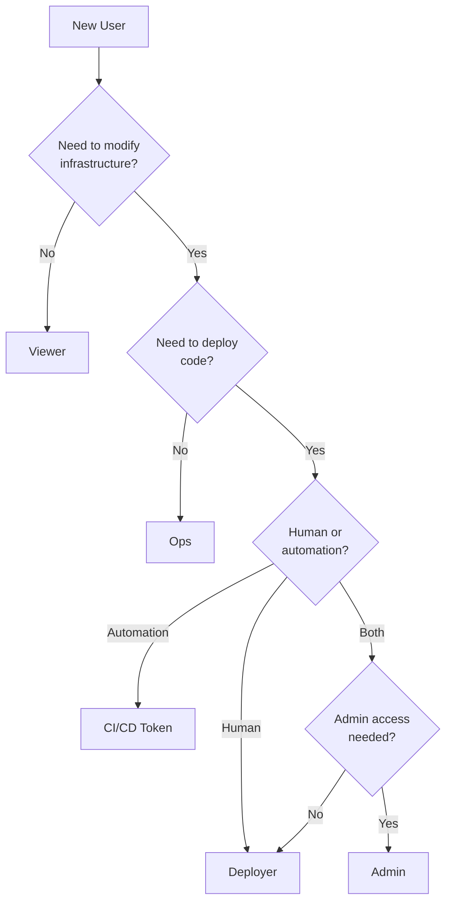

import { Aside, Badge } from '@astrojs/starlight/components';

Rack Gateway defines five roles organized in a hierarchy. Each role includes specific permissions and may inherit permissions from other roles.

## Role Hierarchy



The hierarchy uses inheritance: each role automatically includes all permissions from roles below it.

## Viewer

<Badge text="Human Users" variant="note" />

**Purpose**: Read-only access for monitoring and observability.

| Attribute | Value |
|-----------|-------|
| **Label** | Viewer |
| **Inherits From** | None |
| **Description** | Read-only access to apps, builds, processes, and rack status |

### Permissions

| Permission | Description |
|------------|-------------|
| `convox:app:list` | List all applications |
| `convox:app:read` | View application details |
| `convox:process:list` | List running processes |
| `convox:process:read` | View process details |
| `convox:instance:list` | List EC2/container instances |
| `convox:instance:read` | View instance details |
| `convox:log:read` | Stream application logs |
| `convox:build:list` | List builds |
| `convox:build:read` | View build details |
| `convox:rack:read` | View rack configuration |

### Use Cases

- **Stakeholders**: Product managers, executives viewing deployment status
- **Support Teams**: Customer support checking application health
- **Auditors**: External auditors reviewing system state
- **Developers (Limited)**: Engineers who only need to observe, not modify

### What Viewers Cannot Do

- Restart applications
- Execute commands in containers
- View environment variables (contain secrets)
- Create builds or deployments
- Modify any resources

---

## Ops (Operations)

<Badge text="Human Users" variant="note" />

**Purpose**: Operational access for incident response and debugging.

| Attribute | Value |
|-----------|-------|
| **Label** | Operations |
| **Inherits From** | Viewer |
| **Description** | Restart apps, manage processes, and view environments |

### Additional Permissions

Beyond all Viewer permissions:

| Permission | Description |
|------------|-------------|
| `convox:app:restart` | Restart application processes |
| `convox:process:start` | Start a process |
| `convox:process:exec` | Execute commands in containers |
| `convox:process:terminate` | Terminate a process |
| `convox:release:list` | List releases |
| `convox:env:read` | View environment variables |

### Use Cases

- **On-Call Engineers**: Incident response and debugging
- **SRE Teams**: Operational troubleshooting
- **DevOps Engineers**: Day-to-day operations without deployment access

### Key Capability: Container Exec

The `convox:process:exec` permission allows running commands inside containers:

```bash
rack-gateway run web "rails console" -a myapp
rack-gateway run web "cat /etc/hosts" -a myapp
```

<Aside type="caution" title="Security Consideration">
Container exec access is powerful. Users can potentially access secrets in the container's environment or filesystem. Grant Ops role only to trusted engineers.
</Aside>

### What Ops Cannot Do

- Create builds
- Promote releases to production
- Modify environment variables
- Create or delete applications
- Manage users or settings

---

## Deployer

<Badge text="Human Users" variant="note" />

**Purpose**: Full deployment access for engineers who ship code.

| Attribute | Value |
|-----------|-------|
| **Label** | Deployer |
| **Inherits From** | Ops |
| **Description** | Full deployment permissions including env updates |

### Additional Permissions

Beyond all Ops permissions:

| Permission | Description |
|------------|-------------|
| `convox:app:restart` | Restart applications |
| `convox:build:create` | Create new builds |
| `convox:object:create` | Upload build artifacts |
| `convox:release:create` | Create releases |
| `convox:release:read` | View release details |
| `convox:release:promote` | Promote releases to production |
| `convox:env:read` | View environment variables |
| `convox:env:set` | Set environment variables |
| `convox:app:update` | Update application settings |
| `gateway:deploy_approval_request:create` | Request deploy approval |
| `gateway:deploy_approval_request:read` | View approval requests |

### Use Cases

- **Software Engineers**: Deploy code to production
- **DevOps Engineers**: Full deployment workflow
- **Release Managers**: Coordinate releases

### Key Capability: Full Deployment

Deployers can execute the complete deployment workflow:

```bash
# Build from source
rack-gateway build -a myapp

# Or deploy directly (build + promote)
rack-gateway deploy -a myapp

# Update environment variables
rack-gateway env set API_KEY=secret -a myapp

# Promote a specific release
rack-gateway releases promote RABCDEF -a myapp
```

### What Deployers Cannot Do

- Delete applications
- Manage users and roles
- Configure gateway settings
- Access audit logs
- Create API tokens for other users

---

## CI/CD

<Badge text="API Tokens Only" variant="caution" />

**Purpose**: Minimal permissions for automated deployment pipelines.

| Attribute | Value |
|-----------|-------|
| **Label** | CI/CD |
| **Inherits From** | None (standalone) |
| **Description** | Recommended scope for automation tokens (not assignable to human users) |

<Aside type="note" title="Token-Only Role">
The CI/CD role cannot be assigned to human users. It's specifically designed for API tokens used in automated pipelines like CircleCI, GitHub Actions, or Jenkins.
</Aside>

### Permissions

| Permission | Description |
|------------|-------------|
| `convox:app:list` | List applications |
| `convox:app:read` | View application details |
| `convox:process:list` | List processes |
| `convox:process:read` | View process details |
| `convox:instance:list` | List instances |
| `convox:instance:read` | View instance details |
| `convox:rack:read` | View rack info |
| `gateway:deploy_approval_request:create` | Request deploy approval |
| `gateway:deploy_approval_request:read` | View approval status |
| `convox:deploy:deploy_with_approval` | Deploy when approved |

### Use Cases

- **CI/CD Pipelines**: CircleCI, GitHub Actions, Jenkins
- **Automated Testing**: Integration test runners
- **Deployment Automation**: Infrastructure-as-code tools

### Deploy Approval Integration

The CI/CD role is designed to work with [Deploy Approvals](/integrations/deploy-approvals/):

1. CI/CD pipeline creates a deploy approval request
2. Human approver reviews and approves in Slack or web UI
3. CI/CD pipeline promotes the release with `deploy_with_approval`

```bash
# In CI/CD pipeline
rack-gateway deploy-request create -a myapp --build-id BXYZ123
# ... wait for approval ...
rack-gateway releases promote RXYZ789 -a myapp
```

### Why Not Use Deployer for CI/CD?

The Deployer role includes permissions CI/CD pipelines don't need:

- Container exec (`convox:process:exec`) - Security risk in automation
- Environment variable access - Pipelines shouldn't read production secrets
- Direct deployment - Bypasses approval workflow

---

## Admin

<Badge text="Human Users" variant="note" />

**Purpose**: Complete administrative access for platform administrators.

| Attribute | Value |
|-----------|-------|
| **Label** | Admin |
| **Inherits From** | All (wildcard) |
| **Description** | Complete access to all gateway operations |

### Permissions

| Permission | Description |
|------------|-------------|
| `convox:*:*` | All Convox operations |
| `gateway:*:*` | All Gateway operations |

The wildcard permissions grant access to everything, including:

- All Convox operations (apps, builds, releases, etc.)
- User management (create, update, delete users)
- Role assignments
- Gateway settings and configuration
- Audit log access
- API token management for all users
- Destructive operations (delete apps, users)

### Use Cases

- **Platform Administrators**: Full system management
- **Security Team**: Access reviews and incident investigation
- **Initial Setup**: Configuring the gateway for first use

### Admin-Only Operations

| Operation | Permission |
|-----------|------------|
| Create users | `gateway:user:create` |
| Delete users | `gateway:user:delete` |
| Change user roles | `gateway:user:update` |
| View all API tokens | `gateway:api_token:list` |
| Delete any API token | `gateway:api_token:delete` |
| View audit logs | `gateway:audit:read` |
| Delete applications | `convox:app:delete` |
| Configure gateway settings | `gateway:setting:set` |

<Aside type="caution" title="Limit Admin Access">
Follow the principle of least privilege. Most teams should have only 2-3 admins. Regular engineers should use Deployer or Ops roles.
</Aside>

---

## Role Comparison Matrix

| Capability | Viewer | Ops | Deployer | CI/CD | Admin |
|------------|:------:|:---:|:--------:|:-----:|:-----:|
| View apps, processes, logs | Yes | Yes | Yes | Yes | Yes |
| View builds | Yes | Yes | Yes | Yes | Yes |
| View releases | No | Yes | Yes | No | Yes |
| View environment variables | No | Yes | Yes | No | Yes |
| Restart applications | No | Yes | Yes | No | Yes |
| Exec into containers | No | Yes | Yes | No | Yes |
| Create builds | No | No | Yes | No | Yes |
| Promote releases | No | No | Yes | No | Yes |
| Set environment variables | No | No | Yes | No | Yes |
| Request deploy approval | No | No | Yes | Yes | Yes |
| Deploy with approval | No | No | Yes | Yes | Yes |
| Manage users | No | No | No | No | Yes |
| View audit logs | No | No | No | No | Yes |
| Delete applications | No | No | No | No | Yes |
| Configure settings | No | No | No | No | Yes |

## Choosing the Right Role



## Next Steps

- [Permissions](/security/rbac/permissions/) - Complete permission reference
- [Best Practices](/security/rbac/best-practices/) - Role assignment patterns
