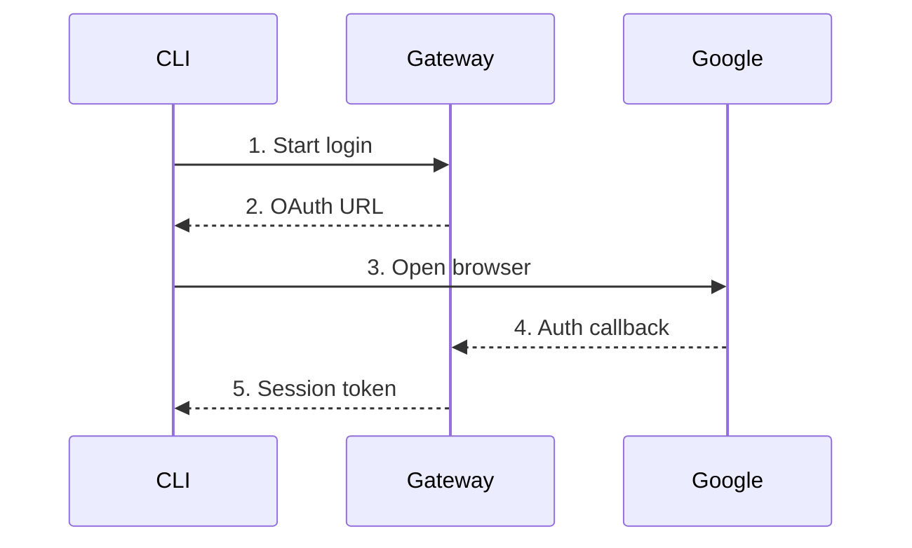

import { Aside, Steps } from '@astrojs/starlight/components';

The `rack-gateway` CLI uses OAuth to authenticate you with the gateway. This page covers the login flow, session management, and troubleshooting authentication issues.

## Login Flow

<Steps>

1. **Run the login command**
   ```bash
   rack-gateway login production https://gateway.example.com
   ```
   - `production` is an alias you choose for this rack
   - The URL is your gateway's address

2. **Browser opens automatically**

   Your default browser opens to the gateway's OAuth page. If it doesn't open automatically, the CLI prints a URL you can copy.

3. **Sign in with Google**

   Authenticate with your Google Workspace account. The gateway validates that your email domain is allowed.

4. **Return to terminal**

   After successful authentication, you can close the browser. The CLI receives a session token and stores it locally.

5. **Verify connection**
   ```bash
   rack-gateway rack
   # Shows rack information if authentication succeeded
   ```

</Steps>

## What Happens During Login



The CLI:
1. Requests a login URL from the gateway
2. Opens your browser to Google's OAuth consent page
3. The gateway receives the OAuth callback and stores the auth code
4. The CLI polls the gateway to complete login
5. Stores the session token in your config file

## Session Storage

Session tokens are stored in `~/.config/rack-gateway/config.json`:

```json
{
  "current": "production",
  "gateways": {
    "production": {
      "url": "https://gateway.example.com",
      "token": "rgw_sess_...",
      "email": "developer@company.com",
      "expires_at": "2024-02-15T10:30:00Z",
      "session_id": 1024,
      "channel": "cli",
      "device_id": "8f4c4b8c-...",
      "device_name": "dev-mbp",
      "mfa_verified": true
    }
  }
}
```

<Aside type="caution" title="Protect Your Config">
The config file contains session tokens. Protect it with appropriate file permissions:
```bash
chmod 600 ~/.config/rack-gateway/config.json
```
</Aside>

## Session Lifecycle

### Session Duration

CLI sessions are long-lived by default (currently 90 days). Sessions can be:
- **Revoked** by an administrator via the web UI
- **Expired** after a period of inactivity
- **Invalidated** if MFA enforcement changes

### Checking Session Status

```bash
# Test your current session
rack-gateway test-auth

# Output shows authentication status
✓ Authenticated as developer@company.com
  Role: deployer
  Session expires: 2024-02-15 10:30:00 UTC
```

### Session Expiration

When your session expires, you'll see an error like:

```
Error: session expired or invalid
Please run: rack-gateway login production https://gateway.example.com
```

Simply re-run the login command to get a new session.

## Logout

To remove your session:

```bash
# Logout from current rack
rack-gateway logout

# The session is revoked on the server and removed locally
```

This:
1. Notifies the gateway to invalidate your session
2. Removes the session token from your local config
3. Keeps the rack configuration so you can easily log in again

## Using API Tokens

For CI/CD or automation, you can use API tokens instead of OAuth sessions:

```bash
# Set via environment variable
export RACK_GATEWAY_API_TOKEN="rgw_token_..."
rack-gateway apps

# Or pass directly
rack-gateway apps --api-token "rgw_token_..."
```

API tokens:
- Don't require interactive login
- Have their own role and permissions
- Can be scoped to specific operations
- Should be created via the web UI or `api-token` command

See [API Tokens](/user-guide/web-ui/api-tokens/) for creating and managing tokens.

## MFA During Login

If MFA is required for your account, you'll be prompted after OAuth:

```bash
rack-gateway login production https://gateway.example.com

Opening browser for authentication...
✓ OAuth successful

MFA verification required.
Enter TOTP code: 123456
✓ MFA verified

✓ Logged in as developer@company.com
```

The CLI supports:
- **TOTP** - Enter the code from your authenticator app
- **WebAuthn** - Touch your security key when prompted
- **Backup codes** - Enter a backup code if you've lost access to your device

See [MFA Verification](/user-guide/cli/mfa-verification/) for details.

## Troubleshooting

### "Browser didn't open"

The CLI tries to open your default browser. If it fails:

```bash
# Copy the printed URL and open it manually
rack-gateway login production https://gateway.example.com
# Output: Open this URL in your browser: https://gateway.example.com/api/v1/auth/cli/start?...
```

### "OAuth callback failed"

The gateway receives the OAuth callback, then the CLI polls until completion. Issues can include:
- **Gateway not reachable**: DNS/VPN/Tailscale issues
- **Browser blocked the redirect**: allow the callback URL
- **Stale login state**: retry `rack-gateway login`

### "Domain not allowed"

```
Error: email domain not allowed
```

Your Google Workspace domain isn't configured in the gateway. Contact your administrator to add your domain to `GOOGLE_ALLOWED_DOMAIN`.

### "Session invalid" after working previously

Possible causes:
1. **Administrator revoked your session** - Log in again
2. **MFA enforcement changed** - You may need to enroll in MFA
3. **Gateway restarted with new secret** - All sessions invalidated; log in again

### "Permission denied" errors

You're authenticated but your role doesn't allow the operation:

```
Error: permission denied: convox:app:delete requires admin role
```

Contact your administrator to adjust your role if needed.

## Environment Variables

| Variable | Description |
|----------|-------------|
| `RACK_GATEWAY_API_TOKEN` | API token for authentication (bypasses OAuth) |
| `GATEWAY_CLI_CONFIG_DIR` | Override config directory location |
| `RACK_GATEWAY_RACK` | Override current rack for this command |
| `RACK_GATEWAY_URL` | Override gateway URL (used with API token) |

## Next Steps

- [Multi-Rack](/user-guide/cli/multi-rack/) - Work with multiple racks
- [MFA Verification](/user-guide/cli/mfa-verification/) - Step-up authentication
- [Commands](/user-guide/cli/commands/) - Full command reference
