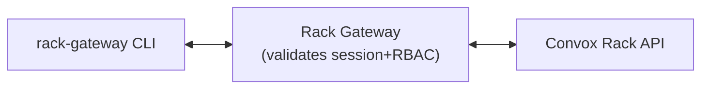

import { Aside, Card, CardGrid } from '@astrojs/starlight/components';

The `rack-gateway` CLI is the primary way developers interact with Convox racks protected by Rack Gateway. It handles authentication, wraps Convox commands, and manages multi-rack configurations.

## Why a Separate CLI?

The standard Convox CLI authenticates directly using the rack's primary API token. With Rack Gateway, authentication goes through OAuth instead:

```
Standard Convox:  convox → Rack API (primary token)
With Gateway:     rack-gateway → Gateway (OAuth session) → Rack API
```

The `rack-gateway` CLI:
- Handles OAuth authentication flow (opens browser, gateway receives callback, CLI polls for completion)
- Stores session tokens securely per-rack
- Wraps Convox commands
- Manages MFA verification when required
- Supports multiple rack configurations

## Quick Start

```bash
# Login to a gateway (opens browser for OAuth)
rack-gateway login production https://gateway.example.com

# Run Convox commands through the gateway
rack-gateway apps
rack-gateway ps -a myapp
rack-gateway logs -a myapp

# Set up a convenient alias
alias cg="rack-gateway"
cg apps
cg deploy
```

## Command Categories

<CardGrid>
  <Card title="Authentication" icon="star">
    `login`, `logout`, `test-auth` - Manage your gateway sessions
  </Card>
  <Card title="Rack Management" icon="setting">
    `rack`, `racks`, `switch` - Configure and switch between racks
  </Card>
  <Card title="Convox Commands" icon="rocket">
    `apps`, `deploy`, `ps`, `logs`, etc. - All standard Convox operations
  </Card>
  <Card title="Gateway Features" icon="seti:lock">
    `api-token`, `deploy-approval`, `gateway` - Gateway-specific features
  </Card>
</CardGrid>

## How It Works

When you run a command like `rack-gateway apps`:

1. CLI loads your session token from `~/.config/rack-gateway/config.json`
2. CLI sends the request to the gateway with your session token
3. Gateway validates your session and checks RBAC permissions
4. Gateway proxies the request to the Convox rack
5. Response flows back through the gateway to your terminal



## Configuration Location

The CLI stores configuration in `~/.config/rack-gateway/`:

```
~/.config/rack-gateway/
└── config.json    # Rack URLs, session tokens, current rack
```

You can override this with the `--config` flag or `GATEWAY_CLI_CONFIG_DIR` environment variable.

## Available Commands

### Authentication
| Command | Description |
|---------|-------------|
| `login <rack> <url>` | Login to a gateway via OAuth |
| `logout` | Logout from the current rack |
| `test-auth` | Test authentication (optionally with MFA) |

### Rack Management
| Command | Description |
|---------|-------------|
| `rack` | Show current rack configuration |
| `racks` | List all configured racks |
| `switch <rack>` | Switch to a different rack |

### Convox Operations
| Command | Description |
|---------|-------------|
| `apps` | List applications |
| `build` | Create a build |
| `builds` | List builds |
| `deploy` | Deploy an application |
| `env` | Manage environment variables |
| `exec` | Execute command in a container |
| `instances` | List instances |
| `logs` | View application logs |
| `ps` | List app processes |
| `releases` | List releases |
| `resources` | List resources |
| `restart` | Restart an application |
| `run` | Run a one-off process |
| `scale` | Scale app processes |

### Gateway Features
| Command | Description |
|---------|-------------|
| `api-token` | Manage API tokens |
| `deploy-approval` | Manage deploy approvals |
| `gateway` | Show gateway server information |
| `version` | Show CLI, gateway, and rack versions |
| `web` | Open the gateway web UI in browser |

## Global Flags

| Flag | Description |
|------|-------------|
| `--rack, -r` | Override the current rack for this command |
| `--config` | Override the config directory |
| `--api-token` | Use an API token instead of session |
| `--mfa-code` | Provide MFA code for step-up auth |
| `--mfa-method` | Specify MFA method (totp or webauthn) |

## Next Steps

- [Installation](/user-guide/cli/installation/) - Install the CLI
- [Authentication](/user-guide/cli/authentication/) - Login and session management
- [Multi-Rack](/user-guide/cli/multi-rack/) - Managing multiple racks
- [Commands](/user-guide/cli/commands/) - Complete command reference
