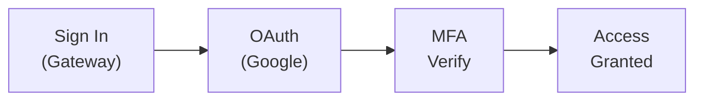

import { Aside, Card, CardGrid } from '@astrojs/starlight/components';

Multi-factor authentication (MFA) adds an extra layer of security to your Rack Gateway account. Even if your password is compromised, attackers can't access your account without your second factor.

## Why Use MFA?

MFA protects against:
- **Credential theft** - Stolen passwords alone aren't enough
- **Phishing** - Even if you enter credentials on a fake site
- **Account takeover** - Blocks unauthorized access attempts
- **Compliance requirements** - SOC 2 and other frameworks often require MFA

## Supported MFA Methods

<CardGrid>
  <Card title="TOTP" icon="star">
    **Time-based One-Time Passwords**

    Use authenticator apps like Google Authenticator, Authy, or 1Password. Generate 6-digit codes that change every 30 seconds.

    [Set up TOTP →](/user-guide/mfa/totp-setup/)
  </Card>
  <Card title="WebAuthn" icon="seti:lock">
    **Security Keys & Biometrics**

    Use hardware keys (YubiKey 5), fingerprint readers (Touch ID), or platform authenticators (Windows Hello).

    [Set up WebAuthn →](/user-guide/mfa/webauthn/)
  </Card>
  <Card title="YubiKey OTP" icon="setting">
    **YubiKey One-Time Passwords**

    Use YubiKey's built-in OTP feature with a simple touch.

    [Set up YubiKey →](/user-guide/mfa/yubikey/)
  </Card>
  <Card title="Backup Codes" icon="document">
    **Recovery Codes**

    One-time use codes for when you've lost access to your primary MFA device.

    [Get backup codes →](/user-guide/mfa/backup-codes/)
  </Card>
</CardGrid>

## MFA Enrollment

### First-Time Setup

If MFA is required by your organization, you'll be prompted to enroll after your first login:

1. Sign in with Google OAuth
2. You'll be redirected to the MFA enrollment page
3. Choose your preferred MFA method
4. Complete the enrollment process
5. Save your backup codes

### Adding MFA Later

To add MFA to your account:

1. Open the web UI: `rack-gateway web`
2. Go to **Account** → **Security**
3. Click **Enable Two-Factor Authentication**
4. Follow the setup wizard

## MFA Verification Flow



1. You click "Sign in with Google"
2. Complete Google OAuth authentication
3. If MFA is enabled, verify with your second factor
4. Access is granted

## Step-Up Authentication

Even after logging in, certain sensitive operations may require additional MFA verification:

- Changing environment variables
- Creating API tokens
- Modifying user permissions
- Deleting applications

This is called "step-up" authentication and provides extra protection for destructive or sensitive actions.

### Step-Up Window

After verifying MFA, there's a window (default: 10 minutes) where additional step-up prompts aren't required. This balances security with usability.

## Trusted Devices

To reduce MFA prompts on devices you use regularly:

1. During MFA verification, check "Trust this device"
2. The device is trusted for 30 days (configurable)
3. You won't need MFA on this device until trust expires

<Aside type="note" title="Device Trust">
Trusted device status is tied to your browser. Using a different browser or clearing cookies will require MFA again.
</Aside>

See [Trusted Devices](/user-guide/mfa/trusted-devices/) for details.

## Backup Codes

Always generate and securely store backup codes:

- 10 one-time codes generated at enrollment
- Each code can only be used once
- Store in a password manager or secure location
- Regenerate after using codes

<Aside type="caution" title="Save Your Backup Codes">
If you lose access to your MFA device and don't have backup codes, you'll need an administrator to reset your MFA.
</Aside>

See [Backup Codes](/user-guide/mfa/backup-codes/) for details.

## MFA for CLI

The `rack-gateway` CLI supports MFA verification:

```bash
# Interactive prompt during login
rack-gateway login production https://gateway.example.com

# Provide code directly
rack-gateway deploy -a myapp --mfa-code 123456

# WebAuthn (touch your key)
rack-gateway deploy -a myapp --mfa-method webauthn
```

See [CLI MFA Verification](/user-guide/cli/mfa-verification/) for details.

## Comparison of MFA Methods

| Method | Security | Convenience | Best For |
|--------|----------|-------------|----------|
| **WebAuthn** | Highest | High | Primary method, phishing-resistant |
| **TOTP** | High | Medium | Universal support, works offline |
| **YubiKey OTP** | High | High | Simple touch authentication |
| **Backup Codes** | Medium | Low | Emergency recovery only |

## Administrator Controls

Administrators can configure MFA policies:

| Setting | Description |
|---------|-------------|
| **Require for all users** | Force MFA enrollment |
| **Step-up window** | Time before re-verification required |
| **Trusted device TTL** | How long device trust lasts |

See [Security Settings](/user-guide/web-ui/settings/) for configuration options.

## Troubleshooting

### "Invalid code"

- TOTP codes are time-sensitive; check your device clock
- Codes expire every 30 seconds
- Make sure you're using the correct account in your authenticator

### "WebAuthn not available"

- Check that your browser supports WebAuthn
- Ensure your security key is connected
- Try using TOTP as a fallback

### "Lost access to MFA device"

1. Use a backup code to sign in
2. Go to Account Security
3. Remove the lost device
4. Enroll a new MFA method
5. Generate new backup codes

If you don't have backup codes, contact your administrator for MFA reset.

## Next Steps

Choose an MFA method to set up:

- [TOTP Setup](/user-guide/mfa/totp-setup/) - Authenticator apps
- [WebAuthn](/user-guide/mfa/webauthn/) - Security keys
- [YubiKey](/user-guide/mfa/yubikey/) - YubiKey OTP
- [Backup Codes](/user-guide/mfa/backup-codes/) - Recovery codes
