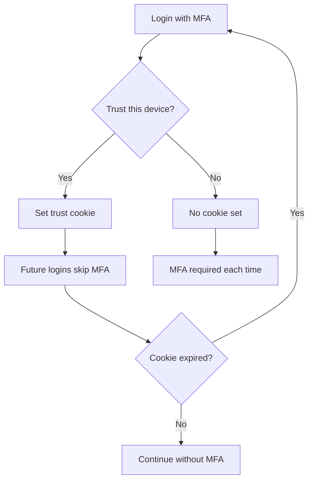

import { Aside, Steps } from '@astrojs/starlight/components';

Trusted devices allow you to skip MFA verification on recognized browsers and machines for a configurable period.

## How Trusted Devices Work

When you authenticate with MFA:

1. You can choose to **Trust this device**
2. A secure cookie is set in your browser
3. Future logins skip MFA for the trust period (default: 30 days)
4. After the period expires, MFA is required again



## Trusting a Device

### During Login

<Steps>

1. Complete your MFA verification (TOTP, WebAuthn, etc.)

2. Check the **Trust this device for 30 days** checkbox

3. Complete login

</Steps>

The device is now trusted until the period expires or you revoke it.

### What Gets Trusted

A trusted device is identified by:

- Browser fingerprint
- Device identifier
- Session binding

<Aside type="note">
Trusting a device is browser-specific. If you use multiple browsers, you'll need to trust each one separately.
</Aside>

## Managing Trusted Devices

### View Your Trusted Devices

Navigate to **MFA** in the web interface to see your trusted devices:

| Device | Browser | Trusted On | Expires | Last Used |
|--------|---------|------------|---------|-----------|
| MacBook Pro | Chrome | Jan 15, 2024 | Feb 14, 2024 | Jan 20, 2024 |
| Desktop | Firefox | Jan 10, 2024 | Feb 9, 2024 | Jan 18, 2024 |
| iPhone | Safari | Jan 5, 2024 | Feb 4, 2024 | Jan 19, 2024 |

### Revoke a Trusted Device

If a device is lost or compromised:

<Steps>

1. Navigate to **MFA**

2. Find the device in the trusted devices list

3. Click **Revoke**

4. Confirm the action

</Steps>

The device will require MFA on next login.

### Revoke All Devices

To require MFA on all devices:

<Steps>

1. Navigate to **MFA**

2. Click **Revoke All Trusted Devices**

3. Confirm the action

</Steps>

<Aside type="tip">
Use this if you suspect a security issue or are leaving a shared environment.
</Aside>

## Trust Duration

### Default Settings

| Setting | Default Value |
|---------|---------------|
| Trust duration | 30 days |
| Maximum devices | 10 per user |

### Administrator Configuration

Administrators can configure trust settings:

- **Trust duration** - How long devices remain trusted (1-90 days)
- **Disable trusted devices** - Require MFA every time
- **Maximum trusted devices** - Limit per user

## Security Considerations

### When to Trust

**Trust devices that are:**
- Personal devices you control
- Secured with PIN/biometrics
- Used in private environments

**Don't trust devices that are:**
- Shared or public computers
- In coffee shops or coworking spaces
- Used by multiple people

### Automatic Revocation

Trusted devices are automatically revoked when:

- The trust period expires
- Your password changes
- An administrator resets your MFA
- Suspicious activity is detected

### Risk Indicators

The gateway may require MFA despite a trusted device if:

- Login from a new IP address or location
- Unusual access patterns detected
- Sensitive action attempted
- Administrator policy requires step-up

## CLI Trusted Sessions

The CLI doesn't use browser cookies but has similar trust behavior:

### Session Tokens

When you log in via CLI:

```bash
rack-gateway login
```

A session token is stored locally. This token:
- Persists until explicitly logged out or expired
- Includes device metadata (machine ID, OS)
- Doesn't require MFA for each command

### Viewing CLI Sessions

```bash
rack-gateway session info
```

Shows your current session status:

```
Session Status:
  Rack: production
  User: alice@example.com
  Role: deployer
  MFA Verified: 2024-01-20 10:30:00
  Session Expires: 2024-01-21 10:30:00
```

### Revoking CLI Sessions

From the web UI, you can see and revoke CLI sessions:

1. Navigate to **MFA** > **Active Sessions**
2. Find CLI sessions (marked as "CLI" channel)
3. Click **Revoke** to invalidate

## Troubleshooting

### Trust Not Working

**Cookie issues:**
- Ensure cookies are enabled in your browser
- Check that third-party cookie blocking isn't affecting the site
- Try clearing cookies and re-trusting

**Different browser:**
- Trust is browser-specific
- Use the same browser/profile for trusted access

**Expired trust:**
- Check the expiration date in MFA settings
- Re-trust the device after MFA

### Unexpected MFA Prompts

You may be prompted for MFA despite a trusted device when:

- Accessing from a new IP address
- Performing sensitive operations (step-up)
- Administrator policies override trust
- Browser cookies were cleared

### Device Limit Reached

If you've reached the maximum trusted devices:

1. Navigate to **MFA**
2. Revoke old or unused devices
3. Trust the new device

## Best Practices

### Personal Devices

- Trust your primary work devices
- Use strong device security (encryption, biometrics)
- Revoke trust when devices are retired

### Work Environment

- Trust office devices cautiously
- Never trust shared workstations
- Review trusted devices regularly

### Travel

- Consider revoking trust before travel
- Use hardware security keys instead of trusted devices
- Re-trust when back in a secure environment

## Related

- [MFA Overview](/user-guide/mfa/) - All MFA options
- [TOTP Setup](/user-guide/mfa/totp-setup/) - Authenticator apps
- [Security Sessions](/security/authentication/sessions/) - Session security
