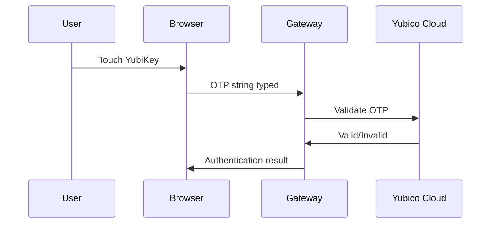

import { Aside, Steps } from '@astrojs/starlight/components';

YubiKey OTP provides one-touch authentication by generating a unique password each time you touch the key.

<Aside type="note">
**WebAuthn is the recommended method** for YubiKey authentication. YubiKey OTP is provided as an alternative for environments where WebAuthn is not available. See [WebAuthn](/user-guide/mfa/webauthn/) for the preferred setup.
</Aside>

## What is YubiKey OTP?

YubiKey OTP (One-Time Password) is a proprietary authentication method where:

1. You touch the YubiKey's button
2. The key types a 44-character one-time password
3. The server validates it against Yubico's cloud or a self-hosted server

**Comparison with WebAuthn:**

| Feature | YubiKey OTP | WebAuthn |
|---------|-------------|----------|
| Standards-based | Proprietary | W3C Standard |
| Cloud dependency | Yubico Cloud (or self-hosted) | None |
| Browser support | Any (keyboard input) | Modern browsers |
| Phishing protection | Limited | Strong |
| Touch to authenticate | ✓ | ✓ |

## Supported YubiKeys

YubiKey OTP is available on most YubiKey models:

| Model | OTP Slot 1 | OTP Slot 2 |
|-------|------------|------------|
| YubiKey 5 NFC | ✓ | ✓ |
| YubiKey 5C | ✓ | ✓ |
| YubiKey 5 Nano | ✓ | ✓ |
| YubiKey Bio | ✓ | ✓ |
| Security Key (FIDO-only) | ✗ | ✗ |

<Aside type="caution">
FIDO-only Security Keys (blue keys) do not support YubiKey OTP. Use WebAuthn instead.
</Aside>

## How YubiKey OTP Works



Each OTP contains:
- **Public ID** (12 chars) - Identifies the key
- **Encrypted data** (32 chars) - Counter, timestamp, CRC
- Validated by Yubico's servers against the key's secret

## Setting Up YubiKey OTP

### Prerequisites

Before setup:
1. Have a YubiKey with OTP capability
2. Register your YubiKey at [Yubico](https://www.yubico.com/genuine/) (for cloud validation)

### In the Web UI

<Steps>

1. Log in to the gateway

2. Navigate to **MFA** in the sidebar

3. Click **Add YubiKey OTP**

4. Place your cursor in the input field

5. Touch your YubiKey
   - The key will type a 44-character code
   - Don't press Enter - it submits automatically

6. The key is registered after validation

</Steps>

### Understanding YubiKey Slots

YubiKeys have two OTP slots:

| Slot | Activation | Default |
|------|------------|---------|
| Slot 1 | Short touch (1-2 sec) | Yubico OTP |
| Slot 2 | Long touch (3+ sec) | Usually empty |

Most users should use Slot 1 (short touch) with the factory-programmed Yubico OTP.

## Using YubiKey OTP

### Web Authentication

When MFA is required:

1. Click in the OTP input field
2. Touch your YubiKey briefly
3. The code is typed automatically
4. Authentication completes

### CLI Authentication

```bash
rack-gateway login
```

When prompted:

```
MFA verification required
Touch your YubiKey: ccccccbcgujhingjr...
```

Touch your YubiKey - the code is entered automatically.

### Long Touch for Slot 2

If you've programmed Slot 2:

1. Hold the YubiKey for 3+ seconds
2. The Slot 2 code is generated
3. Use this for alternative configurations

## Managing YubiKey OTP

### View Registered Keys

In **MFA** settings, you'll see:

| Key ID | Public ID | Registered | Last Used |
|--------|-----------|------------|-----------|
| YubiKey Work | ccccccbcgujh | 2024-01-15 | 2024-01-20 |

### Remove a Key

<Steps>

1. Navigate to **MFA**

2. Find the YubiKey to remove

3. Click **Remove**

4. Confirm with MFA verification

</Steps>

## Troubleshooting

### OTP Not Accepted

**"Invalid OTP" error:**
- Ensure you're using Slot 1 (short touch)
- Check that your YubiKey is registered with Yubico
- Verify the key hasn't been reprogrammed

**Partial code typed:**
- Ensure the input field has focus
- Wait for the full 44 characters
- Try a different USB port

### Key Types Wrong Characters

- Check your keyboard layout (should be US English for OTP)
- Ensure no modifier keys are pressed
- The YubiKey types as if it's a US keyboard

### Counter Desync

If the YubiKey counter gets out of sync:

1. Touch the key several times in quick succession
2. The cloud server will resync after a few attempts
3. If persistent, re-register the key

### Key Not Recognized

**USB issues:**
- Try a different port
- Avoid USB hubs
- Check for driver issues (rare on modern systems)

**Registration issues:**
- Ensure the key is registered at yubico.com
- For self-hosted validation, check server configuration

## Security Considerations

### Cloud Dependency

YubiKey OTP requires Yubico's cloud for validation:
- **Pro**: Simple setup, always up-to-date
- **Con**: Requires internet, trust in Yubico

For air-gapped environments, consider WebAuthn instead.

### Physical Security

- YubiKey OTP requires physical touch
- Keep your YubiKey secure when not in use
- Report lost keys immediately

### Slot Configuration

- Don't reprogram Slot 1 unless necessary
- If reprogrammed, you'll need to re-register everywhere
- Consider using Slot 2 for custom configurations

## Advanced: Self-Hosted Validation

For environments that can't use Yubico's cloud:

<Aside type="caution">
Self-hosted YubiKey OTP validation requires additional infrastructure. Contact your administrator for guidance.
</Aside>

Self-hosted validation requires:
- A YubiKey Validation Server
- Access to secret keys for your YubiKeys
- Network configuration to route validation requests

## Related

- [WebAuthn](/user-guide/mfa/webauthn/) - Recommended for YubiKey users
- [MFA Overview](/user-guide/mfa/) - All MFA options
- [Backup Codes](/user-guide/mfa/backup-codes/) - Recovery options
